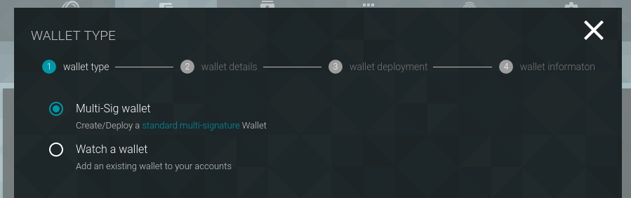
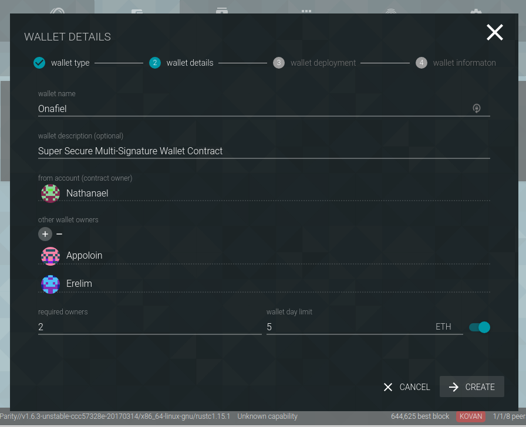
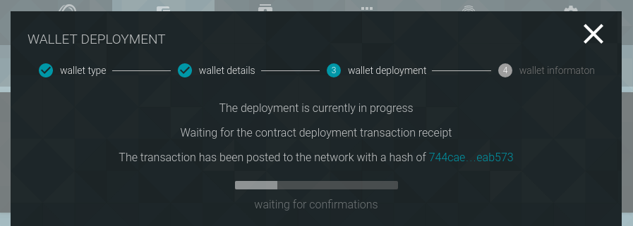
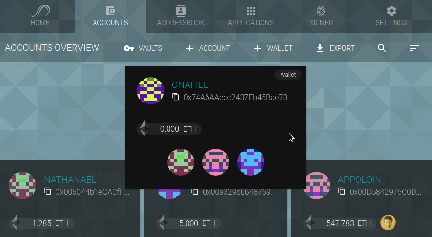

The parity wallet offers multiple options to store tokens and Ether.

### Accounts

Accounts are the most **basic way to store assets**. They consist of simple public/private key-pairs, which are used to sign transactions, enable authentication, and prove ownership.

To create an account with the [[Parity Wallet]], open the _Accounts_ tab, click the `+ACCOUNT` button, and follow the instructions. Make sure to write down your recovery phrase in a secure location and to create [backups](Backing-up-&-Restoring) of your private key after account creation.

### Wallets

Wallets are smart contracts which manage assets and can me owned by multiple accounts. Unlike accounts, contract wallets are controlled by code, which means that it is possible to customize their behavior. The most common use-case are **multi-signature wallets**, that allow for transaction logging, withdrawal limits, and signature requirement rule-sets.

To create a multi-sig wallet with [UI](Parity-Wallet), open the _Accounts_ tab, click on the `+WALLET` button and select _Multi-Sig Wallet_.

In a supplemental step, select at least two owners and specify the number of signatures required to withdraw funds. For example, to create a classic 2-of-3 multi-signature contract, add three wallet owners by selecting them from your account list or pasting the public key, and set the require number of owners to `2`.

In addition, the wallet contract allows to define a daily withdrawal limit allowing each owner to withdraw up to this amount of Ether without requiring any other owner to sign (optional).

In order to create a wallet, the contract has to be deployed on the blockchain. After setting up all parameters for the contact, click _Create_ and sign the transaction with one of the owner accounts.

Once deployed, the wallet will be visible in your accounts list on top of your normal accounts.

The wallet contract used for Parity is available for review here: [`enhanced-wallet.sol`](https://github.com/paritytech/parity/blob/63137b15482344ff9df634c086abaabed452eadc/js/src/contracts/snippets/enhanced-wallet.sol)

### Vaults

Vaults are an additional security feature to lock away your accounts behind a second layer of encryption. While your normal accounts are encrypted with your passphrase, their meta-data is accessible for all applications interacting with your wallet. Creating a vault encrypts the meta-data (e.g., the public key) and therefore hides the accounts unless you unlock the vault.

To create a new vault with the [[Parity Wallet]], open the _Accounts_ tab, click the `VAULT` button, click `+CREATE VAULT`, and follow the instructions.

After creating a vault, click open it, click on _Accounts_, select the accounts which should be moved into the vault, and confirm with _Set_.

 Once moved into the vault, the addresses are encrypted and not stored as plain text on your disk anymore.

Closing a vault hides all accounts.

