The parity wallet offers multiple options to store tokens and Ether.

### Accounts

Accounts are the most **basic way to store assets**. They consist of simple public/private key-pairs, which are used to sign transactions, enable authentication, and prove ownership.

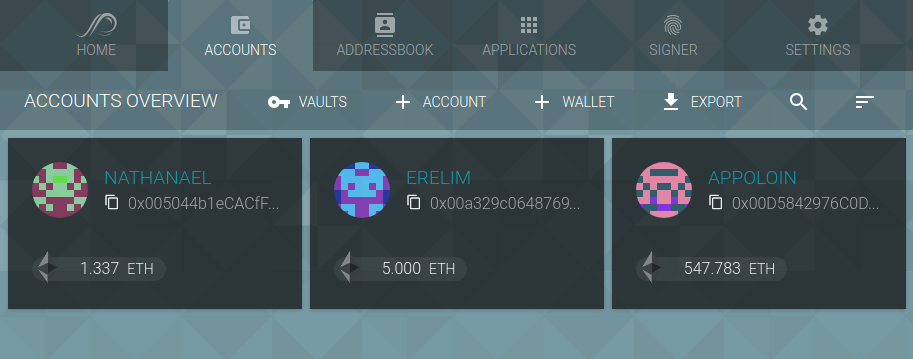

To create an account with the [Parity Wallet](Parity-Wallet), open the _Accounts_ tab, click the `+ACCOUNT` button, and follow the instructions. Make sure to write down your recovery phrase in a secure location and to create [backups](Backing-up-&-Restoring) of your private key after account creation.

### Wallets

Wallets are smart contracts which manage assets and can be owned by multiple accounts. Unlike accounts, contract wallets are controlled by code, which means that it is possible to customize their behavior. The most common use-case are **multi-signature wallets**, that allow for transaction logging, withdrawal limits, and rule-sets for signatures required.

Parity only allows to watch wallets and interract with them (view and sign transactions, send funds..). It does not allow to create multi-sig wallets.
To watch a multi-sig wallet within Parity UI, open the _Accounts_ tab, click on the `+WALLET` button and select _Watch a Wallet_.

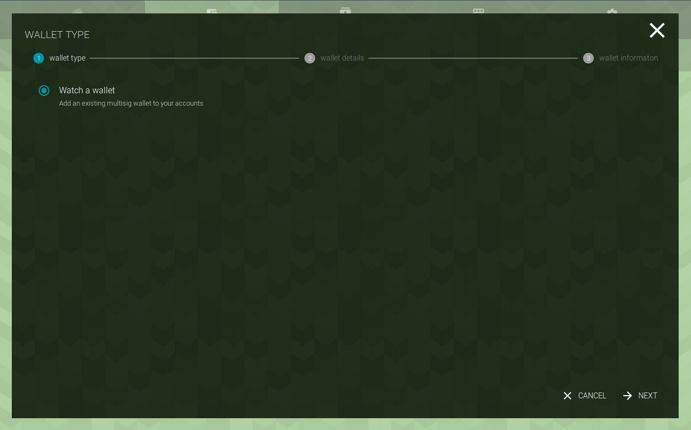

In a supplemental step, enter the wallet address provided upon deployement on the blockchain, you should chose a name and description.

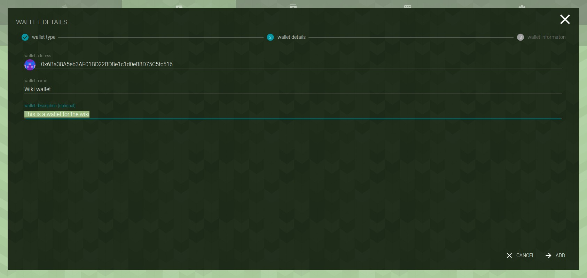

The next step will show you an overview of the wallet parameters such as the owners, the numbre of needed signatures and the funds it contains. 

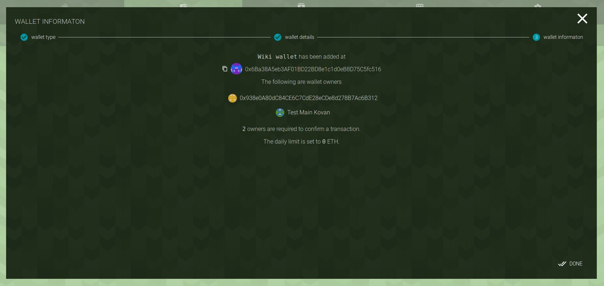

Once done, the wallet will be visible in your accounts list on top of your normal accounts.

Opening the wallet reveals details about available balances and transactions, as well as pending confirmations for the multi-signature transactions.

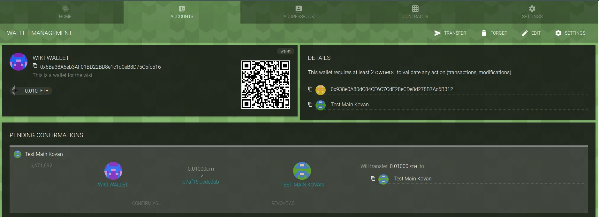

### Vaults

Vaults are an additional privacy feature to lock away your accounts behind a second layer of encryption. While your normal accounts are encrypted with your pass-phrase, their meta-data is accessible for all applications interacting with your wallet. Creating **a vault encrypts the meta-data** (e.g., the public address) and therefore hides the accounts until you unlock the vault.

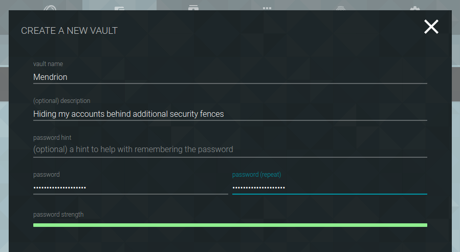

To create a new vault with the [Parity Wallet](Parity-Wallet), open the _Accounts_ tab, click the `VAULT` button, click `+CREATE VAULT`, and follow the instructions.

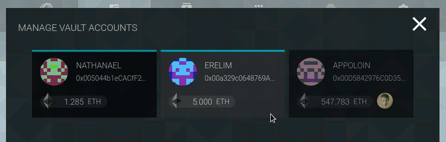

After creating a vault, click open it, click on _Accounts_, select the accounts which should be moved into the vault, and confirm with _Set_.

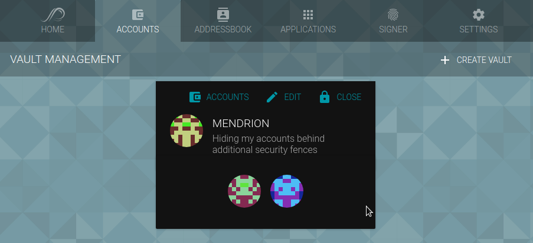

Once moved into the vault, the addresses are encrypted and not stored as plain text on your disk anymore.

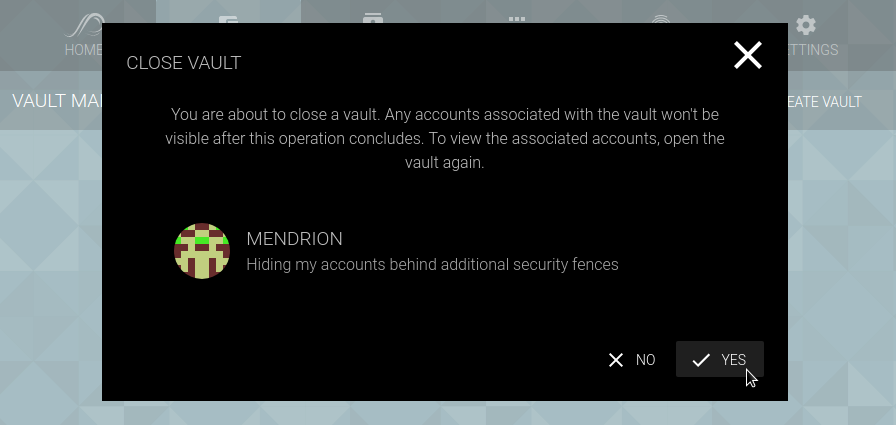

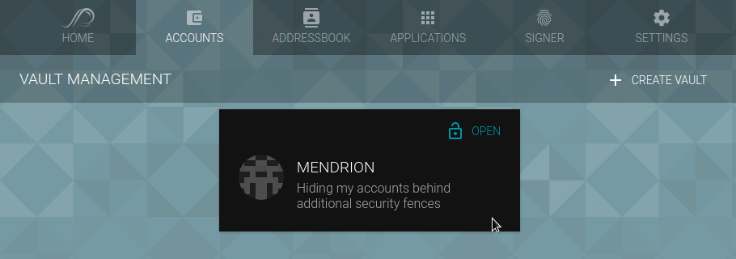

Closing a vault hides all accounts from your public accounts tab.

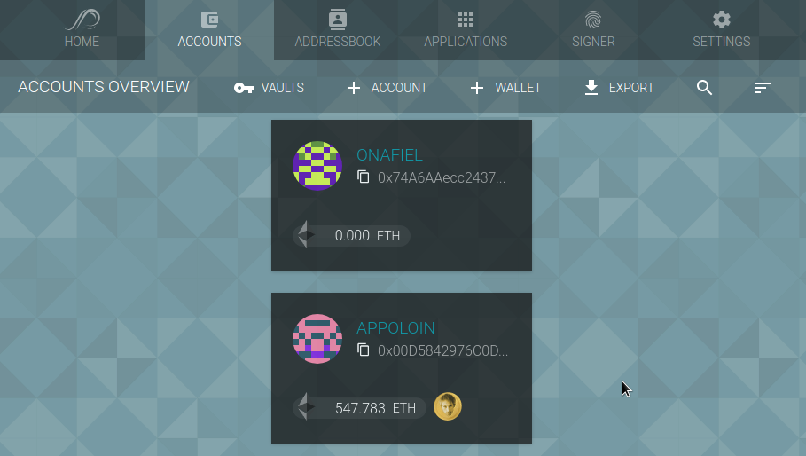
