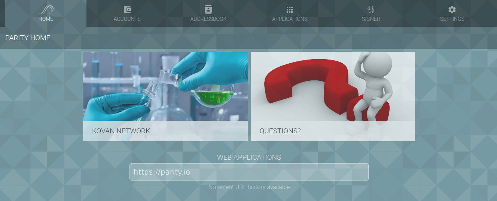

To use Parity run `parity ui` command or head on to [http://127.0.0.1:8180/](http://127.0.0.1:8180/) or another port specified by `--ui-port PORT` option. This will bring up the UI that can be used to monitor Ethereum blockchain syncing progress and to use installed DApps.



Once the syncing is complete, new transactions can be sent. Before relaying a transaction [Secure Transaction Signer](Secure Transaction Signer) has to be used to sign it.

- [Configuration](#configuration)
- [Networking](#networking)
- [JSON-RPC API](#json-rpc-api)
- [JavaScript Console](#javascript-console)
    - [Browser developer console](#browser-developer-console)
    - [Node.js CLI Console](#nodejs-cli-console)
    - [Legacy Geth Console](#legacy-geth-console)


### Configuration

Use `parity --help` to find out about available options. To avoid adding options on every run of Parity a [config file](Configuring-Parity#config-file). The file can be easily generated using [this tool](https://paritytech.github.io/parity-config-generator/).

### Networking

You can connect to the Ropsten testnet with `parity --chain ropsten` or to the Kovan testnet with `parity --chain kovan`.

You can override the normal boot nodes and connect to your own nodes by using `parity --bootnodes`, i.e., you might run a local `geth` node and sync from that by running:

```bash
$ parity --bootnodes enode://YOU_GETH_NODE_ID_HERE@127.0.0.1:30303
```

You need to check geth's output to figure out what node ID is.

### JSON-RPC API

Assuming you start with JSONRPC API enabled (default), then [Ethereum's JSON-RPC](JSONRPC) can be used, e.g.:

```bash
$ curl -X POST -H "Content-Type: application/json" --data '{"jsonrpc":"2.0","method":"eth_getBalance","params":["0x0037a6b811ffeb6e072da21179d11b1406371c63", "latest"],"id":1}' http://127.0.0.1:8545
{"jsonrpc":"2.0","result":"0x0406c5a45045137507eb","id":1}
```

### JavaScript Console

Ethereum has the [web3 Javascript API](https://github.com/ethereum/wiki/wiki/JavaScript-API) for interacting with an Ethereum client.

##### Browser developer console

The easiest way to interact with parity over the console is to use your browser and Parity's API console. Simply Head to the _Applications_ page and hit the _Console_ application.

##### Node.js CLI Console

Parity doesn't include a JavaScript interpreter but if you want to use an interactive JavaScript console, you can install [node and npm](http://nodejs.org) and use its console. Once you have node/NPM installed, you'll just need to install the latest Web3 module:

```bash
$ npm install web3
```

From then on you just need to run `node` and require the Web3 module:

```javascript
$ node
> Web3 = require("web3")
> web3 = new Web3(new Web3.providers.HttpProvider("http://localhost:8545"));
```

After this point, you'll be able to use the Web3 API from with this environment, e.g.:

```javascript
> web3.eth.blockNumber
743397
```

##### Legacy Geth Console

As of this writing, it is possible to configure parity to expose an IPC port which can be readily attached to by Geth. To do this, run parity with the `--geth` flag, like so:

```bash
$ parity --geth
```

In the home directory of the user who ran the parity command, parity will create an `.ethereum` subdirectory, and an IPC file within that. You can then run Geth with the attach option, just like so:

```bash
$ geth attach
```
