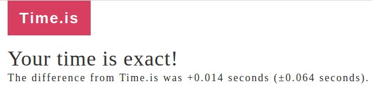

## Summary
- [Most asked questions](#most-asked-questions)
- [Backup, Restore and Files](#backup-restore-and-files)
- [Basic Operations, Configuration, and Synchronization](#basic-operations-configuration-and-synchronization)
- [CLI, Mining, and Networks](#cli-mining-and-networks)
- [Troubleshooting (Yelp!!!!11)](#troubleshooting-yelp11)
- [User Interface, Wallet and DApps](#user-interface-wallet-and-dapps)

## Most asked questions

### How to get Parity Ethereum in sync quickly?

The quickest way of syncing Parity Ethereum client with the top of the chain is achieved using Warp sync in combination with `warp-barrier`.

To make sure you get the most recent snapshot available and warp sync very close to the top of the chain, Parity Ethereum >=v1.10.1 supports the flag `--warp-barrier [NUM]`. Replace [NUM] with [the chain's latest block number](https://stats.parity.io/) **minus at least 10,000 blocks**. Example: if latest block number is 5,633,123 you should launch `parity --warp-barrier 5620000`.

Read more about [Warp sync (also called fastsync)](Warp-Sync-Snapshot-Format.md).

### What are the Parity Ethereum disk space needs and overall hardware requirements?

#### Full Node

Running a full node with the standard configuration for the Ethereum Mainnet requires a lot of computer resources. The blockchain download and validation process are particularly heavy on CPU and disk IO. It is therefore recommended to run a full node on a computer with multi-core CPU, 4GB RAM and an SSD drive and at least 100GB free space. Internet connection can also be a limiting factor. A decent DSL connection is required.

Computers using HDD are advised to run a [Light Node](#light-node).

#### Light Node

Running a light node using the flag `--light` does not require to download and perform validation of the whole blockchain. A light node relies on full node peers to receive block headers and verify transactions. It is therefore far less resource demanding than a full node.

A computer or mobile phone with single core CPU, 512MB RAM and an HDD with 128MB free space are recommended to run a light node.

#### Storage Requirements Overview

Indicative data storage requirement from May 2018 syncing Ethereum Mainnet (ETH) with Parity Ethereum 1.10.0 and Ubuntu 16.4 LTS, VPS instance with SSD backed storage:
```
Client / Mode                     | Block Number   | Disk Space | CLI flags                |
==================================|================|============|==========================|
parity light                      | 5_600_000      |  89M       | --light                  |
parity warp pruning fast -ancient | 5_600_000      |  20G       | --no-ancient-blocks      |
parity warp pruning fast          | 5_600_000      |  82G       |                          |
parity pruning fast               | 5_600_000      |  78G       | --no-warp                |
parity pruning fast fatdb trace   | 5_600_000      | 108G       | --fat-db on --tracing on |
parity pruning archive            | 5_600_000      | 1.1T       | --pruning archive        |
```

### How to use Parity Ethereum Chrome Extension to browse a Web3 website?

Using the [Parity Ethereum Chrome Extension](https://github.com/paritytech/parity-extension), you can browse web3 enabled website and use your Parity Ethereum accounts to send and sign transactions.
All you need is a Parity Ethereum local node running with the flag `--force-ui`, it should also be fully synced.

### The UI isn't working when I visit 127.0.0.1:8180

Since Parity Ethereum v1.10, the User Interface (UI) has been separated from the Parity Ethereum client. The browser UI has been disabled by default and totally removed from v2.0. You can now access the User Interface through an application called Parity UI. Please follow [these instructions](https://wiki.parity.io/Parity-Wallet) to download and use Parity Ethereum wallet using the Parity UI app. Please report any bug or unexpected behavior by [creating an issue in GitHub Parity UI repository](https://github.com/Parity-JS/shell/issues/new).
If you still want to use the browser UI (deprecated) using a version older than 2.0, you can launch Parity Ethereum with the flag `--force-ui` and visit 127.0.0.1:8180 in your favorite browser.

### What does Parity's command line output mean?

When running Parity Ethereum using the command line, a lot of information is displayed in the terminal. Here is a description of these logs.
#### While syncing the full node
Example: `2018-04-30 16:10:13 Syncing #5532478 9ce2…0499  69.28 blk/s  235.7 tx/s 15 Mgas/s 0+ 17 Qed #5532493 25/25 peers 5 MiB chain 128 MiB db 2 MiB queue 3 MiB sync RPC: 0 conn, 0 req/s, 0 µs`
- `2018-04-30 16:10:13`: timestamp of the log
- `Syncing #5532478`: block number currently processed
- `9ce2…0499`: block's hash
- `69.28`: average block(s) processed per second
- `235.7`: average transactions processed per second
- `15 Mgas/s`: million gas processed per second
- `0+`: unverified block queue size
- `17 Qed`: block queue size
- `#5532493`: highest block number seen on the network
- `25/25 peers`: number of active peers  / configured maximum number of peers
- `5 MiB db`: state database memory used
- `128 MiB chain`: blockchain cache info memory used
- `5 MiB queue`: queue memory used (contains information about the queued blocks)
- `3 MiB sync`: sync memory used (contains information about the connected peers, last imported block, etc.)
- `RPC 0 conn`: number of RPC connections to the node
- `0 req/s`: number of RPC request per seconds
- `0 µs`: average RPC roundtrip time for a single request

#### Imported blocks once the node is synced with the top of the chain
Example: `2018-05-02 12:33:23  Imported #3153278 28e4…9981 (12 txs, 3.19 Mgas, 6.84 ms, 12.40 KiB) + another 1 block(s) containing 5 tx(s)`
- `2018-05-02 12:33:23`: timestamp of the log
- `Imported #3153278`: block number received from peers
- `28e4…9981`: block's truncated hash
- `12 txs`: number of transactions in the block
- `3.19 Mgas`: million gas used in the imported block
- `6.84 ms`: the time it took to process the block
- `12.40 KiB`: block size
- `+ another 1 block(s) containing 5 tx(s)`: appears when 2 or more blocks are imported within 1 tick of informant (one line in the console) - In that particular example it means that 2 blocks were imported since last `Imported` line and the second had 5 transactions.

#### Verifying blocks after a warp sync
Example: `2018-05-11T15:25:27.225Z 2018-05-11 15:25:27 UTC     #40653   13/25 peers     37 MiB chain  182 MiB db  0 bytes queue   24 MiB sync  RPC:  0 conn,  0 req/s,   0 µs`

The Warp sync feature lets the node download a snapshot of the state of the blockchain at a block number close to the top of the chain. It allows the node to get in sync with the top of the chain quickly. Nevertheless, a full node needs to verify every block from the genesis. This process is done in parallel with the sync. This line starting with a block number means that the node is currently processing and verifying an older block.

- `#40653`: block number currently processed
- `13/25 peers`: number of active peers  / configured maximum number of peers
- `37 MiB db`: state database memory used
- `182 MiB chain`: blockchain cache info memory used
- `0 bytes queue`: queue memory used (contains information about the queued blocks)
- `24 MiB sync`: sync memory used (contains information about the connected peers, last imported block, etc.)
- `RPC 0 conn`: number of RPC connections to the node
- `0 req/s`: number of RPC request per seconds
- `0 µs`: average RPC roundtrip time for a single request

#### While syncing in light mode
Example: `2018-05-02 14:51:02  Syncing   #14677 aa97…42d2  1536.2 hdr/s      0+20139 Qed    9/50 peers   9 MiB cache 18 MiB queue  RPC:  0 conn,  0 req/s,   0 µs`
- `#14677`: block number currently processed
- `aa97…42d2`: header's truncated hash
- `1536.2 hdr/s` average number of processed headers per second
- `0+`: unverified header queue size
- `20139 Qed`: header queue size
- `9/50 peers`: number of active peers  / configured maximum number of peers
- `9 MiB cache`: blockchain cache info memory used
- `18 MiB queue`: queue memory used (contains information about the queued headers)
- `RPC 0 conn`: number of RPC connections to the node
- `0 req/s`: number of RPC request per seconds
- `0 µs`: average RPC roundtrip time for a single request

#### Once the node is synced with the top of the chain in light mode
Example: `2018-05-02 15:20:41  Imported #5543645 0x86ed…6288 (7.99 Mgas) + another 3 header(s)`
- `2018-05-02 15:20:41`: timestamp of the log
- `Imported #5543645`: header block number received from peers
- `0x86ed…6288`: header's truncated hash
- `(7.99 Mgas)`: million gas used in the imported block
- `+ another 3 header(s)`: appears when 2 or more headers are imported within 1 tick of informant (one line in the console) - In that particular example it means that 4 headers were imported since last `Imported` line

All other command line columns are described in full node logs above.


### How to contribute to this wiki documentation?

This Wiki is open source, anybody can contribute! If you spot an error, a typo, or feel like creating or amending some content, feel free to do so. Here is a quick how-to:

1. Visit [https://github.com/paritytech/wiki](https://github.com/paritytech/wiki) repository and click on `Fork` in the top right-hand corner.  

1. The Wiki will be cloned in your own repo, you will be redirected to https://github.com/your_handle/wiki
1. From here you can edit a page directly by clicking on a file and edit it (click on the pen on the top right-hand corner)
1. Once you are done editing, describe and commit your changes in your master branch  

1. You will now be able to submit a Pull Request (PR) to the Parity Ethereum Wiki repo.
1. Click on the `Pull Requests` and then on the `New Pull Request` button  

1. From here, you are able to select what branch of your repo should be merged to what branch on Parity Ethereum Wiki repo  

1. The default option will propose to merge from your master branch to the Parity Ethereum Wiki's master branch, which is fine.
1. Double check the modifications you made and click on `Create a Pull Request` when you are sure  
1. Describe your changes and submit it!

## Backup, Restore and Files

### Where can I find Parity's local files?

On Windows blockchain data is located in `C:\Users\You\AppData\Local\Parity\Ethereum`
while keys and configuration are kept in `C:\Users\You\AppData\Roaming\Parity\Ethereum`

On MacOS: `/Users/you/Library/Application Support/io.parity.ethereum`

On Linux: `/home/you/.local/share/io.parity.ethereum`

### How can I backup my accounts and keys? How can I restore my keys?

See [Backing-up-&-Restoring](Backing-up-&-Restoring.md).

### Can I import my keys from Geth?

They get imported automatically. :)

### Can I import accounts not created with Parity Ethereum or Geth (e.g., MyEtherWallet)?

- Simply use Parity Ethereum Wallet's "New Account" function on the "Accounts" page.

- Or complicated: copy it into your `$HOME/.local/share/io.parity.ethereum/keys` directory. Parity Ethereum will import all keys found there.

### How do I backup my blockchain?

You can just export it to a file:

```bash
parity export blocks $HOME/ethereum-chain-backup.rlp
```

### How do I restore my blockchain from a previous backup?

Just use `import`:
```bash
parity import $HOME/ethereum-chain-backup.rlp
```

### Can I import the chain from Geth?

Yes, see [Importing a Chain from Geth](Importing-a-Chain-from-Geth.md).

### How to delete the blockchain to initiate full re-sync without deleting wallet info?

- Stop Parity Ethereum, then execute `parity db kill`.
- Relevant options are `--chain=*` `--pruning=*` and `--db-path/--base-path`, i.e. to delete `kovan` run:

```bash
parity db kill --chain=kovan
```

## Basic Operations, Configuration, and Synchronization

### How do I run Parity?

After installing Parity, just run `parity` from the command line. See also [how do I configure Parity](#how-do-i-configure-parity) below

After building Parity Ethereum from source:

- On Windows run: `target/release/parity.exe`
- On MacOS and Linux run: `target/release/parity`

### How do I configure Parity?

You can configure your Parity Ethereum client by passing command-line flags to the executable. For usage instructions, see `parity --usage` and for a list of available flags, see `parity --help` or check out the [CLI Options here](https://wiki.parity.io/Configuring-Parity-Ethereum#cli-options).

In additoin, Parity Ethereum can be configured using a [TOML](https://github.com/toml-lang/toml) file. The file can be generated using the [Parity Ethereum Config Generator](https://paritytech.github.io/parity-config-generator/). To start Parity Ethereum with a config file, the file needs to be located in:

* Windows: `%UserProfile%\AppData\Roaming\Parity\Ethereum\config.toml`
* Linux: `~/.local/share/io.parity.ethereum/config.toml`
* macOS: `$HOME/Library/Application Support/io.parity.ethereum/config.toml`

To use a custom path run `$ parity --config path/to/config.toml`. Read more on [Parity Ethereum config file here](https://wiki.parity.io/Configuring-Parity-Ethereum#config-file).

### What are the security best practices?

- Prefer [personal_sendTransaction](https://wiki.parity.io/JSONRPC-personal-module#personal_sendtransaction) over unlockAccount or the `--unlock` CLI flag to securely send transactions without leaving an account unlocked.
- Do not use `all`/`0.0.0.0` for `--ws-interface`, `--ws-hosts`, `--ws-origins` and prefer a proper IP address/domain.
- Do not use `all`/`0.0.0.0` for `--jsonrpc-interface`, `--jsonrpc-hosts`, `--jsonrpc-origins` and prefer a proper IP address/domain.
- Do not use `*`/`all` for`--jsonrpc-cors`, `--ipfs-api-cors` and prefer a proper domain.
- Do not use `--unsafe-expose` on a production server.
- To access a server [SSH tunneling](Wallet-Remote-Access) is the way to go.
- Regular users should not use `--unlock`.
- Limit the `--jsonrpc-apis` if you don't need everything.
- Disable unused servers: `--no-ws` `--no-ipc`.

### What are the different Parity Ethereum synchronization and pruning modes?

Since Parity Ethereum v1.2, state-trie pruning is enabled by default (`--pruning fast`). You can disable it by setting the pruning method to `archive` which keeps all state trie data:

    --pruning METHOD               Configure pruning of the state/storage trie. METHOD
                                   may be one of auto, archive, fast:
                                   archive - keep all state trie data. No pruning.
                                   fast - maintain journal overlay. Fast but 50MB used.
                                   auto - use the method most recently synced or
                                   default to fast if none synced (default: auto).

To reduce the size of the kept pruning history, you can set the minimum number of recent states with the `--pruning-history` flag:

    --pruning-history NUM          Set a minimum number of recent states to keep when pruning
                                   is active. (default: 64).
    --pruning-memory MB            The ideal amount of memory in megabytes to use to store
                                   recent states. As many states as possible will be kept
                                   within this limit, and at least --pruning-history states
                                   will always be kept. (default: 32)


By default, 64 states are kept.

### What can I do when Parity Ethereum has trouble getting in sync?

Parity Ethereum is running but seems to remain at the same block for a long time.

1. Make sure you have the latest version of Parity.
2. Go to http://time.is/ and ensure it says "Your time is exact":

   

   If it isn't, get it synced. Your machine will not automatically do this; my machine is routinely 1-2 seconds out of sync which is enough to disrupt peer discovery.

3. Make sure your network does not block UDP traffic.
4. Remove your nodes file (`$HOME/.local/share/io.parity.ethereum/network/nodes.json`) while Parity Ethereum is not running.
5. Wait a bit longer.

If the problem persists, please run Parity Ethereum with `-l sync=trace` option for a while and post the output [here](https://github.com/paritytech/parity/issues/2447).

### Sync is stuck around block 2,421,000 or 2,675,000!?!

These blocks are quite heavy on the IO and take a long time to import, especially on machines with HDD. Consider using `--warp` or switching to SSD drive.

### How can I run Parity Ethereum in Docker?

Docker images for Parity Ethereum are available via [Docker Hub](Docker), i.e.:

```bash
docker pull ethcore/parity:beta
```

You can view the [Dockerfile here](https://github.com/paritytech/parity/blob/master/docker/ubuntu/Dockerfile).

### Can I run Parity Ethereum as a daemon or system service?

The versions installed with the **Windows** and **MacOS X** installers automatically configure and enable a system service.

To manually enable the system service for Parity Ethereum installed with **Homebrew**, run:

```bash
sudo launchctl enable io.parity.ethereum
sudo launchctl start io.parity.ethereum
```

To manually enable the system service for Parity Ethereum installed on **Linux**, get the [`parity.service` file](https://github.com/paritytech/parity/blob/master/scripts/parity.service) from GitHub.

```bash
sudo wget https://raw.githubusercontent.com/paritytech/parity/master/scripts/parity.service -O /etc/systemd/system/parity.service
sudo chmod +x /etc/systemd/system/parity.service
sudo systemctl enable parity
sudo systemctl start parity
```

To manually run Parity Ethereum in **daemon mode** in the background, run `parity daemon`.

### How can I stop a Parity Ethereum node cleanly?

If you run Parity Ethereum in a terminal, hitting `CTRL+C` will cleanly exit it. Make sure to wait a couple of seconds.

To stop Parity Ethereum started as system service, try to stop it with `systemctl` (Linux) or `launchctl` (MacOS):

```bash
sudo launchctl stop io.parity.ethereum
```

Another way is to issue a _hang-up_ (HUP) call for the Parity Ethereum client, i.e.:

```bash
killall -HUP parity
```

### How to launch Parity Ethereum using the command line on Windows?

1. Make sure you close Parity Ethereum and that no `parity` process is running (using <kbd>Ctrl</kbd> + <kbd>Alt</kbd> + <kbd>Esc</kbd>)
1. Navigate in Windows Explorer to the Parity Ethereum folder where parity.exe is, it should be located in `C:\Program Files\Parity Technologies\Parity`
1. Highlight the complete folder path in the top pane, type `cmd` and hit Enter

1. This opens a command line window in the Parity Ethereum folder, you can launch Parity Ethereum with [CLI flags](https://wiki.parity.io/Configuring-Parity-Ethereum.html#cli-options)

### How to launch Parity Ethereum using the command line on Mac OSX?

1. Make sure you close Parity Ethereum and that no `parity` process is running. ([See here how to kill a process](http://osxdaily.com/2012/03/02/force-quit-mac-apps/))
1. Press <kbd>CMD</kbd> + <kbd>Space</kbd> to open spotlight search
1. Type `terminal` and hit return to open Terminal app.
1. Type or paste `/Applications/Parity\ Ethereum.app/Contents/MacOS/parity` in the terminal, you can launch Parity Ethereum with [CLI flags](https://wiki.parity.io/Configuring-Parity-Ethereum.html#cli-options) if needed.

### How to generate a new hardcoded sync block for Parity Ethereum light client?

Parity Ethereum light client allows you to set a hardcoded block from which the light client will sync to reach the top of the chain faster. Note that this hardcoded block will only be used if no prior light database is found. Here is how you can generate the needed info to create a chain specifications file:
1. Run `parity --light` and make sure to reach the top of the chain.
1. Stop Parity Ethereum with `ctrl-c`.
1. Run `parity export-hardcoded-sync`.
1. Copy the output of the previous command using the field : `"hardcodedSync": { COPY_OUTPUT_HERE }` into your new [chain specifications](https://wiki.parity.io/Chain-specification.html) file.
1. Run the light client with your new specifications `parity --light --chain /path/to/your/new/specifications`

## CLI, Mining, and Networks

### How do I mine with Parity?

Parity Ethereum supports standard Ethereum JSON-RPC interface for mining ([eth_getWork](JSONRPC-eth-module.md#eth_getwork), [eth_submitWork](JSONRPC-eth-module.md#eth_submitwork) methods) and thus compatible with any miner which implements Ethereum Proof-of-Work.

First get a Parity Ethereum node up and running (either build yourself or install one of the packages; the [Setup](Setup.md) guide can help you). Next, you'll need to install your preferred miner. Read more on [Mining](Mining.md).

### Which chains are supported by Parity?

Parity Ethereum supports multiple public chain configurations:

    --chain CHAIN                  Specify the blockchain type. CHAIN may be either a
                                   JSON chain specification file or olympic, frontier,
                                   homestead, mainnet, morden, ropsten, classic, expanse,
                                   testnet, kovan or dev (default: homestead).

- [`mainnet`](https://github.com/paritytech/parity/blob/master/ethcore/res/ethereum/foundation.json) (default) main Ethereum network
- [`kovan` or `testnet`](https://github.com/paritytech/parity/blob/master/ethcore/res/ethereum/kovan.json) the [fast Ethereum test network](https://github.com/kovan-testnet/config)
- [`ropsten`](https://github.com/paritytech/parity/blob/master/ethcore/res/ethereum/ropsten.json) the old Ethereum test network
- [`classic`](https://github.com/paritytech/parity/blob/master/ethcore/res/ethereum/classic.json) Ethereum Classic network
- [`classic-testnet`](https://github.com/paritytech/parity/blob/master/ethcore/res/ethereum/morden.json) original Morden testnet and current Ethereum Classic testnet
- [`expanse`](https://github.com/paritytech/parity/blob/master/ethcore/res/ethereum/expanse.json) Expanse network
- [`dev`](https://github.com/paritytech/parity/blob/master/ethcore/res/instant_seal.json) a [Private development chain](https://wiki.parity.io/Private-development-chain.html) to be used locally, submitted transactions are inserted into blocks instantly without the need to mine
- [`Musicoin`](https://github.com/paritytech/parity/blob/master/ethcore/res/ethereum/musicoin.json) Musicoin network
- [`ellaism`](https://github.com/paritytech/parity/blob/master/ethcore/res/ethereum/ellaism.json) Ellaism network

See also [Chain specification](Chain-specification.md).

### What are the different consensus engines available for Parity?

- Ethash (Ethereum Proof-of-Work Engine), see [Ethash](https://github.com/ethereum/wiki/wiki/Ethash).
- Instant Seal (Development Engine), see [Private development chain](Private-development-chain.md).
- Aura (Proof-of-Authority Validator Engine), see [Aura](Aura.md).

### How do I get Ether for the Morden, Ropsten, or Kovan testnets?

- See [Morden and Ropsten Faucets](http://ethereum.stackexchange.com/q/84).
- See [Kovan Faucets](https://github.com/kovan-testnet/faucet).


### None of my JSONRPC requests work, they all fail with no output!?!

As a safeguard against a certain type of attack, Parity Ethereum requires you to use a special content type. Just add `-H "Content-Type: application/json"` to your `curl` command.

### When I start Parity Ethereum with the 'homestead_test.json' I get a 0 blocks chain, and mining never seals a block!?!

`homestead_test.json` is a file meant for testing on a chain very similar to the Homestead chain. As such it is of equivalent (substantial) difficulty to mine on it. Rather what you need is something of minimal mining difficulty, like Morden. See more instructions [here](Private-chains.md).

### Why do my transactions not get mined?

Your gas price is probably too low. Try increasing the gas price to 20Gwei by appending `, gasPrice: 20000000000` into your transaction spec or `sendTransaction` options.

### All my 'eth_sendTransaction' calls only return '0x00000000...00000000' as return value!?!

You're probably trying to send from a locked account. Ensure you use the `--unlock` (to specify which accounts to unlock) and `--password` (to pass in the file contain any passwords needed to unlock those accounts) so that the accounts from which you're sending the transaction are unlocked.

### I've received an abuse message from my ISP/hosting provider. Something about malicious activity triggered by Parity.

See [Network Configuration](https://wiki.parity.io/Network-Configuration) for some tips on how to configure Parity Ethereum to behave.

## Troubleshooting (Yelp!!!!11)

### Double-clicking the Parity Ethereum icon doesn't do anything!?!

Probably your node is already running (or another node is running, i.e., Geth) and another instance of Parity Ethereum cannot be launched with the same configuration (ports, dapps, web interface, etc.).

### How can I make Parity Ethereum to write logs?

You can control the logging level with `-l` and define a `--log_file` location:

```bash
  -l --logging LOGGING           Specify the general logging level (error, warn, info, debug or trace).
                                 It can also be set for a specific module. Example: '-l sync=debug, rpc=trace'.
  --log-file FILENAME            Specify a filename into which logging should be
                                 appended. (default: None)
```
LOGGING accepts the following modules:
`account_bloom`,`basicauthority`,`blockchain`,`chain`,`client`,`cull`,`dapps`,`discovery`,`diskmap`,`enact`,`engine`,`estimate_gas`,`ethash`,`evm`,`executive`,`ext`,`externalities`,`external_tx`,`fatdb`,`fetch`,`finality`,`hw`,`hypervisor`,`import`,`jdb`,`jdb.fine`,`jdb.ops`,`journaldb`,`jsontests`,`les`,`light_fetch`,`local_store`,`migration`,`miner`,`mode`,`network`,`on_demand`,`own_tx`,`parity_whisper`,`perf`,`pip`,`pip_provider`,`poa`,`pubsub`,`rcdb`,`reorg`,`rpc`,`rpc-client`,`secretstore`,`secretstore_net`,`shutdown`,`signer`,`snapshot`,`snapshot_io`,`snapshot_watcher`,`spec`,`state`,`stats`,`stratum`,`sync`,`trace`,`tx`,`tx_filter`,`txpool`,`txqueue`,`updater`,`verification`,`warp`,`wasm`,`whisper`,`whisper-cli`

Additionally, a logging level can  be set per module:
`info`, `debug`, `trace` (default if no level is specified for a module)

Examples:
- `-l sync=debug` prints the debug level logs for the sync module only.
- `-l sync,snapshot,txqueue` prints the logs for sync, snapshot, and txqueue with trace level.
- `-l sync=info,snapshot=debug,txqueue=trace` prints the info level logs for the sync module, the debug level of logs for the snapshot module etc.

Note that the info logging level of all modules will always be printed, equivalent to `-l info`.

See also: [How to make Parity Ethereum write logs](http://ethereum.stackexchange.com/questions/3331/how-to-make-parity-write-logs)?

### Where are the logs when Parity Ethereum runs in daemon mode?

Use

```bash
parity daemon --log-file /path/to/parity.log
```

See also: [Where are the Parity Ethereum log files in daemon mode](http://ethereum.stackexchange.com/questions/11363/where-are-the-parity-log-files-in-daemon-mode)?


### Parity Ethereum doesn't start on Windows, and fails with 'api-ms-win-crt-math-l1-1-0.dll' missing!?!


Install the following windows update: https://support.microsoft.com/en-us/kb/2999226

### Parity Ethereum uses 100% of disk I/O during sync

Parity Ethereum is a disk IO intensive application. By default, your system will allow it to block other programs to access the disk while it's reading and writing. On Linux, you can use [`ionice`](https://linux.die.net/man/1/ionice), and newer versions of Windows should allow you to navigate to the process (named "parity.exe") in Task Manager, right click, open the "Process priority" sub-menu and select "Background". If this menu doesn't appear, you may need to select "More details" at the bottom of the window. A WikiHow article with a description of this process on Windows 7 can be found [here](http://www.wikihow.com/Change-Process-Priorities-in-Windows-Task-Manager), and the process is much the same for newer versions of Windows.

### How can I report an issue with Parity?

If you have any urgent matters, get in [touch with us on Gitter](https://gitter.im/paritytech/Parity). If you run into issues with Parity, please consider [creating a ticket on Github](https://github.com/paritytech/Parity/issues/new).

## User Interface, Wallet and DApps

### How can I access the Parity Ethereum Wallet?

Since Parity Ethereum v1.10, the Parity Ethereum Wallet is accessible within Parity UI app.
Please follow [these instructions](Parity-Wallet.md)

### Can I use Mist with Parity?

Yes, run `parity --geth` in Geth-compatibility mode. This sets the IPC path to be the same as Geth's and allows Mist to connect to Parity. See also [Using Parity Ethereum with Mist](Using-Parity-with-Mist.md).

### Can I send Bitcoin to my Parity Ethereum wallet?

No, sending Bitcoin directly to an Ethereum address does not work. However, you can use the Shapeshift integration. Open an account on your wallet and click the blue fox icon.


### Can I create multi-signature wallets with Parity?

No, Parity Ethereum only allows watching wallets and interact with them (view and sign transactions, send funds..). It does not allow to create multi-sig wallets. To watch a multi-sig wallet within Parity UI, [follow these instructions](https://wiki.parity.io/Accounts%2C-Wallets%2C-Vaults#wallets).

### How can I compile and deploy contracts with Parity?

Open your Parity UI and navigate to the _'Contracts'_ tab, it allows you to write, compile and directly deploy contracts on the selected chain.


### What DApps are available for Parity?

Parity UI comes with a couple of builtin DApps:

- **Method registry**: A registry of method signatures for lookups on transactions.
- **Registry**: A global registry of addresses on the network.
- **Token Deployment**: Deploy new basic tokens that you are able to send around.
- **Token Registry**: A registry of transactable tokens on the network.
- **TX-Queue Viewer**: Have a peak on the internals of transaction queue of your node.

Additional DApps can be added, see [Writing Dapps for Parity](Development-Overview.md).

### How can I write a DApp for Parity?

Head over to the excellent [DApp Tutorial](Tutorial-Part-1.md) documentation. It walks you through making a simple Ethereum-powered, distributed app. By the end of it, you'll be able to head into Parity, select your Dapp and see it in action.

### Does Parity Ethereum support the Swarm and Whisper sub-protocols?

Currently, Parity Ethereum does neither support Swarm nor Whisper sub-protocols. However, [Whisper Support](https://github.com/paritytech/parity/issues/4685) is on the road-map.

### How to connect Parity UI to a node on my network?

You can specify the WebSocket IP and port that Parity UI should use to connect to a node. To do so, launch `parity-ui` with the following flags:
```bash
    --ws-interface=[IP]
        Specify the hostname portion of the WebSockets server
        Parity UI will connect to. IP should be an
        interface's IP address. (default: 127.0.0.1)

    --ws-port=[PORT]
        Specify the port portion of the WebSockets
        server Parity UI will connect to. (default: 8546)
```

### How to customize Parity UI?

In dev mode:
- Fork `https://github.com/parity-js/shell` and make your modifications to the UI
- `npm start`
- Run node with --ui-no-validation
- Visit `localhost:3000`, the page should refresh on file changes.
- (optional) Commit your changes, and submit a PR!

In local prod mode:
- Fork `https://github.com/parity-js/shell` and make your modifications to the UI
- Push your changes, copy the latest commit reference
- Clone/Fork `https://github.com/paritytech/parity`, and in `./dapps/ui/Cargo.toml` modify the line `parity-ui-dev = { ... }` to point to your forked repo and commit reference
- Run `cargo update -p parity-ui` to update Cargo.lock
- `cargo build --release --no-default-features --features ui`
- Run Parity Ethereum, visit localhost:8180.

Dev mode should be used as much as possible since it allows fast iterations. Local prod mode is only used when you want the UI changes to be bundled into your Parity Ethereum when `cargo build`ing it.


## Building, Installing and Testing


### Are there any installers available?

Yes, there are also experimental installers for MacOS X and Windows which will install Parity Ethereum as a system service. Parity Ethereum will always run in the background and hibernate when not being used with the bundled wallet.

You can download the latest versions from the [releases page on GitHub](https://github.com/paritytech/parity/releases).

### Where can I find official releases?

You can download the latest versions from the [releases page on GitHub](https://github.com/paritytech/parity/releases). :)

Make sure you check the `md5sum`, on your command-line, type

```bash
md5sum parity_1.5.7_amd64.deb
```

and compare the output with the provided checksum at the [releases page on GitHub](https://github.com/paritytech/parity/releases).

```bash
d8fbd5f71b5b436e1a45d7359e26bc0c  parity_1.5.7_amd64.deb
```

### Are builds for ARM devices available (i.e., Raspberry Pi)?

There are builds for ARMhf (ARMv7) and ARM64 on our releases page on GitHub.

In addition, The [EthRaspbian](https://github.com/diglos/pi-gen) project provides Debian-flavored images for the Raspberry Pi which includes Parity Ethereum as default client. In addition, the [EthArmbian](https://github.com/diglos/userpatches) project supports Odroid C2 devices.

### What is the difference between stable and beta releases?

Stable releases are the most tested and will not get any new features. It is the version that we recommend to most users in a production environment.

Beta releases will be augmented with new features between the different releases which often require more dedicated long-term testing and could have a couple of issues. If you run into issues with Parity, please consider [creating a ticket on Github](https://github.com/paritytech/Parity/issues/new).

### How do I install Parity Ethereum after building?

- On Windows: `copy target/release/parity.exe C:/Windows`
- On Mac/Linux: `cp -f target/release/parity /usr/local/bin`

### How do I update Parity?

Latest versions of Parity Ethereum contain an auto-update feature, which makes sure your client is always updated to the latest version. You can disable the auto-update feature by running Parity Ethereum with the `--no-download` flag.

If you use older versions of Parity Ethereum or want to manually upgrade, simply follow the instructions above to download (or build) and install. The new version will replace the old. Nothing additional is needed.

### I'm getting build errors, what can I do?

Make sure you are using the latest stable rust compiler. Update with `rustup update` when using rustup or `multirust update` when using multirust.

### I'm trying to build but get 'libudev' or 'libssl' errors!?!

Install required packages `libudev-dev` and `libssl-dev`.

### The one-line installer fails with "SSL peer handshake failed" on macOS!?

If you encounter error `curl: (35) SSL peer handshake failed, the server most likely requires a client certificate to connect` then run the following commands prior to the one-liner mentioned above. These commands will install and update your OpenSSL and Curl sym-links and reload your shell session for secure communication:

```bash
# update Homebrew
$ brew update

# upgrade OpenSSL and update symlinks
$ brew upgrade openssl
$ brew link openssl --force

# install cURL and update symlinks
$ brew install --with-openssl curl
$ brew link curl --force

# reload shell session
$ source ~/.bash_profile

# show location of binaries and the current version
$ which curl && which openssl && curl --version
```

### I'm trying to build on Windows but I get 'link failed' errors mentioning 'kernel32.lib'!?!

Make sure you have set up your 64-bit variables in the build shell before issuing `cargo build`:

````
"C:\Program Files (x86)\Microsoft Visual Studio 14.0\VC\bin\amd64\vcvars64.bat"
````

### How can I cross-build Parity Ethereum for other platforms (e.g., ARM)?

See the documentation for [docker build for ARM](https://github.com/paritytech/parity-snappy/wiki/Docker-build-for-ARM-ARM64).

### How can I build and run tests?

First, make sure you have the cross-client consensus tests installed:

```
git submodule init
git submodule update
```

Then you just run `./test.sh`. You can run individual tests with `cargo test -p <package-name>`.

### I just scrolled all the way down here and didn't find what I'm looking for!?!

Get in [touch with us on Gitter](https://gitter.im/paritytech/Parity). If you run into issues with Parity, please consider [creating a ticket on Github](https://github.com/paritytech/Parity/issues/new) or [here](https://github.com/parity-js/shell/issues/new) for Parity UI.
