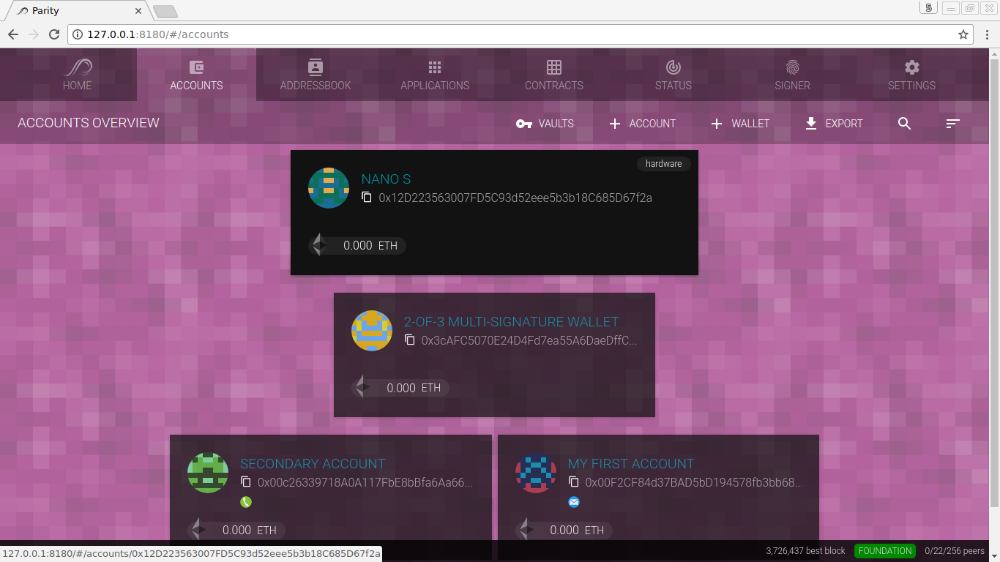

The **Ledger Nano S** by [Ledger](https://www.ledgerwallet.com/) is a hardware wallet supporting Ethereum, Ethereum Classic, as well as other assets and crypto-currencies. It's based on robust safety features for storing cryptographic assets and securing digital payments. It connects to any computer via USB running a Parity Wallet and enables using the account to sign transactions.

### Connecting the Nano S with Parity

Once you plugged-in your Ledger Nano S to your computer, it will usually auto-detect your account and make it available in your Parity Wallet if you mind the following steps:

1. Make sure you have the latest Nano S firmware installed on your device (>= 1.3.1).
1. Make sure you have the latest Ethereum application installed on your device (>= 1.0.8).
1. Plug-in your Nano S to your computer.
1. Unlock your device.
1. Enter the Ethereum application on the Nano S.
1. Make sure the _Browser Mode_ is deactivated in your Ethereum settings on the device.

It should be auto-detected and show up in your accounts list within 5 seconds. It shows a colorful icon while connected or gray icon while disconnected. Now you should be able to transact with the account anywhere you can use an account. The signer will ask you to sign on the device itself.

