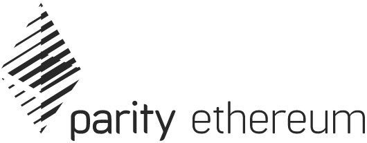

## The fastest and most advanced Ethereum client.

[Download the latest release](https://github.com/paritytech/parity-ethereum/releases/latest)

**Built for mission-critical use**: Miners, service providers, and exchanges need fast synchronisation and maximum uptime. Parity Ethereum provides the core infrastructure essential for speedy and reliable services.

- Clean, modular codebase for easy customisation
- Advanced CLI-based client
- Minimal memory and storage footprint
- Synchronise in hours, not days with Warp Sync
- Modular for light integration into your service or product

## Technical Overview

Parity Ethereum's goal is to be the fastest, lightest, and most secure Ethereum client. We are developing Parity Ethereum using the sophisticated and cutting-edge **Rust programming language**. Parity Ethereum is licensed under the GPLv3 and can be used for all your Ethereum needs.

By default, Parity Ethereum runs a JSON-RPC HTTP server on port `:8545` and a Web-Sockets server on port `:8546`. This is fully configurable and supports a number of APIs.

Some help:
- If you want to get a node up and running with Parity Ethereum, see the [Setup](Setup) guide.
- Frequently asked questions are answered on the [FAQ](FAQ).
- If you're interested in mining with Parity Ethereum, see the [Mining](Mining) guide.
- If you'd like to use the JSON-RPC interface with Parity, see the [JSON-RPC](JSONRPC) guide.
- For [Private chains](Private-chains) and [Proof of Authority Chains](Proof-of-Authority-Chains), you might find the [Chain specification](Chain-specification) useful.
- If you're interested in hacking on the Parity code base see the [Coding guide](Coding-guide).

