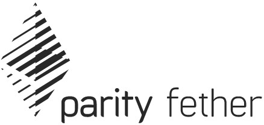

Parity Fether is a fast and decentralised wallet based on Parity Ethereum light-client.

## [» Download the latest release «](https://github.com/paritytech/fether/releases)

---

## About Parity Fether

Parity Fether aims to be the lightest and simplest decentralized wallet. It supports Ether and ERC-20 tokens.It runs on top of [Parity Ethereum](https://github.com/paritytech/parity-ethereum) light client. This allows smooth synchronization and interaction with the Ethereum blockchain, in a decentralized manner.

By default, Parity Fether beta version runs on the Kovan test network. You can receive free Kovan Ether by posting your address in the [Kovan Faucet](https://gitter.im/kovan-testnet/faucet) Gitter channel. Fether will download and launch Parity Ethereum node at startup if it's not found on the computer. You can also separately launch your Ethereum client, Fether will automatically connect to it.

As of v0.2 Fether supports Parity Signer. This lets you add another level of security to your funds. You can keep your private keys on an offline phone that is dedicated to Parity Signer and let Fether broadcast signed transactions. Not only will your private key never be exposed to the dark side of the internet, but the transaction that it signed will be sent in a decentralized manner using a light client! [Here is a tutorial](Parity-Signer-Mobile-App-Fether-tutorial) to get you started. We think we’ve made this process easy, but if you encounter bumps on the way, please let us know.

Parity Fether connects to the light node using [`@parity/light.js`](https://github.com/paritytech/js-libs/tree/master/packages/light.js), a Javascript library specifically crafted for wallets to connect with light clients. 

Parity Fether is licensed under the BSD 3-Clause, and can be used for all your Ethereum needs.

If you run into problems while using Parity Fether, please [file an issue](https://github.com/paritytech/fether/issues/new) in Fether repository, hop on our [Gitter](https://gitter.im/paritytech/fether) or [Riot](https://riot.im/app/#/group/+parity:matrix.parity.io) chat room to get support. We are glad to help! **For security-critical issues**, please refer to the security policy outlined in [SECURITY.md](https://github.com/paritytech/parity/blob/master/SECURITY.md).

## Building instructions

Find more information about how to build Fether from the source code here: https://github.com/paritytech/fether