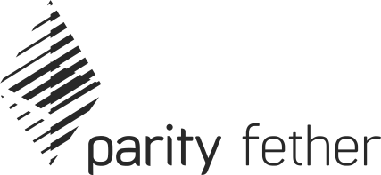

Parity Fether is a fast and decentralised wallet based on Parity Ethereum light-client.

[» Download the latest release «](https://github.com/paritytech/fether/releases)

Fether aims to be the lightest and simplest decentralised wallet. It supports Ether and ERC-20 tokens and runs on top of [Parity Ethereum](https://github.com/paritytech/parity) light client allowing smooth synchronisation and interaction with the Ethereum blockchain, in a decentralised manner.

By default, Parity Fether alpha runs on the Kovan test network. You can receive free Kovan Ether by posting your address in the [Kovan Faucet](https://gitter.im/kovan-testnet/faucet) Gitter channel. Fether will download and launch Parity Ethereum node at startup if it's not found on the computer. You can also separately launch your Ethereum client, and Fether will automatically connect to it.

If you run into problems while using Parity Fether, feel free to file an issue in this repository or hop on our [Gitter](https://gitter.im/paritytech/parity) or [Riot](https://riot.im/app/#/group/+parity:matrix.parity.io) chat room to ask a question. We are glad to help! **For security-critical issues**, please refer to the security policy outlined in [SECURITY.md](https://github.com/paritytech/parity/blob/master/SECURITY.md).

Parity Fether connects to the light node using light.js, a Javascript library specifically crafted for Wallets to connect with light clients. It is licensed under the BSD 3-Clause and can be used for all your Ethereum needs.

## Passing Parity Ethereum flags

You can pass specific flags for Fether to launch the underlying Parity Ethereum with:
```bash
# Launch Parity Ethereum light client on Ropsten and connect Fether to it
$ /path/to/fether --chain ropsten --light
```
## Separately launch Parity Ethereum node

You can launch Parity Ethereum before Fether:
```bash
$ parity --chain ropsten --light
```
In another console launch Fether:
```bash
# Fether will connect to the running node
$ /path/to/fether
```

## Join the chat!

Get in touch with us on Gitter:
[](https://gitter.im/paritytech/fether)


Official website: [https://parity.io](https://parity.io)

## Launch using the binaries
### Linux
```bash
wget https://github.com/paritytech/fether/releases/download/v0.1.0-alpha2/fether-0.1.0.tar.xz
tar -xf fether-0.1.0.tar.xz 
cd fether-0.1.0/
./fether
```


## Build from sources

```bash
git clone https://github.com/paritytech/fether
cd ./fether
yarn install
```

### Dependencies
Make sure you have at least `yarn` version 1.4.2

```bash
yarn --version // Should be at least 1.4.2
```
### Clone this repo

```bash
git clone https://github.com/paritytech/fether
cd ./fether
yarn install
```

### Build this repo and run

```bash
yarn electron
```

### Build binaries

```bash
yarn package
```

### Run with live reload for development

```bash
yarn start
```
