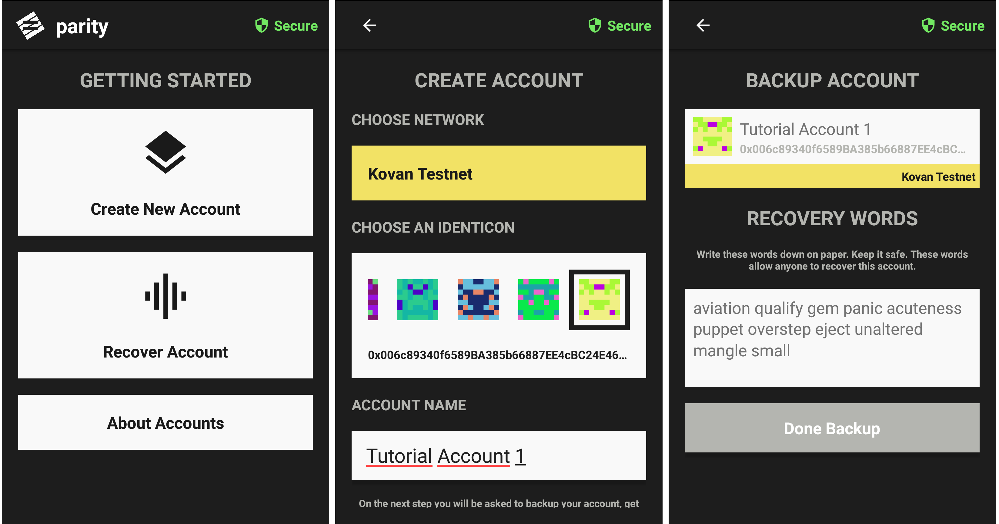
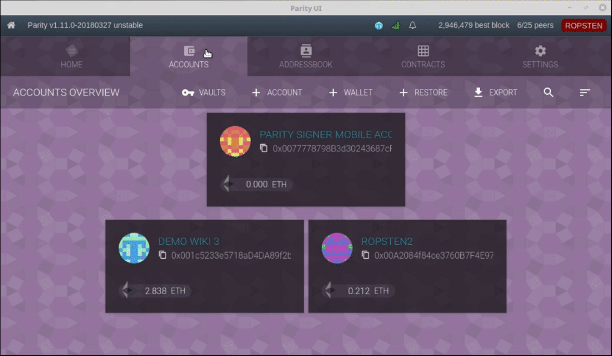
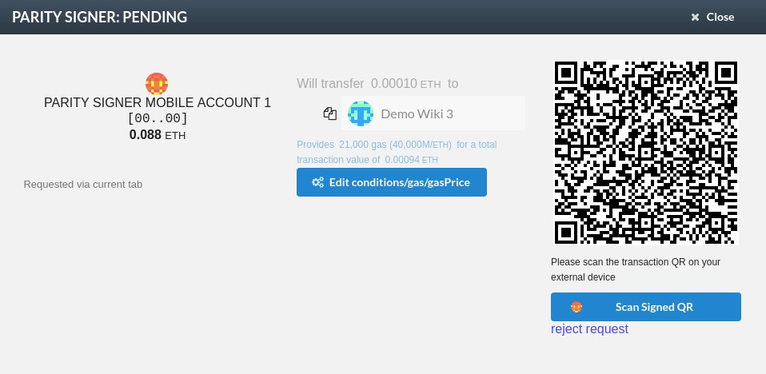
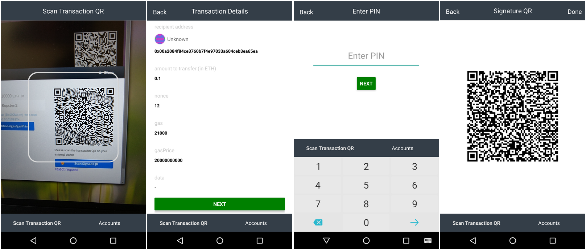

# Parity Signer Mobile App tutorial with Parity Wallet

Parity Signer Mobile App can be used to securely create accounts using an offline mobile device. Being offline has the great advantage to keep the device (and your private keys) away from online related threats. The app also allows you to sign transaction offline using a QR code. [Parity Wallet](https://wiki.parity.io/Parity-Wallet) on the other side allows you to watch an account from your computer without having its private key. It means that it can show its balance but will require you to use the Parity Signer Mobile App to sign a transaction before being able to send funds from this account.
This tutorial will walk through setting up an account with Parity Signer Android or iOs App, attach it to [Parity Wallet](https://wiki.parity.io/Parity-Wallet) and  **sign a transaction offline** to transfer Ether from one account to another.

## Summary
- [1. Get Parity Signer Mobile App](#1-get-parity-signer-mobile-app)
- [2. Setup or recover an account](#2-setup-or-recover-an-account)
  - [Create an account](#create-an-account)
  - [Recover an account with your recovery phrase](#recover-an-account)
- [3. Attach a Parity Signer Mobile App account to Parity Wallet](#3-attach-a-parity-signer-mobile-app-account-to-parity-wallet)
- [4. Send funds from another account to your Parity Signer Mobile App account](#4-send-funds-from-another-account-to-your-Parity-Signer-Mobile-App-account)
- [5. Sign a transaction on Parity Wallet](#5-sign-a-transaction-on-parity-wallet)

## 1. Get Parity Signer Mobile App
Get a Smartphone and install the Parity Signer Mobile App making sure that it originated from **Parity Technologies**
- [Android](https://play.google.com/store/apps/details?id=com.nativesigner)
- [iOs](https://itunes.apple.com/us/app/parity-signer/id1218174838)

## 2. Setup or recover an account
When launching the app for the first time, no account has been set up yet. At this stage, you will either want to create an account directly from your mobile device or recover an account already created in with Parity Signer Mobile App or [Parity Wallet](https://wiki.parity.io/Parity-Wallet) (Desktop)
 
### Create an account
 
Click on `Create account` or `Add` in the top right corner, you will be asked to select an image for your account.

In the next step, you will be presented your newly created address with your recovery phrase.
**Write this recovery phrase down and store it in a safe place**.
If your phone gets stolen/broken/forgotten this will be the only way to recover your funds.

You will then be able to enter a pin number of your choice. This pin will be needed later on to sign a transaction.

### Recover an account with your recovery phrase

If you already created an account using either Parity Signer Mobile App or Parity Ethereum Client and you wish to recover it, you will want to:
- Click on `Create account` or `Add` in the top right-hand corner.
- Select an image.
- Replace the given recovery phrase manually with the one from the account you want to recover.
- Set up a pin code.

## 3. Attach a Parity Signer Mobile App account to Parity Wallet

Follow [these steps](https://wiki.parity.io/Parity-Wallet) to install and launch Parity Wallet.
Once Parity Ethereum Client is running and fully synced, you will be able to watch the account previously created on your mobile device. To do so, you need to:
- Navigate on your computer in Parity UI to `Parity Wallet>Accounts`.
- Click on `+Account`.
- Select `External account` then `Next`, your webcam will be turned on.
- On your mobile phone, select the account you wish to watch.
- Make sure the QR code is fully displayed on your mobile screen and face it to your webcam.
- Parity Wallet will read the QR code and ask for a name and description for the account.
- Once done, click on `Import` then `Done`
- If your Parity Ethereum Client is Synchronized, the current balance of your account will be displayed.

## 4. Send funds from another account to your Parity Signer Mobile App account

Your account is now created on your offline mobile device, you can watch it on your computer with Parity Wallet, but it has no funds yet. We will now send Ether from another account to your Parity Signer Mobile App account. This can be achieved entirely using Parity Wallet on your computer. To do so:

- On your computer on Parity UI, navigate to Parity Wallet>Accounts.
- Select the account that contains Ether and you wish to send Ether from.
- Click on `Transfer`.
- Select the Parity Signer Mobile Account as the receiver and the amount of Ether you wish to send.
- Click `Send`.
- Enter your Parity Wallet password for the sender account.
- Wait a couple seconds for the transaction to get mined.

## 5. Sign a transaction on Parity Wallet

Now that we have funds on your freshly created Parity Signer Mobile App account, you will be able to transfer these to any Ethereum address of your choice without transferring your private key onto your computer, and without needing any internet connection on your mobile phone.

To do so :
- On your computer, in Parity UI, navigate to Parity Wallet>Accounts and select the Parity Signer Mobile App account we added previously.
- Click on `Transfer`.
- Type the address or select the account you wish to send Ether to and the amount.
- Click `Send`.
- Parity UI will now display a QR code, this is the transaction that needs to be signed using the Parity Signer Mobile App.

The following steps need to be performed on your mobile device :
- On Parity Signer Mobile App, click on `Scan Transaction QR`.
- Scan the QR code displayed by Parity Wallet on your computer screen.
- On Parity Signer Mobile App, review carefully the transaction addresses and the amount to send, they must match with what you've entered in Parity Wallet, in case of pishing, this is where you can realize and reject the transaction.
- Once you're sure that the transaction is correct, scroll down and click `Next` to enter your pin.
- A signed transaction QR code will be displayed on your mobile screen.

Your phone has now *signed the transaction offline*. The QR code that is now displayed on your phone represents a signed transaction. We will broadcast it in these last steps:
- From Parity Wallet on your computer, click on `Scan Signed QR`
- Face your phone's display to your webcam for Parity Wallet to be able to read the signed transaction QR code.
- Verify one last time that the account addresses are correct as well as the transfer amount.
- Click on `Send` on Parity Wallet from your computer.
- Congrats you just sent Ether from an air-gapped account :)

