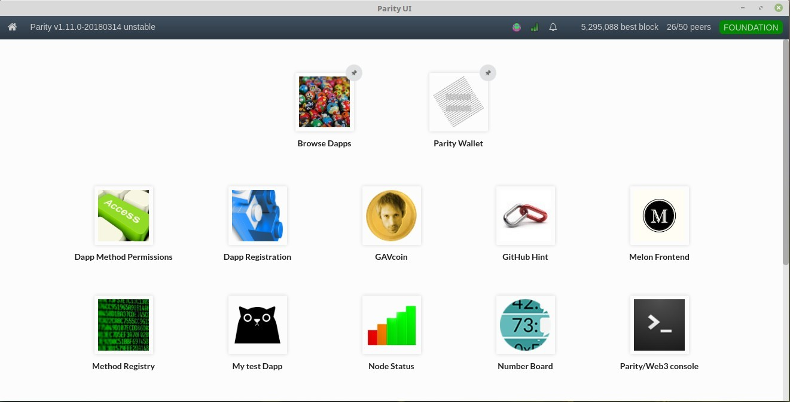
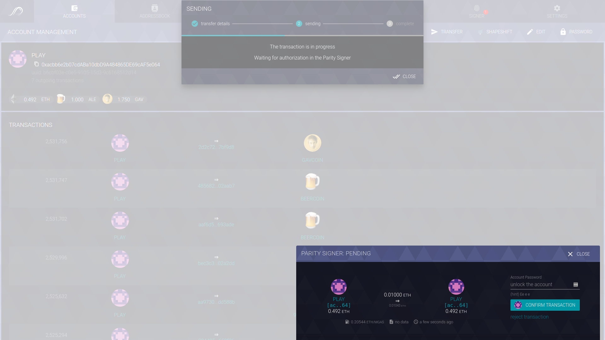

Parity Wallet is designed to integrate seamlessly with all standard Ethereum based tokens as well as Ether itself.
It is accessible in the Parity User Interface - [Parity UI](https://github.com/Parity-JS/shell/releases).
Starting from Parity v1.10, [Parity Ethereum client](https://github.com/paritytech/parity/releases) has been separated from the Parity User Interface (UI). The user interface previously accessible from the browser in versions <=1.9 is now released as a standalone app.

To access Parity Wallet, you need to :
* download and install Parity Ethereum client from the [release page](https://github.com/paritytech/parity/releases) or [build it](https://wiki.parity.io/Setup)
* download and install [Parity UI](https://github.com/Parity-JS/shell/releases)
* launch Parity UI

From here, you can access Parity Wallet by clicking on `Parity Wallet`. You will then be able manage accounts, create transactions, watch contracts and interact with DApps from the `Account` section.

## Secure Transaction Signer
The Secure Transaction Signer is a core piece of technology which ensures that no transaction can be sent from your accounts without your explicit approval. This means that you can interact with DApps without fear that they might attempt to drain your accounts. 

When a transaction request is made, you'll have to use the Signer UI to authenticate the request before the transaction can be signed relayed to the network. This is made to be as seamless as possible, and you can rest easy knowing your Ether is protected.

Here's a picture of it in action:

One more thing: see the purple-ish background? Every person's UI has its own unique, procedurally-generated background. This means that it's impossible for another site to pretend to be your signer. You get to choose your background from a selection of unique candidates whenever you'd like, so you can always find one you enjoy.
