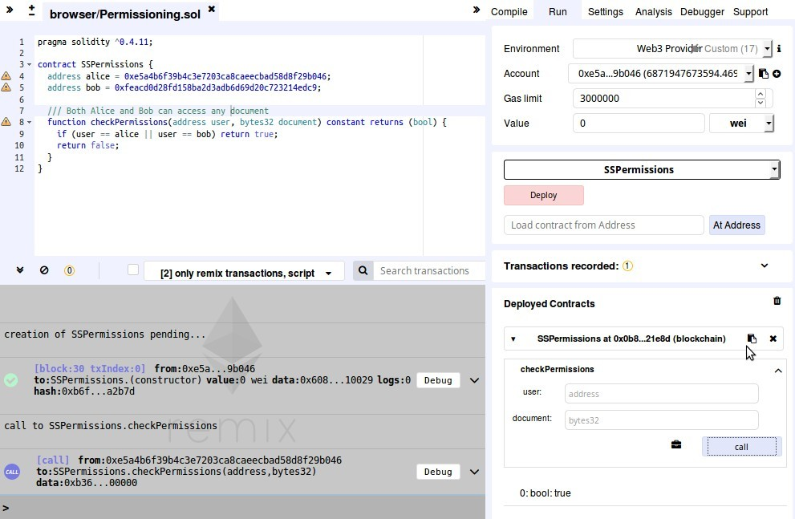

In this part, we will deploy a permissioning contract that will be used for the Secret Store to know which account is allowed to access the decryption keys. It is very similar to the [Part 4 of the Secret Store tutorial](Secret-Store-Tutorial-4#3-create-and-deploy-a-permissioning-contract).

In fact, the only difference is the code of the contract.

## 1. Deploying a permissioning contract

In the rest of the tutorial, we will use the following permissioning contract, which allows Bob or Alice to access the decryption key from the secret store.
Here is the contract code that we will use: 
```solidity
pragma solidity ^0.4.11;

contract SSPermissions {
  address alice = 0xe5a4b6f39b4c3e7203ca8caeecbad58d8f29b046;
  address bob = 0xfeacd0d28fd158ba2d3adb6d69d20c723214edc9;

  /// Both Alice and Bob can access any document
  function checkPermissions(address user, bytes32 document) constant returns (bool) {
    if (user == alice || user == bob) return true;
    return false;
  }
}
```

This contract is voluntarily open in regards to the `document` parameter, as we do not know the document id yet. Therefore, Bob and Alice are given access to the decryption key, regardless of what document is requested.

To deploy the contract, head to [http://remix.ethereum.org](http://remix.ethereum.org).

- In Remix, create a new file by clicking the `+` at the top left.
- Name it as you wish and paste the code of the contract.
- Make sure to edit it to use your own addresses.
- On the right side select the tab `Run`.
- Make sure you have a node running with `alice.toml`.
- Select in the Environment drop-down menu `Web3 provider`.
- Use the default "http://localhost:8545" as it is the port selected in `alice.toml`.
- Select Alice's account in the next drop-down.
- Click Deploy.



- On the right side, you will be given the address of the contract that you can copy.
- You can also test your contract right away, in the screenshot above, I verified that Alice could access the key.

## 2. Update the Secret Store configuration files

Now that we have the contract deployed on the blockchain, we can specify it in the Secret Store nodes.  
Add/modify the `acl_contract` parameter of the `[secretstore]` section of each Secret Store node (`ss1.toml`, `ss2.toml`, `ss3.toml`) as follow:  
`acl_contract = "7aC9F71b22CC080BB71bf47b402d6aE71d8C2c0c"`  
  
The full configuration files are accessible in [this repository](https://github.com/Tbaut/Private-Transations-Tutorial-files/tree/master/config).


|[ ← Part 1 - Configuring each node ](Private-Transactions-Tutorial-1.md)| [ Part 3 - Private contract deployment → ](Private-Transactions-Tutorial-3.md)|
