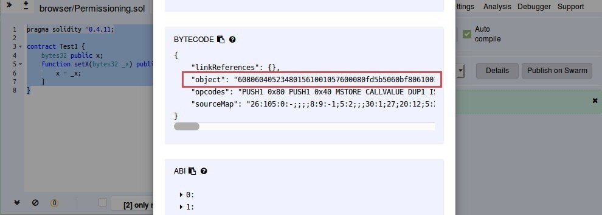
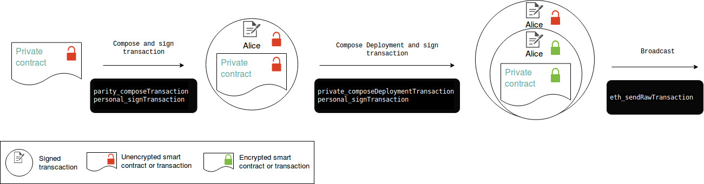

In this part, we will deploy the private contract. In other words, we will encrypt a contract and deploy a public contract that contains the state of our private contract.

## 1. Get the private contract's bytecode

To keep things as simple as possible, we will use the following very basic private contract:
```Solidity
pragma solidity ^0.4.11;

contract Test1 { 
    bytes32 public x; 
    function setX(bytes32 _x) public { 
        x = _x; 
    }
}
```

All this contract does is store a variable `x`, that can be set using the `setX()` function.

We need to get the bytecode of this contract. Now for simplification purpose, we will use Remix. If this contract is sensitive, you should consider using a local tool rather than pasting your code on a website that can be compromised.
- Head to [http://remix.ethereum.org](http://remix.ethereum.org).
- create a new file by clicking the `+` at the top left.
- Name it as you wish and paste the code of the contract.
- On the right-hand side, click on "details".
- In the "Bytecode" section, the `object` field is what we need to copy.



If you use the same sample contract, the bytecode is the following: `608060405234801561001057600080fd5b5060ec8061001f6000396000f3006080604052600436106049576000357c0100000000000000000000000000000000000000000000000000000000900463ffffffff1680630c55699c14604e578063bc64b76d14607e575b600080fd5b348015605957600080fd5b50606060ac565b60405180826000191660001916815260200191505060405180910390f35b348015608957600080fd5b5060aa600480360381019080803560001916906020019092919050505060b2565b005b60005481565b8060008160001916905550505600a165627a7a72305820719e4d0c785bbb23fc002abecf92daf0cf08d277b18c451321962043f2145c090029`

## 2. Compose and sign the contract's transaction

We will now prepare and sign a transaction that deploys this private contract. However, this transaction will not be broadcasted, but rather encrypted and packaged into another transaction to be broadcasted to the validators. The validators will be able to decrypt and verify that the transaction was signed by an authorised actor before running the transaction (deploy the public contract containing the private encrypted contract).

We need to compose the transaction with `parity_composeTransaction`:
```bash
curl --data '{"method":"parity_composeTransaction","params":[{"from":"0xe5a4b6f39b4c3e7203ca8caeecbad58d8f29b046", "data":"0x608060405234801561001057600080fd5b5060ec8061001f6000396000f3006080604052600436106049576000357c0100000000000000000000000000000000000000000000000000000000900463ffffffff1680630c55699c14604e578063bc64b76d14607e575b600080fd5b348015605957600080fd5b50606060ac565b60405180826000191660001916815260200191505060405180910390f35b348015608957600080fd5b5060aa600480360381019080803560001916906020019092919050505060b2565b005b60005481565b8060008160001916905550505600a165627a7a72305820719e4d0c785bbb23fc002abecf92daf0cf08d277b18c451321962043f2145c090029"}],"id":1,"jsonrpc":"2.0"}' -H "Content-Type: application/json" -X POST localhost:8545
```

- `0xe5a4b6f39b4..8f29b046`:  Alice's address
- `0x60606040523..9d208029` : The private contract’s byte code copied in the previous step. 

The result is the transaction with all the needed elements such as the nonce, gasPrice etc..
```json
{
    "jsonrpc": "2.0",
    "result": {
        "condition": null,
        "data": "0x608060405234801561001057600080fd5b5060ec8061001f6000396000f3006080604052600436106049576000357c0100000000000000000000000000000000000000000000000000000000900463ffffffff1680630c55699c14604e578063bc64b76d14607e575b600080fd5b348015605957600080fd5b50606060ac565b60405180826000191660001916815260200191505060405180910390f35b348015608957600080fd5b5060aa600480360381019080803560001916906020019092919050505060b2565b005b60005481565b8060008160001916905550505600a165627a7a72305820719e4d0c785bbb23fc002abecf92daf0cf08d277b18c451321962043f2145c090029",
        "from": "0xe5a4b6f39b4c3e7203ca8caeecbad58d8f29b046",
        "gas": "0xe57e0",
        "gasPrice": "0x0",
        "nonce": "0x17",
        "to": null,
        "value": "0x0"
    },
    "id": 1
}
```

We can now sign this transcation using `personal_signTransaction`.
```bash
curl --data '{"method":"personal_signTransaction","params":[{"condition":null,"data":"0x608060405234801561001057600080fd5b5060ec8061001f6000396000f3006080604052600436106049576000357c0100000000000000000000000000000000000000000000000000000000900463ffffffff1680630c55699c14604e578063bc64b76d14607e575b600080fd5b348015605957600080fd5b50606060ac565b60405180826000191660001916815260200191505060405180910390f35b348015608957600080fd5b5060aa600480360381019080803560001916906020019092919050505060b2565b005b60005481565b8060008160001916905550505600a165627a7a72305820719e4d0c785bbb23fc002abecf92daf0cf08d277b18c451321962043f2145c090029","from":"0xe5a4b6f39b4c3e7203ca8caeecbad58d8f29b046","gas":"0xe57e0","gasPrice":"0x0","nonce":"0x17","to":null,"value":"0x0"},"alicepwd"],"id":1,"jsonrpc":"2.0"}' -H "Content-Type: application/json" -X POST localhost:8545
```

The arguments here are merely a copy/paste from the result of the previous call.

We now have a signed nonencrypted private contract deployment transaction:
```json
{
    "jsonrpc": "2.0",
    "result": {
        "raw": "0xf901591780830e57e08080b9010b608060405234801561001057600080fd5b5060ec8061001f6000396000f3006080604052600436106049576000357c0100000000000000000000000000000000000000000000000000000000900463ffffffff1680630c55699c14604e578063bc64b76d14607e575b600080fd5b348015605957600080fd5b50606060ac565b60405180826000191660001916815260200191505060405180910390f35b348015608957600080fd5b5060aa600480360381019080803560001916906020019092919050505060b2565b005b60005481565b8060008160001916905550505600a165627a7a72305820719e4d0c785bbb23fc002abecf92daf0cf08d277b18c451321962043f2145c09002946a01081d5049e50f08cc1b3e333d1fa85c33bdd26f738ff123064e0c7fcc6ebd7dba002aa3209fb462b2fccb7199454eb6b3871aa299836277361b922fa4982285f7e",
        "tx": {
            "blockHash": null,
            "blockNumber": null,
            "chainId": "0x11",
            "condition": null,
            "creates": "0x4466399893d182dcbe43c2a5a79db93b52ed26ae",
            "from": "0xe5a4b6f39b4c3e7203ca8caeecbad58d8f29b046",
            "gas": "0xe57e0",
            "gasPrice": "0x0",
            "hash": "0x4354e3c75fc47795f932ecc66700c1b6b26cbb60569034f3caa250895406af0e",
            "input": "0x608060405234801561001057600080fd5b5060ec8061001f6000396000f3006080604052600436106049576000357c0100000000000000000000000000000000000000000000000000000000900463ffffffff1680630c55699c14604e578063bc64b76d14607e575b600080fd5b348015605957600080fd5b50606060ac565b60405180826000191660001916815260200191505060405180910390f35b348015608957600080fd5b5060aa600480360381019080803560001916906020019092919050505060b2565b005b60005481565b8060008160001916905550505600a165627a7a72305820719e4d0c785bbb23fc002abecf92daf0cf08d277b18c451321962043f2145c090029",
            "nonce": "0x17",
            "publicKey": "0xc20eea90083d48d53356423038056bc896b5f63ace0c4a8861deaffc5130da7747c7a2274165060f8f39c707e15dea47098a402e05c5e326b8d4f07d896edd86",
            "r": "0x1081d5049e50f08cc1b3e333d1fa85c33bdd26f738ff123064e0c7fcc6ebd7db",
            "raw": "0xf901591780830e57e08080b9010b608060405234801561001057600080fd5b5060ec8061001f6000396000f3006080604052600436106049576000357c0100000000000000000000000000000000000000000000000000000000900463ffffffff1680630c55699c14604e578063bc64b76d14607e575b600080fd5b348015605957600080fd5b50606060ac565b60405180826000191660001916815260200191505060405180910390f35b348015608957600080fd5b5060aa600480360381019080803560001916906020019092919050505060b2565b005b60005481565b8060008160001916905550505600a165627a7a72305820719e4d0c785bbb23fc002abecf92daf0cf08d277b18c451321962043f2145c09002946a01081d5049e50f08cc1b3e333d1fa85c33bdd26f738ff123064e0c7fcc6ebd7dba002aa3209fb462b2fccb7199454eb6b3871aa299836277361b922fa4982285f7e",
            "s": "0x2aa3209fb462b2fccb7199454eb6b3871aa299836277361b922fa4982285f7e",
            "standardV": "0x1",
            "to": null,
            "transactionIndex": null,
            "v": "0x46",
            "value": "0x0"
        }
    },
    "id": 1
}
```

## 3. Encrypt and broadcast the deployment transaction

### 3.1 Encrypt the deployment transaction for the validators

We can now compose the deployment transaction mentionning Bob as the validator. This consists in encrypting the previous transaction with an encryption key provided by the Secret Store. This is automatically performed by `private_composeDeploymentTransaction` when running:

```bash
curl --data '{"method":"private_composeDeploymentTransaction","params":["latest", "0xf901591780830e57e08080b9010b608060405234801561001057600080fd5b5060ec8061001f6000396000f3006080604052600436106049576000357c0100000000000000000000000000000000000000000000000000000000900463ffffffff1680630c55699c14604e578063bc64b76d14607e575b600080fd5b348015605957600080fd5b50606060ac565b60405180826000191660001916815260200191505060405180910390f35b348015608957600080fd5b5060aa600480360381019080803560001916906020019092919050505060b2565b005b60005481565b8060008160001916905550505600a165627a7a72305820719e4d0c785bbb23fc002abecf92daf0cf08d277b18c451321962043f2145c09002946a01081d5049e50f08cc1b3e333d1fa85c33bdd26f738ff123064e0c7fcc6ebd7dba002aa3209fb462b2fccb7199454eb6b3871aa299836277361b922fa4982285f7e", ["0xfeacd0d28fd158ba2d3adb6d69d20c723214edc9"], "0x0"],"id":1,"jsonrpc":"2.0"}' -H "Content-Type: application/json" -X POST localhost:8545 
```

- `0xf901591..982285f7e` is the `raw` transaction field from [Step 2](#2-compose-and-sign-the-contracts-transaction)
- `0xfeacd0d..23214edc9` Address of the validator(s) (Bob in our case) 

The result is the transaction with the encrypted contract transaction deployment and all the needed elements such as the nonce, gasPrice, etc.
Note at this point that we know the address of the public contract containing the state of our private contract. In this case `0x4466399893d182dcbe43c2a5a79db93b52ed26ae`.
```json
{
    "jsonrpc": "2.0",
    "result": {
        "receipt": {
            "contractAddress": "0x4466399893d182dcbe43c2a5a79db93b52ed26ae",
            "status": 0,
            "transactionHash": "0xa6d76a50b9ca942091a0a766e7ca7ede06062c5b43916fa4bb4ed1c04d5bcd14"
        },
        "transaction": {
            "condition": null,
            "data": "0x6060604052341561000f57600080fd5b604051610b0d380380610b0d833981016040528080518201919060200180518201919060200180518201919050508260009080519060200190610053929190610092565b50816002908051906020019061006a92919061011c565b50806001908051906020019061008192919061011c565b506001600381905550505050610204565b82805482825590600052602060002090810192821561010b579160200282015b8281111561010a5782518260006101000a81548173ffffffffffffffffffffffffffffffffffffffff021916908373ffffffffffffffffffffffffffffffffffffffff160217905550916020019190600101906100b2565b5b509050610118919061019c565b5090565b828054600181600116156101000203166002900490600052602060002090601f016020900481019282601f1061015d57805160ff191683800117855561018b565b8280016001018555821561018b579182015b8281111561018a57825182559160200191906001019061016f565b5b50905061019891906101df565b5090565b6101dc91905b808211156101d857600081816101000a81549073ffffffffffffffffffffffffffffffffffffffff0219169055506001016101a2565b5090565b90565b61020191905b808211156101fd5760008160009055506001016101e5565b5090565b90565b6108fa806102136000396000f300606060405260043610610078576000357c0100000000000000000000000000000000000000000000000000000000900463ffffffff16806317ac53a21461007d57806324c12bf61461019a57806335aa2e4414610228578063affed0e01461028b578063b7ab4db5146102b4578063c19d93fb1461031e575b600080fd5b341561008857600080fd5b610198600480803590602001908201803590602001908080601f016020809104026020016040519081016040528093929190818152602001838380828437820191505050505050919080359060200190820180359060200190808060200260200160405190810160405280939291908181526020018383602002808284378201915050505050509190803590602001908201803590602001908080602002602001604051908101604052809392919081815260200183836020028082843782019150505050505091908035906020019082018035906020019080806020026020016040519081016040528093929190818152602001838360200280828437820191505050505050919050506103ac565b005b34156101a557600080fd5b6101ad610600565b6040518080602001828103825283818151815260200191508051906020019080838360005b838110156101ed5780820151818401526020810190506101d2565b50505050905090810190601f16801561021a5780820380516001836020036101000a031916815260200191505b509250505060405180910390f35b341561023357600080fd5b610249600480803590602001909190505061069e565b604051808273ffffffffffffffffffffffffffffffffffffffff1673ffffffffffffffffffffffffffffffffffffffff16815260200191505060405180910390f35b341561029657600080fd5b61029e6106dd565b6040518082815260200191505060405180910390f35b34156102bf57600080fd5b6102c76106e3565b6040518080602001828103825283818151815260200191508051906020019060200280838360005b8381101561030a5780820151818401526020810190506102ef565b505050509050019250505060405180910390f35b341561032957600080fd5b610331610777565b6040518080602001828103825283818151815260200191508051906020019080838360005b83811015610371578082015181840152602081019050610356565b50505050905090810190601f16801561039e5780820380516001836020036101000a031916815260200191505b509250505060405180910390f35b6000806040805190810160405280876040518082805190602001908083835b6020831015156103f057805182526020820191506020810190506020830392506103cb565b6001836020036101000a03801982511681845116808217855250505050505090500191505060405180910390206000191660001916815260200160035460010260001916600019168152506040518082600260200280838360005b8381101561046657808201518184015260208101905061044b565b5050505090500191505060405180910390209150600090505b6000805490508110156105d55760008181548110151561049b57fe5b906000526020600020900160009054906101000a900473ffffffffffffffffffffffffffffffffffffffff1673ffffffffffffffffffffffffffffffffffffffff1660018387848151811015156104ee57fe5b90602001906020020151878581518110151561050657fe5b90602001906020020151878681518110151561051e57fe5b90602001906020020151604051600081526020016040526000604051602001526040518085600019166000191681526020018460ff1660ff16815260200183600019166000191681526020018260001916600019168152602001945050505050602060405160208103908084039060008661646e5a03f115156105a057600080fd5b50506020604051035173ffffffffffffffffffffffffffffffffffffffff161415156105c857fe5b808060010191505061047f565b85600190805190602001906105eb929190610815565b50600160035401600381905550505050505050565b60028054600181600116156101000203166002900480601f0160208091040260200160405190810160405280929190818152602001828054600181600116156101000203166002900480156106965780601f1061066b57610100808354040283529160200191610696565b820191906000526020600020905b81548152906001019060200180831161067957829003601f168201915b505050505081565b6000818154811015156106ad57fe5b90600052602060002090016000915054906101000a900473ffffffffffffffffffffffffffffffffffffffff1681565b60035481565b6106eb610895565b600080548060200260200160405190810160405280929190818152602001828054801561076d57602002820191906000526020600020905b8160009054906101000a900473ffffffffffffffffffffffffffffffffffffffff1673ffffffffffffffffffffffffffffffffffffffff1681526020019060010190808311610723575b5050505050905090565b60018054600181600116156101000203166002900480601f01602080910402602001604051908101604052809291908181526020018280546001816001161561010002031660029004801561080d5780601f106107e25761010080835404028352916020019161080d565b820191906000526020600020905b8154815290600101906020018083116107f057829003601f168201915b505050505081565b828054600181600116156101000203166002900490600052602060002090601f016020900481019282601f1061085657805160ff1916838001178555610884565b82800160010185558215610884579182015b82811115610883578251825591602001919060010190610868565b5b50905061089191906108a9565b5090565b602060405190810160405280600081525090565b6108cb91905b808211156108c75760008160009055506001016108af565b5090565b905600a165627a7a723058200ae0215fae320b646a22fdd58278b328f46d915bd65ddbfeb5b4a09643d6e0220029000000000000000000000000000000000000000000000000000000000000006000000000000000000000000000000000000000000000000000000000000000a000000000000000000000000000000000000000000000000000000000000001c00000000000000000000000000000000000000000000000000000000000000001000000000000000000000000feacd0d28fd158ba2d3adb6d69d20c723214edc900000000000000000000000000000000000000000000000000000000000000fc4c5d67d4f32afe4255372cb09c66f95c6cc0d3f847fae3daf400c451c77da3ec722c81b25440cad0eda11103b3e5036ee978e4ca23c4c6518da68ed6f366bbf16afb45e05d5f535cc7e1dac36077b1e4299e4a50129ce10aebf5bb7c25b9c674e64745e33d4312f82d0c7b5c7e9af06a18a0fde847dd095ddd988bf692cd40b9ce4215ffb28b6e3baf7e98b5e3ab0d7493c6fd4ae4154c4eee23fb2e74a868bf840ce0436542837d875b95cc284851a06e31f6a9e1d268826c99a8a28b4c6cff28d1acfb090177c44d49960fd9424a449a4bf3ee9937e629570a659735c5c2b0c76a3ab1aa92692142bfcb596ac8468a2cdfb1e87a4999480ef8c0490000000000000000000000000000000000000000000000000000000000000000000000103d5dca32b04c088dbea884d9d0d5f97400000000000000000000000000000000",
            "from": "0xe5a4b6f39b4c3e7203ca8caeecbad58d8f29b046",
            "gas": "0x2b1740",
            "gasPrice": "0x0",
            "nonce": "0x17",
            "to": null,
            "value": "0x0"
        }
    },
    "id": 1
}
```

### 3.2 Sign and broadcast the deployment transaction

We can now sign this transaction using the elements received in the `transaction` field of the previous step:
```bash
curl --data '{"method":"personal_signTransaction","params":[{"condition":null,"data":"0x6060604052341561000f57600080fd5b604051610b0d380380610b0d833981016040528080518201919060200180518201919060200180518201919050508260009080519060200190610053929190610092565b50816002908051906020019061006a92919061011c565b50806001908051906020019061008192919061011c565b506001600381905550505050610204565b82805482825590600052602060002090810192821561010b579160200282015b8281111561010a5782518260006101000a81548173ffffffffffffffffffffffffffffffffffffffff021916908373ffffffffffffffffffffffffffffffffffffffff160217905550916020019190600101906100b2565b5b509050610118919061019c565b5090565b828054600181600116156101000203166002900490600052602060002090601f016020900481019282601f1061015d57805160ff191683800117855561018b565b8280016001018555821561018b579182015b8281111561018a57825182559160200191906001019061016f565b5b50905061019891906101df565b5090565b6101dc91905b808211156101d857600081816101000a81549073ffffffffffffffffffffffffffffffffffffffff0219169055506001016101a2565b5090565b90565b61020191905b808211156101fd5760008160009055506001016101e5565b5090565b90565b6108fa806102136000396000f300606060405260043610610078576000357c0100000000000000000000000000000000000000000000000000000000900463ffffffff16806317ac53a21461007d57806324c12bf61461019a57806335aa2e4414610228578063affed0e01461028b578063b7ab4db5146102b4578063c19d93fb1461031e575b600080fd5b341561008857600080fd5b610198600480803590602001908201803590602001908080601f016020809104026020016040519081016040528093929190818152602001838380828437820191505050505050919080359060200190820180359060200190808060200260200160405190810160405280939291908181526020018383602002808284378201915050505050509190803590602001908201803590602001908080602002602001604051908101604052809392919081815260200183836020028082843782019150505050505091908035906020019082018035906020019080806020026020016040519081016040528093929190818152602001838360200280828437820191505050505050919050506103ac565b005b34156101a557600080fd5b6101ad610600565b6040518080602001828103825283818151815260200191508051906020019080838360005b838110156101ed5780820151818401526020810190506101d2565b50505050905090810190601f16801561021a5780820380516001836020036101000a031916815260200191505b509250505060405180910390f35b341561023357600080fd5b610249600480803590602001909190505061069e565b604051808273ffffffffffffffffffffffffffffffffffffffff1673ffffffffffffffffffffffffffffffffffffffff16815260200191505060405180910390f35b341561029657600080fd5b61029e6106dd565b6040518082815260200191505060405180910390f35b34156102bf57600080fd5b6102c76106e3565b6040518080602001828103825283818151815260200191508051906020019060200280838360005b8381101561030a5780820151818401526020810190506102ef565b505050509050019250505060405180910390f35b341561032957600080fd5b610331610777565b6040518080602001828103825283818151815260200191508051906020019080838360005b83811015610371578082015181840152602081019050610356565b50505050905090810190601f16801561039e5780820380516001836020036101000a031916815260200191505b509250505060405180910390f35b6000806040805190810160405280876040518082805190602001908083835b6020831015156103f057805182526020820191506020810190506020830392506103cb565b6001836020036101000a03801982511681845116808217855250505050505090500191505060405180910390206000191660001916815260200160035460010260001916600019168152506040518082600260200280838360005b8381101561046657808201518184015260208101905061044b565b5050505090500191505060405180910390209150600090505b6000805490508110156105d55760008181548110151561049b57fe5b906000526020600020900160009054906101000a900473ffffffffffffffffffffffffffffffffffffffff1673ffffffffffffffffffffffffffffffffffffffff1660018387848151811015156104ee57fe5b90602001906020020151878581518110151561050657fe5b90602001906020020151878681518110151561051e57fe5b90602001906020020151604051600081526020016040526000604051602001526040518085600019166000191681526020018460ff1660ff16815260200183600019166000191681526020018260001916600019168152602001945050505050602060405160208103908084039060008661646e5a03f115156105a057600080fd5b50506020604051035173ffffffffffffffffffffffffffffffffffffffff161415156105c857fe5b808060010191505061047f565b85600190805190602001906105eb929190610815565b50600160035401600381905550505050505050565b60028054600181600116156101000203166002900480601f0160208091040260200160405190810160405280929190818152602001828054600181600116156101000203166002900480156106965780601f1061066b57610100808354040283529160200191610696565b820191906000526020600020905b81548152906001019060200180831161067957829003601f168201915b505050505081565b6000818154811015156106ad57fe5b90600052602060002090016000915054906101000a900473ffffffffffffffffffffffffffffffffffffffff1681565b60035481565b6106eb610895565b600080548060200260200160405190810160405280929190818152602001828054801561076d57602002820191906000526020600020905b8160009054906101000a900473ffffffffffffffffffffffffffffffffffffffff1673ffffffffffffffffffffffffffffffffffffffff1681526020019060010190808311610723575b5050505050905090565b60018054600181600116156101000203166002900480601f01602080910402602001604051908101604052809291908181526020018280546001816001161561010002031660029004801561080d5780601f106107e25761010080835404028352916020019161080d565b820191906000526020600020905b8154815290600101906020018083116107f057829003601f168201915b505050505081565b828054600181600116156101000203166002900490600052602060002090601f016020900481019282601f1061085657805160ff1916838001178555610884565b82800160010185558215610884579182015b82811115610883578251825591602001919060010190610868565b5b50905061089191906108a9565b5090565b602060405190810160405280600081525090565b6108cb91905b808211156108c75760008160009055506001016108af565b5090565b905600a165627a7a723058200ae0215fae320b646a22fdd58278b328f46d915bd65ddbfeb5b4a09643d6e0220029000000000000000000000000000000000000000000000000000000000000006000000000000000000000000000000000000000000000000000000000000000a000000000000000000000000000000000000000000000000000000000000001c00000000000000000000000000000000000000000000000000000000000000001000000000000000000000000feacd0d28fd158ba2d3adb6d69d20c723214edc900000000000000000000000000000000000000000000000000000000000000fc4c5d67d4f32afe4255372cb09c66f95c6cc0d3f847fae3daf400c451c77da3ec722c81b25440cad0eda11103b3e5036ee978e4ca23c4c6518da68ed6f366bbf16afb45e05d5f535cc7e1dac36077b1e4299e4a50129ce10aebf5bb7c25b9c674e64745e33d4312f82d0c7b5c7e9af06a18a0fde847dd095ddd988bf692cd40b9ce4215ffb28b6e3baf7e98b5e3ab0d7493c6fd4ae4154c4eee23fb2e74a868bf840ce0436542837d875b95cc284851a06e31f6a9e1d268826c99a8a28b4c6cff28d1acfb090177c44d49960fd9424a449a4bf3ee9937e629570a659735c5c2b0c76a3ab1aa92692142bfcb596ac8468a2cdfb1e87a4999480ef8c0490000000000000000000000000000000000000000000000000000000000000000000000103d5dca32b04c088dbea884d9d0d5f97400000000000000000000000000000000","from":"0xe5a4b6f39b4c3e7203ca8caeecbad58d8f29b046","gas":"0x2b1740","gasPrice":"0x0","nonce":"0x17","to":null,"value":"0x0"},"alicepwd"],"id":1,"jsonrpc":"2.0"}' -H "Content-Type: application/json" -X POST localhost:8545
```

We get the raw signed transaction.
```json
{
    "jsonrpc": "2.0",
    "result": {
        "raw": "0xf90d5b1780832b17408080b90d0d6060604052341561000f57600080fd5b604051610b0d380380610b0d833981016040528080518201919060200180518201919060200180518201919050508260009080519060200190610053929190610092565b50816002908051906020019061006a92919061011c565b50806001908051906020019061008192919061011c565b506001600381905550505050610204565b82805482825590600052602060002090810192821561010b579160200282015b8281111561010a5782518260006101000a81548173ffffffffffffffffffffffffffffffffffffffff021916908373ffffffffffffffffffffffffffffffffffffffff160217905550916020019190600101906100b2565b5b509050610118919061019c565b5090565b828054600181600116156101000203166002900490600052602060002090601f016020900481019282601f1061015d57805160ff191683800117855561018b565b8280016001018555821561018b579182015b8281111561018a57825182559160200191906001019061016f565b5b50905061019891906101df565b5090565b6101dc91905b808211156101d857600081816101000a81549073ffffffffffffffffffffffffffffffffffffffff0219169055506001016101a2565b5090565b90565b61020191905b808211156101fd5760008160009055506001016101e5565b5090565b90565b6108fa806102136000396000f300606060405260043610610078576000357c0100000000000000000000000000000000000000000000000000000000900463ffffffff16806317ac53a21461007d57806324c12bf61461019a57806335aa2e4414610228578063affed0e01461028b578063b7ab4db5146102b4578063c19d93fb1461031e575b600080fd5b341561008857600080fd5b610198600480803590602001908201803590602001908080601f016020809104026020016040519081016040528093929190818152602001838380828437820191505050505050919080359060200190820180359060200190808060200260200160405190810160405280939291908181526020018383602002808284378201915050505050509190803590602001908201803590602001908080602002602001604051908101604052809392919081815260200183836020028082843782019150505050505091908035906020019082018035906020019080806020026020016040519081016040528093929190818152602001838360200280828437820191505050505050919050506103ac565b005b34156101a557600080fd5b6101ad610600565b6040518080602001828103825283818151815260200191508051906020019080838360005b838110156101ed5780820151818401526020810190506101d2565b50505050905090810190601f16801561021a5780820380516001836020036101000a031916815260200191505b509250505060405180910390f35b341561023357600080fd5b610249600480803590602001909190505061069e565b604051808273ffffffffffffffffffffffffffffffffffffffff1673ffffffffffffffffffffffffffffffffffffffff16815260200191505060405180910390f35b341561029657600080fd5b61029e6106dd565b6040518082815260200191505060405180910390f35b34156102bf57600080fd5b6102c76106e3565b6040518080602001828103825283818151815260200191508051906020019060200280838360005b8381101561030a5780820151818401526020810190506102ef565b505050509050019250505060405180910390f35b341561032957600080fd5b610331610777565b6040518080602001828103825283818151815260200191508051906020019080838360005b83811015610371578082015181840152602081019050610356565b50505050905090810190601f16801561039e5780820380516001836020036101000a031916815260200191505b509250505060405180910390f35b6000806040805190810160405280876040518082805190602001908083835b6020831015156103f057805182526020820191506020810190506020830392506103cb565b6001836020036101000a03801982511681845116808217855250505050505090500191505060405180910390206000191660001916815260200160035460010260001916600019168152506040518082600260200280838360005b8381101561046657808201518184015260208101905061044b565b5050505090500191505060405180910390209150600090505b6000805490508110156105d55760008181548110151561049b57fe5b906000526020600020900160009054906101000a900473ffffffffffffffffffffffffffffffffffffffff1673ffffffffffffffffffffffffffffffffffffffff1660018387848151811015156104ee57fe5b90602001906020020151878581518110151561050657fe5b90602001906020020151878681518110151561051e57fe5b90602001906020020151604051600081526020016040526000604051602001526040518085600019166000191681526020018460ff1660ff16815260200183600019166000191681526020018260001916600019168152602001945050505050602060405160208103908084039060008661646e5a03f115156105a057600080fd5b50506020604051035173ffffffffffffffffffffffffffffffffffffffff161415156105c857fe5b808060010191505061047f565b85600190805190602001906105eb929190610815565b50600160035401600381905550505050505050565b60028054600181600116156101000203166002900480601f0160208091040260200160405190810160405280929190818152602001828054600181600116156101000203166002900480156106965780601f1061066b57610100808354040283529160200191610696565b820191906000526020600020905b81548152906001019060200180831161067957829003601f168201915b505050505081565b6000818154811015156106ad57fe5b90600052602060002090016000915054906101000a900473ffffffffffffffffffffffffffffffffffffffff1681565b60035481565b6106eb610895565b600080548060200260200160405190810160405280929190818152602001828054801561076d57602002820191906000526020600020905b8160009054906101000a900473ffffffffffffffffffffffffffffffffffffffff1673ffffffffffffffffffffffffffffffffffffffff1681526020019060010190808311610723575b5050505050905090565b60018054600181600116156101000203166002900480601f01602080910402602001604051908101604052809291908181526020018280546001816001161561010002031660029004801561080d5780601f106107e25761010080835404028352916020019161080d565b820191906000526020600020905b8154815290600101906020018083116107f057829003601f168201915b505050505081565b828054600181600116156101000203166002900490600052602060002090601f016020900481019282601f1061085657805160ff1916838001178555610884565b82800160010185558215610884579182015b82811115610883578251825591602001919060010190610868565b5b50905061089191906108a9565b5090565b602060405190810160405280600081525090565b6108cb91905b808211156108c75760008160009055506001016108af565b5090565b905600a165627a7a723058200ae0215fae320b646a22fdd58278b328f46d915bd65ddbfeb5b4a09643d6e0220029000000000000000000000000000000000000000000000000000000000000006000000000000000000000000000000000000000000000000000000000000000a000000000000000000000000000000000000000000000000000000000000001c00000000000000000000000000000000000000000000000000000000000000001000000000000000000000000feacd0d28fd158ba2d3adb6d69d20c723214edc900000000000000000000000000000000000000000000000000000000000000fc4c5d67d4f32afe4255372cb09c66f95c6cc0d3f847fae3daf400c451c77da3ec722c81b25440cad0eda11103b3e5036ee978e4ca23c4c6518da68ed6f366bbf16afb45e05d5f535cc7e1dac36077b1e4299e4a50129ce10aebf5bb7c25b9c674e64745e33d4312f82d0c7b5c7e9af06a18a0fde847dd095ddd988bf692cd40b9ce4215ffb28b6e3baf7e98b5e3ab0d7493c6fd4ae4154c4eee23fb2e74a868bf840ce0436542837d875b95cc284851a06e31f6a9e1d268826c99a8a28b4c6cff28d1acfb090177c44d49960fd9424a449a4bf3ee9937e629570a659735c5c2b0c76a3ab1aa92692142bfcb596ac8468a2cdfb1e87a4999480ef8c0490000000000000000000000000000000000000000000000000000000000000000000000103d5dca32b04c088dbea884d9d0d5f9740000000000000000000000000000000045a09c23cbdb80d859ee2389ecc42bbf9c734db228aa4e9593487e83a36d7e68d640a00e3b7af6da244a892997f506e51f299889d22bd564832ec9ba024263f524178f",
        "tx": {
            "blockHash": null,
            "blockNumber": null,
            "chainId": "0x11",
            "condition": null,
            "creates": "0x4466399893d182dcbe43c2a5a79db93b52ed26ae",
            "from": "0xe5a4b6f39b4c3e7203ca8caeecbad58d8f29b046",
            "gas": "0x2b1740",
            "gasPrice": "0x0",
            "hash": "0xe223273e8908fbcbeaa60d4cf47afb7a39c00f5832c603dbe2934a75679c74f2",
            "input": "0x6060604052341561000f57600080fd5b604051610b0d380380610b0d833981016040528080518201919060200180518201919060200180518201919050508260009080519060200190610053929190610092565b50816002908051906020019061006a92919061011c565b50806001908051906020019061008192919061011c565b506001600381905550505050610204565b82805482825590600052602060002090810192821561010b579160200282015b8281111561010a5782518260006101000a81548173ffffffffffffffffffffffffffffffffffffffff021916908373ffffffffffffffffffffffffffffffffffffffff160217905550916020019190600101906100b2565b5b509050610118919061019c565b5090565b828054600181600116156101000203166002900490600052602060002090601f016020900481019282601f1061015d57805160ff191683800117855561018b565b8280016001018555821561018b579182015b8281111561018a57825182559160200191906001019061016f565b5b50905061019891906101df565b5090565b6101dc91905b808211156101d857600081816101000a81549073ffffffffffffffffffffffffffffffffffffffff0219169055506001016101a2565b5090565b90565b61020191905b808211156101fd5760008160009055506001016101e5565b5090565b90565b6108fa806102136000396000f300606060405260043610610078576000357c0100000000000000000000000000000000000000000000000000000000900463ffffffff16806317ac53a21461007d57806324c12bf61461019a57806335aa2e4414610228578063affed0e01461028b578063b7ab4db5146102b4578063c19d93fb1461031e575b600080fd5b341561008857600080fd5b610198600480803590602001908201803590602001908080601f016020809104026020016040519081016040528093929190818152602001838380828437820191505050505050919080359060200190820180359060200190808060200260200160405190810160405280939291908181526020018383602002808284378201915050505050509190803590602001908201803590602001908080602002602001604051908101604052809392919081815260200183836020028082843782019150505050505091908035906020019082018035906020019080806020026020016040519081016040528093929190818152602001838360200280828437820191505050505050919050506103ac565b005b34156101a557600080fd5b6101ad610600565b6040518080602001828103825283818151815260200191508051906020019080838360005b838110156101ed5780820151818401526020810190506101d2565b50505050905090810190601f16801561021a5780820380516001836020036101000a031916815260200191505b509250505060405180910390f35b341561023357600080fd5b610249600480803590602001909190505061069e565b604051808273ffffffffffffffffffffffffffffffffffffffff1673ffffffffffffffffffffffffffffffffffffffff16815260200191505060405180910390f35b341561029657600080fd5b61029e6106dd565b6040518082815260200191505060405180910390f35b34156102bf57600080fd5b6102c76106e3565b6040518080602001828103825283818151815260200191508051906020019060200280838360005b8381101561030a5780820151818401526020810190506102ef565b505050509050019250505060405180910390f35b341561032957600080fd5b610331610777565b6040518080602001828103825283818151815260200191508051906020019080838360005b83811015610371578082015181840152602081019050610356565b50505050905090810190601f16801561039e5780820380516001836020036101000a031916815260200191505b509250505060405180910390f35b6000806040805190810160405280876040518082805190602001908083835b6020831015156103f057805182526020820191506020810190506020830392506103cb565b6001836020036101000a03801982511681845116808217855250505050505090500191505060405180910390206000191660001916815260200160035460010260001916600019168152506040518082600260200280838360005b8381101561046657808201518184015260208101905061044b565b5050505090500191505060405180910390209150600090505b6000805490508110156105d55760008181548110151561049b57fe5b906000526020600020900160009054906101000a900473ffffffffffffffffffffffffffffffffffffffff1673ffffffffffffffffffffffffffffffffffffffff1660018387848151811015156104ee57fe5b90602001906020020151878581518110151561050657fe5b90602001906020020151878681518110151561051e57fe5b90602001906020020151604051600081526020016040526000604051602001526040518085600019166000191681526020018460ff1660ff16815260200183600019166000191681526020018260001916600019168152602001945050505050602060405160208103908084039060008661646e5a03f115156105a057600080fd5b50506020604051035173ffffffffffffffffffffffffffffffffffffffff161415156105c857fe5b808060010191505061047f565b85600190805190602001906105eb929190610815565b50600160035401600381905550505050505050565b60028054600181600116156101000203166002900480601f0160208091040260200160405190810160405280929190818152602001828054600181600116156101000203166002900480156106965780601f1061066b57610100808354040283529160200191610696565b820191906000526020600020905b81548152906001019060200180831161067957829003601f168201915b505050505081565b6000818154811015156106ad57fe5b90600052602060002090016000915054906101000a900473ffffffffffffffffffffffffffffffffffffffff1681565b60035481565b6106eb610895565b600080548060200260200160405190810160405280929190818152602001828054801561076d57602002820191906000526020600020905b8160009054906101000a900473ffffffffffffffffffffffffffffffffffffffff1673ffffffffffffffffffffffffffffffffffffffff1681526020019060010190808311610723575b5050505050905090565b60018054600181600116156101000203166002900480601f01602080910402602001604051908101604052809291908181526020018280546001816001161561010002031660029004801561080d5780601f106107e25761010080835404028352916020019161080d565b820191906000526020600020905b8154815290600101906020018083116107f057829003601f168201915b505050505081565b828054600181600116156101000203166002900490600052602060002090601f016020900481019282601f1061085657805160ff1916838001178555610884565b82800160010185558215610884579182015b82811115610883578251825591602001919060010190610868565b5b50905061089191906108a9565b5090565b602060405190810160405280600081525090565b6108cb91905b808211156108c75760008160009055506001016108af565b5090565b905600a165627a7a723058200ae0215fae320b646a22fdd58278b328f46d915bd65ddbfeb5b4a09643d6e0220029000000000000000000000000000000000000000000000000000000000000006000000000000000000000000000000000000000000000000000000000000000a000000000000000000000000000000000000000000000000000000000000001c00000000000000000000000000000000000000000000000000000000000000001000000000000000000000000feacd0d28fd158ba2d3adb6d69d20c723214edc900000000000000000000000000000000000000000000000000000000000000fc4c5d67d4f32afe4255372cb09c66f95c6cc0d3f847fae3daf400c451c77da3ec722c81b25440cad0eda11103b3e5036ee978e4ca23c4c6518da68ed6f366bbf16afb45e05d5f535cc7e1dac36077b1e4299e4a50129ce10aebf5bb7c25b9c674e64745e33d4312f82d0c7b5c7e9af06a18a0fde847dd095ddd988bf692cd40b9ce4215ffb28b6e3baf7e98b5e3ab0d7493c6fd4ae4154c4eee23fb2e74a868bf840ce0436542837d875b95cc284851a06e31f6a9e1d268826c99a8a28b4c6cff28d1acfb090177c44d49960fd9424a449a4bf3ee9937e629570a659735c5c2b0c76a3ab1aa92692142bfcb596ac8468a2cdfb1e87a4999480ef8c0490000000000000000000000000000000000000000000000000000000000000000000000103d5dca32b04c088dbea884d9d0d5f97400000000000000000000000000000000",
            "nonce": "0x17",
            "publicKey": "0xc20eea90083d48d53356423038056bc896b5f63ace0c4a8861deaffc5130da7747c7a2274165060f8f39c707e15dea47098a402e05c5e326b8d4f07d896edd86",
            "r": "0x9c23cbdb80d859ee2389ecc42bbf9c734db228aa4e9593487e83a36d7e68d640",
            "raw": "0xf90d5b1780832b17408080b90d0d6060604052341561000f57600080fd5b604051610b0d380380610b0d833981016040528080518201919060200180518201919060200180518201919050508260009080519060200190610053929190610092565b50816002908051906020019061006a92919061011c565b50806001908051906020019061008192919061011c565b506001600381905550505050610204565b82805482825590600052602060002090810192821561010b579160200282015b8281111561010a5782518260006101000a81548173ffffffffffffffffffffffffffffffffffffffff021916908373ffffffffffffffffffffffffffffffffffffffff160217905550916020019190600101906100b2565b5b509050610118919061019c565b5090565b828054600181600116156101000203166002900490600052602060002090601f016020900481019282601f1061015d57805160ff191683800117855561018b565b8280016001018555821561018b579182015b8281111561018a57825182559160200191906001019061016f565b5b50905061019891906101df565b5090565b6101dc91905b808211156101d857600081816101000a81549073ffffffffffffffffffffffffffffffffffffffff0219169055506001016101a2565b5090565b90565b61020191905b808211156101fd5760008160009055506001016101e5565b5090565b90565b6108fa806102136000396000f300606060405260043610610078576000357c0100000000000000000000000000000000000000000000000000000000900463ffffffff16806317ac53a21461007d57806324c12bf61461019a57806335aa2e4414610228578063affed0e01461028b578063b7ab4db5146102b4578063c19d93fb1461031e575b600080fd5b341561008857600080fd5b610198600480803590602001908201803590602001908080601f016020809104026020016040519081016040528093929190818152602001838380828437820191505050505050919080359060200190820180359060200190808060200260200160405190810160405280939291908181526020018383602002808284378201915050505050509190803590602001908201803590602001908080602002602001604051908101604052809392919081815260200183836020028082843782019150505050505091908035906020019082018035906020019080806020026020016040519081016040528093929190818152602001838360200280828437820191505050505050919050506103ac565b005b34156101a557600080fd5b6101ad610600565b6040518080602001828103825283818151815260200191508051906020019080838360005b838110156101ed5780820151818401526020810190506101d2565b50505050905090810190601f16801561021a5780820380516001836020036101000a031916815260200191505b509250505060405180910390f35b341561023357600080fd5b610249600480803590602001909190505061069e565b604051808273ffffffffffffffffffffffffffffffffffffffff1673ffffffffffffffffffffffffffffffffffffffff16815260200191505060405180910390f35b341561029657600080fd5b61029e6106dd565b6040518082815260200191505060405180910390f35b34156102bf57600080fd5b6102c76106e3565b6040518080602001828103825283818151815260200191508051906020019060200280838360005b8381101561030a5780820151818401526020810190506102ef565b505050509050019250505060405180910390f35b341561032957600080fd5b610331610777565b6040518080602001828103825283818151815260200191508051906020019080838360005b83811015610371578082015181840152602081019050610356565b50505050905090810190601f16801561039e5780820380516001836020036101000a031916815260200191505b509250505060405180910390f35b6000806040805190810160405280876040518082805190602001908083835b6020831015156103f057805182526020820191506020810190506020830392506103cb565b6001836020036101000a03801982511681845116808217855250505050505090500191505060405180910390206000191660001916815260200160035460010260001916600019168152506040518082600260200280838360005b8381101561046657808201518184015260208101905061044b565b5050505090500191505060405180910390209150600090505b6000805490508110156105d55760008181548110151561049b57fe5b906000526020600020900160009054906101000a900473ffffffffffffffffffffffffffffffffffffffff1673ffffffffffffffffffffffffffffffffffffffff1660018387848151811015156104ee57fe5b90602001906020020151878581518110151561050657fe5b90602001906020020151878681518110151561051e57fe5b90602001906020020151604051600081526020016040526000604051602001526040518085600019166000191681526020018460ff1660ff16815260200183600019166000191681526020018260001916600019168152602001945050505050602060405160208103908084039060008661646e5a03f115156105a057600080fd5b50506020604051035173ffffffffffffffffffffffffffffffffffffffff161415156105c857fe5b808060010191505061047f565b85600190805190602001906105eb929190610815565b50600160035401600381905550505050505050565b60028054600181600116156101000203166002900480601f0160208091040260200160405190810160405280929190818152602001828054600181600116156101000203166002900480156106965780601f1061066b57610100808354040283529160200191610696565b820191906000526020600020905b81548152906001019060200180831161067957829003601f168201915b505050505081565b6000818154811015156106ad57fe5b90600052602060002090016000915054906101000a900473ffffffffffffffffffffffffffffffffffffffff1681565b60035481565b6106eb610895565b600080548060200260200160405190810160405280929190818152602001828054801561076d57602002820191906000526020600020905b8160009054906101000a900473ffffffffffffffffffffffffffffffffffffffff1673ffffffffffffffffffffffffffffffffffffffff1681526020019060010190808311610723575b5050505050905090565b60018054600181600116156101000203166002900480601f01602080910402602001604051908101604052809291908181526020018280546001816001161561010002031660029004801561080d5780601f106107e25761010080835404028352916020019161080d565b820191906000526020600020905b8154815290600101906020018083116107f057829003601f168201915b505050505081565b828054600181600116156101000203166002900490600052602060002090601f016020900481019282601f1061085657805160ff1916838001178555610884565b82800160010185558215610884579182015b82811115610883578251825591602001919060010190610868565b5b50905061089191906108a9565b5090565b602060405190810160405280600081525090565b6108cb91905b808211156108c75760008160009055506001016108af565b5090565b905600a165627a7a723058200ae0215fae320b646a22fdd58278b328f46d915bd65ddbfeb5b4a09643d6e0220029000000000000000000000000000000000000000000000000000000000000006000000000000000000000000000000000000000000000000000000000000000a000000000000000000000000000000000000000000000000000000000000001c00000000000000000000000000000000000000000000000000000000000000001000000000000000000000000feacd0d28fd158ba2d3adb6d69d20c723214edc900000000000000000000000000000000000000000000000000000000000000fc4c5d67d4f32afe4255372cb09c66f95c6cc0d3f847fae3daf400c451c77da3ec722c81b25440cad0eda11103b3e5036ee978e4ca23c4c6518da68ed6f366bbf16afb45e05d5f535cc7e1dac36077b1e4299e4a50129ce10aebf5bb7c25b9c674e64745e33d4312f82d0c7b5c7e9af06a18a0fde847dd095ddd988bf692cd40b9ce4215ffb28b6e3baf7e98b5e3ab0d7493c6fd4ae4154c4eee23fb2e74a868bf840ce0436542837d875b95cc284851a06e31f6a9e1d268826c99a8a28b4c6cff28d1acfb090177c44d49960fd9424a449a4bf3ee9937e629570a659735c5c2b0c76a3ab1aa92692142bfcb596ac8468a2cdfb1e87a4999480ef8c0490000000000000000000000000000000000000000000000000000000000000000000000103d5dca32b04c088dbea884d9d0d5f9740000000000000000000000000000000045a09c23cbdb80d859ee2389ecc42bbf9c734db228aa4e9593487e83a36d7e68d640a00e3b7af6da244a892997f506e51f299889d22bd564832ec9ba024263f524178f",
            "s": "0xe3b7af6da244a892997f506e51f299889d22bd564832ec9ba024263f524178f",
            "standardV": "0x0",
            "to": null,
            "transactionIndex": null,
            "v": "0x45",
            "value": "0x0"
        }
    },
    "id": 1
}
```

We can now broadcast the transaction using the `raw` field received at the previous step.

```bash
curl --data '{"method":"eth_sendRawTransaction","params":["0xf90d5b1780832b17408080b90d0d6060604052341561000f57600080fd5b604051610b0d380380610b0d833981016040528080518201919060200180518201919060200180518201919050508260009080519060200190610053929190610092565b50816002908051906020019061006a92919061011c565b50806001908051906020019061008192919061011c565b506001600381905550505050610204565b82805482825590600052602060002090810192821561010b579160200282015b8281111561010a5782518260006101000a81548173ffffffffffffffffffffffffffffffffffffffff021916908373ffffffffffffffffffffffffffffffffffffffff160217905550916020019190600101906100b2565b5b509050610118919061019c565b5090565b828054600181600116156101000203166002900490600052602060002090601f016020900481019282601f1061015d57805160ff191683800117855561018b565b8280016001018555821561018b579182015b8281111561018a57825182559160200191906001019061016f565b5b50905061019891906101df565b5090565b6101dc91905b808211156101d857600081816101000a81549073ffffffffffffffffffffffffffffffffffffffff0219169055506001016101a2565b5090565b90565b61020191905b808211156101fd5760008160009055506001016101e5565b5090565b90565b6108fa806102136000396000f300606060405260043610610078576000357c0100000000000000000000000000000000000000000000000000000000900463ffffffff16806317ac53a21461007d57806324c12bf61461019a57806335aa2e4414610228578063affed0e01461028b578063b7ab4db5146102b4578063c19d93fb1461031e575b600080fd5b341561008857600080fd5b610198600480803590602001908201803590602001908080601f016020809104026020016040519081016040528093929190818152602001838380828437820191505050505050919080359060200190820180359060200190808060200260200160405190810160405280939291908181526020018383602002808284378201915050505050509190803590602001908201803590602001908080602002602001604051908101604052809392919081815260200183836020028082843782019150505050505091908035906020019082018035906020019080806020026020016040519081016040528093929190818152602001838360200280828437820191505050505050919050506103ac565b005b34156101a557600080fd5b6101ad610600565b6040518080602001828103825283818151815260200191508051906020019080838360005b838110156101ed5780820151818401526020810190506101d2565b50505050905090810190601f16801561021a5780820380516001836020036101000a031916815260200191505b509250505060405180910390f35b341561023357600080fd5b610249600480803590602001909190505061069e565b604051808273ffffffffffffffffffffffffffffffffffffffff1673ffffffffffffffffffffffffffffffffffffffff16815260200191505060405180910390f35b341561029657600080fd5b61029e6106dd565b6040518082815260200191505060405180910390f35b34156102bf57600080fd5b6102c76106e3565b6040518080602001828103825283818151815260200191508051906020019060200280838360005b8381101561030a5780820151818401526020810190506102ef565b505050509050019250505060405180910390f35b341561032957600080fd5b610331610777565b6040518080602001828103825283818151815260200191508051906020019080838360005b83811015610371578082015181840152602081019050610356565b50505050905090810190601f16801561039e5780820380516001836020036101000a031916815260200191505b509250505060405180910390f35b6000806040805190810160405280876040518082805190602001908083835b6020831015156103f057805182526020820191506020810190506020830392506103cb565b6001836020036101000a03801982511681845116808217855250505050505090500191505060405180910390206000191660001916815260200160035460010260001916600019168152506040518082600260200280838360005b8381101561046657808201518184015260208101905061044b565b5050505090500191505060405180910390209150600090505b6000805490508110156105d55760008181548110151561049b57fe5b906000526020600020900160009054906101000a900473ffffffffffffffffffffffffffffffffffffffff1673ffffffffffffffffffffffffffffffffffffffff1660018387848151811015156104ee57fe5b90602001906020020151878581518110151561050657fe5b90602001906020020151878681518110151561051e57fe5b90602001906020020151604051600081526020016040526000604051602001526040518085600019166000191681526020018460ff1660ff16815260200183600019166000191681526020018260001916600019168152602001945050505050602060405160208103908084039060008661646e5a03f115156105a057600080fd5b50506020604051035173ffffffffffffffffffffffffffffffffffffffff161415156105c857fe5b808060010191505061047f565b85600190805190602001906105eb929190610815565b50600160035401600381905550505050505050565b60028054600181600116156101000203166002900480601f0160208091040260200160405190810160405280929190818152602001828054600181600116156101000203166002900480156106965780601f1061066b57610100808354040283529160200191610696565b820191906000526020600020905b81548152906001019060200180831161067957829003601f168201915b505050505081565b6000818154811015156106ad57fe5b90600052602060002090016000915054906101000a900473ffffffffffffffffffffffffffffffffffffffff1681565b60035481565b6106eb610895565b600080548060200260200160405190810160405280929190818152602001828054801561076d57602002820191906000526020600020905b8160009054906101000a900473ffffffffffffffffffffffffffffffffffffffff1673ffffffffffffffffffffffffffffffffffffffff1681526020019060010190808311610723575b5050505050905090565b60018054600181600116156101000203166002900480601f01602080910402602001604051908101604052809291908181526020018280546001816001161561010002031660029004801561080d5780601f106107e25761010080835404028352916020019161080d565b820191906000526020600020905b8154815290600101906020018083116107f057829003601f168201915b505050505081565b828054600181600116156101000203166002900490600052602060002090601f016020900481019282601f1061085657805160ff1916838001178555610884565b82800160010185558215610884579182015b82811115610883578251825591602001919060010190610868565b5b50905061089191906108a9565b5090565b602060405190810160405280600081525090565b6108cb91905b808211156108c75760008160009055506001016108af565b5090565b905600a165627a7a723058200ae0215fae320b646a22fdd58278b328f46d915bd65ddbfeb5b4a09643d6e0220029000000000000000000000000000000000000000000000000000000000000006000000000000000000000000000000000000000000000000000000000000000a000000000000000000000000000000000000000000000000000000000000001c00000000000000000000000000000000000000000000000000000000000000001000000000000000000000000feacd0d28fd158ba2d3adb6d69d20c723214edc900000000000000000000000000000000000000000000000000000000000000fc4c5d67d4f32afe4255372cb09c66f95c6cc0d3f847fae3daf400c451c77da3ec722c81b25440cad0eda11103b3e5036ee978e4ca23c4c6518da68ed6f366bbf16afb45e05d5f535cc7e1dac36077b1e4299e4a50129ce10aebf5bb7c25b9c674e64745e33d4312f82d0c7b5c7e9af06a18a0fde847dd095ddd988bf692cd40b9ce4215ffb28b6e3baf7e98b5e3ab0d7493c6fd4ae4154c4eee23fb2e74a868bf840ce0436542837d875b95cc284851a06e31f6a9e1d268826c99a8a28b4c6cff28d1acfb090177c44d49960fd9424a449a4bf3ee9937e629570a659735c5c2b0c76a3ab1aa92692142bfcb596ac8468a2cdfb1e87a4999480ef8c0490000000000000000000000000000000000000000000000000000000000000000000000103d5dca32b04c088dbea884d9d0d5f9740000000000000000000000000000000045a09c23cbdb80d859ee2389ecc42bbf9c734db228aa4e9593487e83a36d7e68d640a00e3b7af6da244a892997f506e51f299889d22bd564832ec9ba024263f524178f"],"id":1,"jsonrpc":"2.0"}' -H "Content-Type: application/json" -X POST localhost:8545
```

The result is the transaction hash. As we already know the address of the public smart contract contraining our private contract, we will not use this transaction hash.
```json
{"jsonrpc":"2.0","result":"0xe223273e8908fbcbeaa60d4cf47afb7a39c00f5832c603dbe2934a75679c74f2","id":1}
```

## 4. Overview

Here is an overview of this part:



- We first compiled the private smart contract as if it was a regular smart contract.
- We then created a deployment transaction and signed it, at this point anybody can still read the private contract.
- We then encrypted this previous deployment transaction mentioning the validators (Bob) and packaged it in a new public transaction. 
- We have signed this transaction and deployed it.

There is now a contract created a the address `0x4466399893d182dcbe43c2a5a79db93b52ed26ae` containing our encrypted private smart contract. Nobody else than the validators and the authorised accounts can read it.


|[ ← Part 2 - Permissioning contract ](Private-Transactions-Tutorial-2.md)| [Part 4 - Send private transactions → ](Private-Transactions-Tutorial-4.md)|
