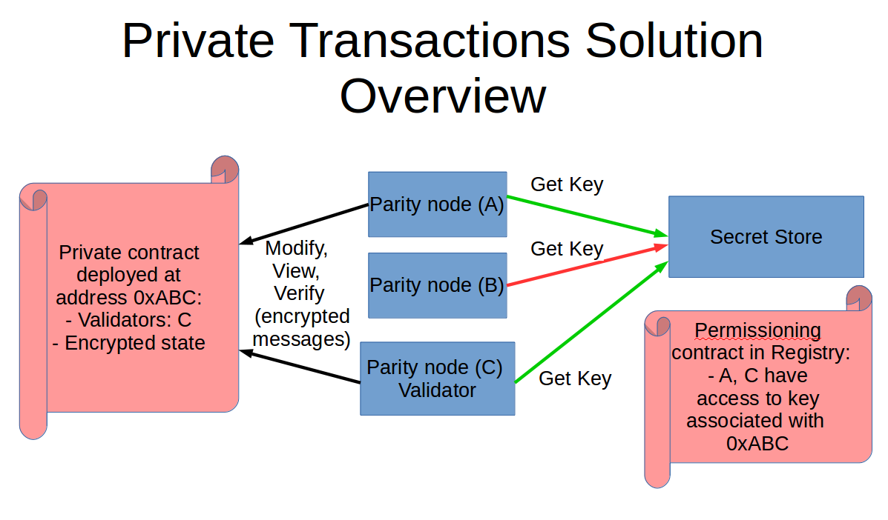
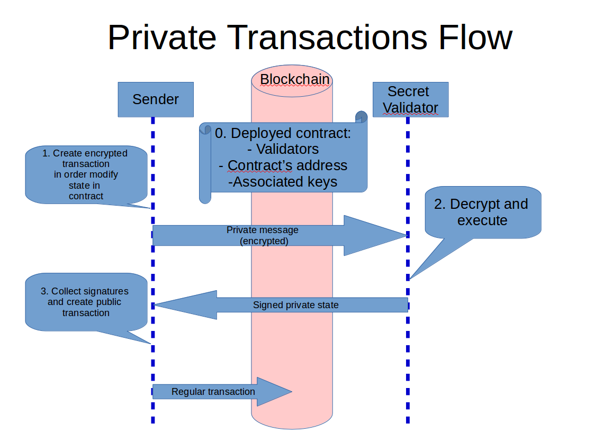
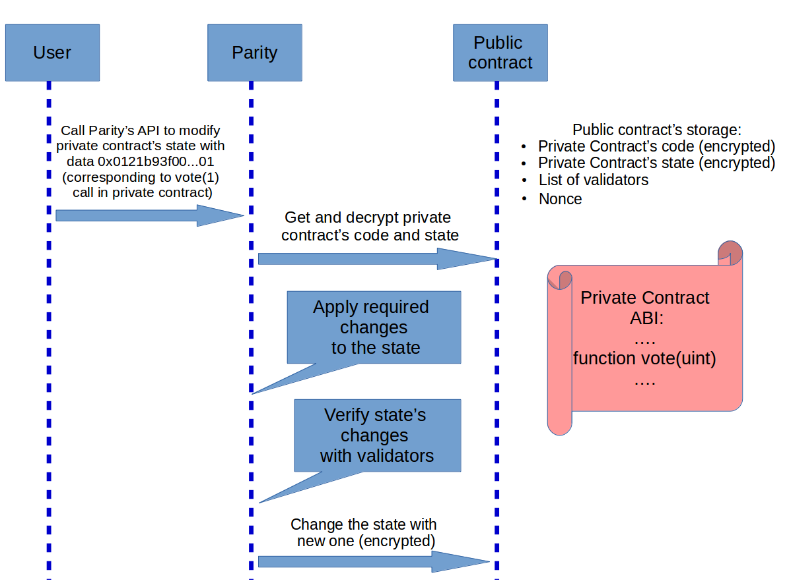

_The development of this feature was supported by the Energy Web Foundation in order to expedite the energy sector revolution towards decentralisation._

## Solution's Description

### Introduced terminology
**Private contract** Smart contract deployed in Ethereum chain by means of public contract's deployment (see below). State and code of private contract stored encrypted and not publicly readable. Read and modification of private contract's state and code are available only for the accounts specified during public contract's deployment. 

**Public contract** Special service smart contract deployed in Ethereum chain, wrapping private contract. See the source of the contract [here](https://github.com/parity-contracts/private-tx/blob/master/contracts/PrivateContract.sol). Encrypted private contract's state and code are stored in code and state variables of public contract. The deployment transaction for public contract is always generated by Parity, the user needs to provide the data for private contract.

**Validator** Account responsible for validation of changes made for private contract's state. The list of validators specified during corresponding public contract's deployment. Any account and any node can validate the changes. In general there is no any blockchain incentive defined for the validator. Validation of the changes is required and encouraged by business role of validator. 

**Private transaction** Special message containing encrypted data for modification private contract's state. Must be validated by all validators in order to apply changes using public transaction (see below)

**Public transaction** Regular transaction, containing the call to public contract to store changes in private contract.

### Overall system architecture
Private transactions system implements a solution allowing to store, modify and view encrypted data (state) using Ethereum blokchain. The solution doesn't depend on the type of the chain and can be deployed on any Ethereum chain with any consensus algorithm (public transactions must be mined in order to be included into the blockchain but it's up to the chain, how to achieve mining).
The system contains the following major components:
- Parity nodes. The system uses special messages with encrypted data in order to communicate between nodes.
- Public contract containing private contract (see terminology above).
- Secret store nodes. Deployed secret store used for creating and providing access to the key. With every public contract one key is associated, which is used to encrypt all data (state and messages between nodes). Exact URL to secret store is specified for every Parity node participating in private transaction system (see Parity arguments for more details). The availability of secret store is crucial for the system. Without connection to it all the calls will fail.
- Permissioning contract. A smart contract, that is deployed and specified in the chain's registry (see details in setup chapter), describing which nodes have access to contract's key

Example system shown below. Nodes A and C have access to the contract's key. Node C is specified as validator for the system.



### Flow description
For this example trivial private contract is used:
`contract Test1 { 
   bytes32 public x; 
   function setX(bytes32 _x) {
      x = _x; 
    }
}`
In order to call setX method of deployed private contract the user needs to:

1) Compose a regular transaction for calling corresponding methods of the contract:

```bash
curl --data '{"method":"parity_composeTransaction","params":[{"from":"0xcf9e2287227c5cc5978e7bdbbdaf293fe4992a24","to":"0x52f5f1b8c785ab1c0e892b4c46b080fde9ad992b","data":"0xbc64b76d2a00000000000000000000000000000000000000000000000000000000000000"}],"id":1,"jsonrpc":"2.0"}' -H "Content-Type: application/json" -X POST localhost:8549
```

data value (0xbc64b76d2a00000000000000000000000000000000000000000000000000000000000000) corresponds to the call of SetState method of example contract with 42 parameter passed.

2) Sign the transaction.
3) Send signed transaction using private_sendTransaction API method:

```bash
curl --data '{"method":"private_sendTransaction","params":["0xf88407...1137"],"id":1,"jsonrpc":"2.0"}' -H "Content-Type: application/json" -X POST localhost:8549
```

Where "0xf88407...1137" is the signed transaction created on the previous step

The next steps of the flow are shown on the picture below:



### Public\private contracts internals
In order to reflect more details of the specifics of the key element of the system (public contract with private contract included) let's consider one more example. For the private contract the simple voting contract will be used [source](http://solidity.readthedocs.io/en/v0.4.21/solidity-by-example.html#voting). The public contract with this private contract was deployed. As it was said, it's a special service contract storing private contract's state and code in its storage (see public contract's [code](https://github.com/parity-contracts/private-tx/blob/master/contracts/PrivateContract.sol)).

In order to make a call vote(1) for the private contract the system performs the following steps:



### Current limitations:
- Only one private transaction per block per contract allowed (since pending state is not implemented for private transactions yet)
- Current implementation requires verification of the private transaction by all validators in the system

## Setup of the private network
The following steps need to be performed in order to setup a chain with private transactions using on Parity client:

0) (Pre-requisite) Contracts registry must be deployed for the chain.
1) Secret store permissioning contract should be deployed and its address added into contracts registry under **secretstore_acl_checker** name.
Example of the trivial permissioning contract is placed [here](https://gist.github.com/grbIzl/14541e57f50b3ceae9831512c8234624)
The only requirement for such a contract is existing of

`function checkPermissions(address user, bytes32 document) constant returns (bool) {} `

in contract's ABI. It's up to the network administrator, how to define a logic for providing access to the keys inside this contract.

2) Private contract should be deployed.
In the following example the same trivial private contract:
`contract Test1 { 
   bytes32 public x; 
   function setX(bytes32 _x) {
      x = _x; 
    }
}`
will be used.
In order to deploy the private contract:

2.1) Regular transaction with contract's code should be composed and signed.

```bash
curl --data '{"method":"parity_composeTransaction","params":[{"from":"0xcf9e2287227c5cc5978e7bdbbdaf293fe4992a24","data":"0x6060604052341561000f57600080fd5b60d88061001d6000396000f30060606040526000357c0100000000000000000000000000000000000000000000000000000000900463ffffffff1680630c55699c146046578063bc64b76d14607457600080fd5b3415605057600080fd5b60566098565b60405180826000191660001916815260200191505060405180910390f35b3415607e57600080fd5b6096600480803560001916906020019091905050609e565b005b60005481565b8060008160001916905550505600a165627a7a723058206acbdf4b15ca4c2d43e1b1879b830451a34f1e9d02ff1f2f394d8d857e79d2080029"}],"id":1,"jsonrpc":"2.0"}' -H "Content-Type: application/json" -X POST localhost:8549
```

Where data parameter contains private contract.
The result transaction should be signed.

2.2) Public contract's deployment transaction should be generated using Private API.

```bash
curl --data '{"method":"private_composeDeploymentTransaction","params":["pending", "0xf9014203...ba4a30127e29774d15b1e12be", ["0x7ffbe3512782069be388f41be4d8eb350672d3a5"], "0x0"],"id":1,"jsonrpc":"2.0"}' -H "Content-Type: application/json" -X POST localhost:8549`
```

Where "0xf9014203...ba4a30127e29774d15b1e12be" is signed transaction created on the previous step.
This method returns a deployment transaction, which should be signed as well.

The detailed description of method's parameters see in API section.

2.3) Deployment transaction should deployed on the blockchain.
The signed deployment transaction returned on the previous step should be deployed in the blockchain (sent and mined). As a result, public contract containing private contract will be deployed.

For example, using eth_sendRawTransaction method.

3) Permissions for the key, associated with the private contract, should be specified.
In order to obtain key id, associated with the contract, use corresponding Private API method (that can be called locally):

```bash
curl --data '{"method":"private_contract_key","params":["0x52f5f1b8c785ab1c0e892b4c46b080fde9ad992b"],"id":1,"jsonrpc":"2.0"}' -H "Content-Type: application/json" -X POST localhost:8549
```

Where 0x52f5f1b8c785ab1c0e892b4c46b080fde9ad992b is public contract's address returned in 2.2 step (see API description for details).
After that, the permissions for this key id should be set inside permissioning contract of secret store.
For [the sample contract](https://gist.github.com/grbIzl/14541e57f50b3ceae9831512c8234624) method `addKey(address[] users, bytes32 key)` should be called with key id and list of the adresses required the permission to use the key.

## Parity arguments
All parameters required for usage of private transactions functionality provided via Parity launch arguments.

- `--private-tx-enabled`.
Flag for enabling private transactions processing for the node. By default it's set to false.

- `--private-signer=[ACCOUNT]`.
Account for signing public transaction, created in terms of verified private transaction. This account will be used on the last step of the flow (see above) in order to sign the result public transaction for changing state.

- `--private-validators=[ACCOUNTS]`.
List of the accounts used for validating private transactions. ACCOUNTS is a comma-delimited list of addresses.

- `--private-account=[ACCOUNT]`.
Account used for signing requests to secret store. This account should have access to contract's key. So it should be specified during private transactions system setup in permissioning contract. All nodes (senders and validators), participating in private transactions system, must have this account setup in order to encrypt\decrypt the data.

- `--private-sstore-url=[URL]`.
Secret store URL used for encrypting private transactions.

- `--private-sstore-threshold=[NUM]`.
Specify secret store threshold used for encrypting private transactions (see Secret Store [documentation](https://paritytech.github.io/wiki/Secret-Store) for details).

- `--private-passwords=[FILE]...`
Path to the file containing passwords for unlocking accounts (signer, private account, validators)

Example of usage:

```bash
~/parity/parity --config "/chain/config.toml" --author "0x7ffbe3512782069be388f41be4d8eb350672d3a5" --engine-signer "0x7ffbe3512782069be388f41be4d8eb350672d3a5" --private-tx-enabled --private-validators "0x7ffbe3512782069be388f41be4d8eb350672d3a5" --private-account "0x7ffbe3512782069be388f41be4d8eb350672d3a5" --private-sstore-url "http://secretstore:8082" --private-passwords "/parity/password.txt"
```

## RPC API
Several RPC methods were added in order to access private transactions functionality. For usage, private api has to be included into apis block in configuration:

`[rpc]`
`apis = ["web3", "eth", "net", "personal", "parity", "parity_set", "traces", "rpc", "parity_accounts", "private"]`

Methods:

### `private_composeDeploymentTransaction`

Returns a transaction for deployment of the public contract with private contract inside. The transaction should be signed and sent for the deployment.
#### Parameters
`num: BlockNumber` - integer block number, or the string `'latest'`, `'earliest'` or `'pending'`
`request: Bytes` - signed transaction for contract's creation (in hex)
`validators: Vec<H160>` - list of validator accounts for this contract
`gas_price: U256` - gas price for the transaction

#### Returning data:
`struct PrivateTransactionReceiptAndTransaction {`
`/// Receipt`
`receipt: PrivateTransactionReceipt,`
`/// Transaction`
`transaction: TransactionRequest,`
`}`

`struct PrivateTransactionReceipt {`
`/// Transaction Hash`
`transaction_hash: H256,`
`/// Private contract address`
`contract_address: Option<H160>,`
`/// Status code`
`status_code: u8,`
`}`

### `private_sendTransaction`
Sends a private transaction (see Private Transactions Flow for details of implementation).
#### Parameters
`request: Bytes` - signed regular transaction (in hex).

### `private_call`
View encrypted data of the private contract. The resulted call will be made internally.
#### Parameters
`num: BlockNumber` - integer block number, or the string `'latest'`, `'earliest'`.
`request: CallRequest` - call parameters in the form of regular transaction. For example: 

```bash
curl --data '{"method":"private_call","params":["latest",{"from":"0xcf9e2287227c5cc5978e7bdbbdaf293fe4992a24","to":"0xcd96d189596c690ff983e4e14d1838d0305186dc","data":"0x0c55699c","nonce":"0x0"}],"id":1,"jsonrpc":"2.0"}' -H "Content-Type: application/json" -X POST localhost:8549
```
data field corresponds to getX() call of the trivial private contract example 

### `private_contract_key`
Returns key id associated with the deployed public contract.
#### Parameters
`contract_address: H160` - address of the private contract
