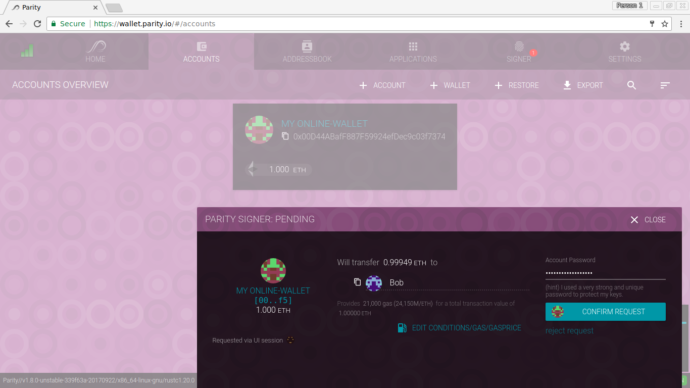

If you want to serve a [Parity Wallet](Parity-Wallet.md) to multiple private or public devices it's worth to consider running a **Public Node** rather then whitelisting hosts for user and websockets interfaces. To start a public node, simply run:

```bash
parity --public-node
```

This will publicly expose the Parity Wallet on port `:8180` of your node and can be reached by anyone with access to the public IP or domain. An example public node is served on [wallet.parity.io](https://wallet.parity.io/), see also [[Wallet.Parity.Io]].



The most important difference to a regular (local) Parity wallet is the way your keys are stored. Instead of creating a local profile on your disk, **your keys are entirely kept in your browser's local storage!** Always  [backup](Backing-up-&-Restoring.md) your recovery phrase and export the private keys (JSON) before using the public node on any of your devices.

List of additional features of a public node:

- @TODO

List of disabled features:

- @TODO
