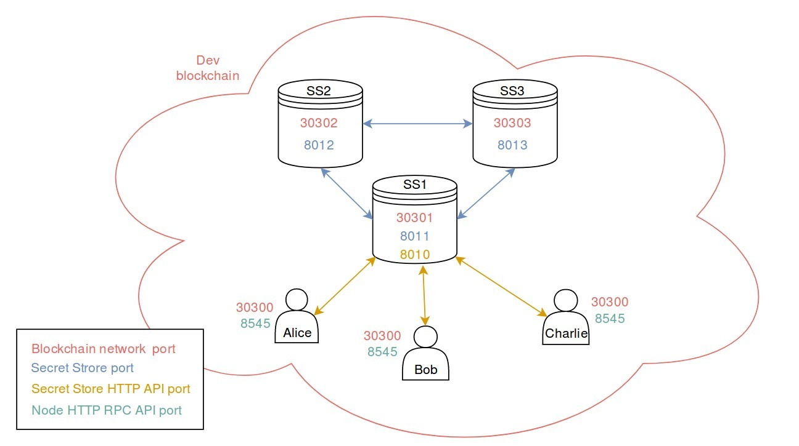

## 1. Enable the Secret Store feature of Parity

Per default, Parity Ethereum client is built without the Secret Store feature. To enable it, you need to build it from the sources and specifically enable the Secret Store.

- Make sure you have all the [build dependencies](https://github.com/paritytech/parity/#build-dependencies).
- Run
```
$ git clone https://github.com/paritytech/parity
$ cd parity
$ git checkout beta
$ cargo build --features secretstore --release
```

You can then launch the freshly built parity using `$ ./target/release/parity [OPTION]`.
In the following steps of the tutorial, `./target/release/` will be omitted for better readability.

## 2. Create and configure the users' nodes

In this tutorial, all nodes will run on 1 single machine. We will need to handle the networking ports carefully to avoid conflicts.

To keep a better overview, we will use TOML files to handle each node's configuration.
Create a directory to store all the configuration files at one place.

All the nodes of this tutorial will run the [Private development chain](Private-development-chain).
To make the configuration a little easier, Alice, Bob or Charlie's node will only run one at a time. They will share the same `users.toml` configuration file as the nodes will not be up and running simultaneously.
Create the file `users.toml` with the following content:

```toml
# File users.toml
# This configuration file can be used for either Alice, Bob or Charlie

[parity]
chain = "dev"
base_path = "db.users"

[rpc]
port = 8545 #default http port for RPC
apis = ["secretstore"] # to access dedicated methods

[secretstore]
disable = true # users do not run a secret store node

[network]
port = 30300
```

We can now create an account for Alice, Bob, and Charlie using the passwords: `alicepwd`, `bobpwd` and `charliepwd`.

To do this, simply run `parity --config users.toml account new` using the passwords given above starting with Alice and repeat the operation for Bob and Charlie.
```bash
Loading config file from users.toml
Please note that password is NOT RECOVERABLE.
Type password: # type the password given above
Repeat password: # type again 
0xe5a4b6f39b4c3e7203ca8caeecbad58d8f29b046
```
It will give you each time the address of the desired user. Make sure to store them.
You now have 3 accounts for your 3 users, we will use these addresses in this tutorial:

| Name    	| Password   	| Address                                    	|
|---------	|------------	|--------------------------------------------	|
| Alice   	| alicepwd   	| 0xe5a4b6f39b4c3e7203ca8caeecbad58d8f29b046 	|
| Bob     	| bobpwd     	| 0xfeacd0d28fd158ba2d3adb6d69d20c723214edc9 	|
| Charlie 	| charliepwd 	| 0xdab0055e3abb40d7281b058bb5e6966c50582951 	|


## 3. Create and configure the Secret Store nodes

As all the Secret Store nodes (ss1, ss2 and ss3) need to run simultaneously, we will have to create 3 different configuration files and make sure the networking ports do not conflict.
The configuration for ss1 will be a little different than the 2 others as this node will be open to receive calls from the users.

### 3.1 Configuration file for the Secret Store node 1
Let's create the file `ss1.toml` with the following content:
```toml
[parity]
chain = "dev"
base_path = "db.ss1"

[ui]
disable = true

[rpc]
disable = true

[ipc]
disable = true

[dapps]
disable = true

[websockets]
disable = true

[network]
port = 30301
bootnodes = []

[ipfs]
enable = false

[snapshots]
disable_periodic = true

[secretstore]
disable = false
disable_http = false      # This node will expose a Secret Store HTTP API
http_interface = "local"  # The HTTP API is available locally only
http_port = 8010          # The Secret Store HTTP API is available at this port
acl_contract = "none"     # Insecure, will be changed later on
server_set_contract = "none"
nodes = []
interface = "local"
port = 8011               # port used to communicated with other Secret Store nodes
path = "db.ss1/secretstore"
```

This configuration file is not complete yet but it allows us to create an account for our first node.
Run `parity --config ss1.toml account new` with the password `ss1pwd` to create an account for our first Secret Store node.
```bash
Loading config file from users.toml
Please note that password is NOT RECOVERABLE.
Type password: # type the password given above
Repeat password: # type again 
0x93f22c0fa2e4e0750669add48dd8d9dfb8af36f4
```

We will need to create a password file also for the account to be autonomously usable by the Secret Store node to sign messages. 

Run the following command to create a file named `ss1.pwd` containing the password `ss1pwd`:

```bash
 echo "ss1pwd" > ss1.pwd
```

We will use this address and password file right away in our `ss1.toml` config file. Add the address (without `0x`) as `self_secret` in the `[secretstore]` part and add an `[account]` as follow. 

```toml
#Add to the [secretstore] section
self_secret = "93f22c0fa2e4e0750669add48dd8d9dfb8af36f4" # account address without the "0x"

#Secret store nodes need an unlocked account to sign messages with
[account]
password = ["ss1.pwd"]
```

The configuration file now looks like:
```toml
[parity]
chain = "dev"
base_path = "db.ss1"

[ui]
disable = true

[rpc]
disable = true

[ipc]
disable = true

[dapps]
disable = true

[websockets]
disable = true

[network]
port = 30301
bootnodes = []

[ipfs]
enable = false

[snapshots]
disable_periodic = true

[secretstore]
self_secret = "93f22c0fa2e4e0750669add48dd8d9dfb8af36f4" # account address without the "0x"
disable = false
disable_http = false
http_interface = "local"
http_port = 8010
acl_contract = "none"
server_set_contract = "none"
nodes = []
interface = "local"
port = 8011
path = "db.ss1/secretstore"

[account]
password = ["ss1.pwd"]
```

Starting the node with this configuration file should now be possible with `parity --config ss1.toml`
```bash
Loading config file from ss1.toml
Starting Parity/v1.12.0-unstable-458afcd-20180620/x86_64-linux-gnu/rustc1.26.1
Keys path db.ss1/keys/DevelopmentChain
DB path db.ss1/chains/DevelopmentChain/db/1484bce8c021f2ca
Path to dapps db.ss1/dapps
State DB configuration: fast
Operating mode: active
Configured for DevelopmentChain using InstantSeal engine
Starting SecretStore node: 83a051ff44f25df39cbf97b5ce48b48f7e3ba740f32d07e39df59743ec4a62b3e24cf041bfe5e1e149dc2228798342927444e3bd4b3798572045404880b275b4
Running SecretStore with disabled ACL check: everyone has access to stored keys
Public node URL: enode://59ff7f71a8ced85f23d2455b8645931e962886cce7025fd4fb769c4881c505d8445aa24be98b1aa3067cf7490a2ff0cd1558c37f6a536a4d799f8d93c3fe21ea@127.0.0.1:30301
```

Note the last 3 lines give interesting information:
- It tells you that our configuration is currently insecure due to `acl_contract = "none"`. If we keep it like this in the future, Alice, Bob or Charlie could access any key. We will change it later in the tutorial.
- `Starting SecretStore node: 0x83a051ff44f...` gives you the public key of this node. Copy it as we will use it in the next step.
- `Public node URL: enode://59ff7f71a8ce..` gives you.. well the public URL of your node! Copy it as we will use it in the next step.

### 3.2 Configuration file for the Secret Store node 2

The second and third nodes will have a very similar syntax. They will not expose any HTTP API to the outside.
Let's create `ss2.toml` with the following content:
```toml
[parity]
chain = "dev"
base_path = "db.ss2"

[ui]
disable = true

[rpc]
disable = true

[ipc]
disable = true

[dapps]
disable = true

[websockets]
disable = true

[network]
port = 30302
bootnodes = []

[ipfs]
enable = false

[snapshots]
disable_periodic = true

[secretstore]
disable = false
disable_http = true   # Secret Store nodes 2 and 3 are not accessibles from the outside
acl_contract = "none" # no permissionning contract used yet
server_set_contract = "none"
nodes = []
interface = "local"
port = 8012
path = "db.ss2/secretstore"
```

Now create an account for `ss2` with the password `ss2pwd` by running `parity --config ss2.toml account new`:
```bash
Loading config file from users.toml
Please note that password is NOT RECOVERABLE.
Type password: # type the password given above
Repeat password: # type again 
0xf0d5f6f68d18e190d010c52269ccf97d06204761
```
Copy the given address, this will be the account ss2 will use to sign its messages.
We will need to create a password file also for the account to be autonomously usable by the Secret Store node. 

Run the following command to create a file named `ss2.pwd` containing the password `ss2pwd`:

```bash
 echo "ss2pwd" > ss2.pwd
```

We will use this address and password file right away in our `ss2.toml` config file. Add the address (without `0x`) as `self_secret` in the `[secretstore]` part and add an `[account]` as follow. 

```toml
#Add to the [secretstore] section
self_secret = "f0d5f6f68d18e190d010c52269ccf97d06204761" # account address without the "0x"

#Secret store nodes need an unlocked account to sign messages with
[account]
password = ["ss2.pwd"]
```

Launch the node with the updated configuration and copy somewhere the public key given after the message `Starting SecretStore node` as well as the `Public node URL`.

### 3.3 Configuration file for the Secret Store node 3

Repeat the same actions with `ss3.toml` with the following content:
```toml
[parity]
chain = "dev"
base_path = "db.ss3"

[ui]
disable = true

[rpc]
disable = true

[ipc]
disable = true

[dapps]
disable = true

[websockets]
disable = true

[network]
port = 30303
bootnodes = []

[ipfs]
enable = false

[snapshots]
disable_periodic = true

[secretstore]
disable = false
disable_http = true   # Secret Store nodes 2 and 3 are not accessibles from the outside
acl_contract = "none" # no permissionning contract used yet
server_set_contract = "none"
nodes = []
interface = "local"
port = 8013
path = "db.ss3/secretstore"
```

Now create an account for `ss3` with the password `ss3pwd` by running `parity --config ss3.toml account new`:
```bash
Loading config file from users.toml
Please note that password is NOT RECOVERABLE.
Type password: # type the password given above
Repeat password: # type again 
0x0f7b7d4120246348968530fb36092cd36ebaedbb
```

We will need to create a password file also for the account to be autonomously usable by the Secret Store node. 

Run the following command to create a file named `ss3.pwd` containing the password `ss3pwd`:

```bash
 echo "ss3pwd" > ss3.pwd
```

We will use this address and password file right away in our `ss3.toml` config file. Add the address (without `0x`) as `self_secret` in the `[secretstore]` part and add an `[account]` as follow. 

```toml
#Add to the [secretstore] section
self_secret = "0f7b7d4120246348968530fb36092cd36ebaedbb" # account address without the "0x"

#Secret store nodes need an unlocked account to sign messages with
[account]
password = ["ss3.pwd"]
```

Launch the node with the updated configuration and note the public key given after the message `Starting SecretStore node` as well as the `Public node URL`

### 4. Add bootnodes to each configuration file

We now have copied all the public URLs (enodes) of our Secret Store nodes as well as their public key. You need manually modify the ip at the end of the enode address to use the local host address `127.0.0.1` instead of your local address. 
```bash
| Node 	| Public Key                                                                                                                       	| Secret Store port 	| Enode                                                                                                                                                    	|
|------	|----------------------------------------------------------------------------------------------------------------------------------	|-------------------	|----------------------------------------------------------------------------------------------------------------------------------------------------------	|
| 1    	| 83a051ff44f25df39cbf97b5ce48b48f7e3ba740f32d07e39df59743ec4a62b3e24cf041bfe5e1e149dc2228798342927444e3bd4b3798572045404880b275b4 	| 8011              	| enode://59ff7f71a8ced85f23d2455b8645931e962886cce7025fd4fb769c4881c505d8445aa24be98b1aa3067cf7490a2ff0cd1558c37f6a536a4d799f8d93c3fe21ea@127.0.0.1:30301 	|
| 2    	| 32be3581ee307da5ed3c6045b6213317fd5f2ac8525d16051c784a251c801ca47f1bb7180b0c40ca754f705837900a4d2f956b7cec5d0094c6dae397371b8f4a 	| 8012              	| enode://800cf3b097974b9740d9d7aeda28bf1655e7c30a10bdb5f616ee0b41b786c13ce8d4008854d96430193b7cb4710a59c418566d5f6111bce4a18319757eaec358@127.0.0.1:30302 	|
| 3    	| 7b42943621c70020e62163ff24cc57366d820d5280495c8d9088b9a6bafbfef5b7a79bc3a56d324c325b970415692e48b9dd85102bd07fbaa7b05c6093697355 	| 8013              	| enode://58815b57d8af2bc04963bde42b27deca674c18dca4098b8891296479ce0a83c2398a141babb835f181c6447bb1ac2ce4dca88ec20908d41b86166018d842fab4@127.0.0.1:30303 	|
```

We now have the enode address of each Secret Store node (with the modified IP `127.0.0.1`). We will add them in the `bootnodes` section of all the files (including the users).
The users' configuration file `users.toml` should contain all of the bootnodes, the network section should now look like this:
```toml
[network]
port = 30300
bootnodes = [
  "enode://59ff7f71a8ced85f23d2455b8645931e962886cce7025fd4fb769c4881c505d8445aa24be98b1aa3067cf7490a2ff0cd1558c37f6a536a4d799f8d93c3fe21ea@127.0.0.1:30301",
  "enode://800cf3b097974b9740d9d7aeda28bf1655e7c30a10bdb5f616ee0b41b786c13ce8d4008854d96430193b7cb4710a59c418566d5f6111bce4a18319757eaec358@127.0.0.1:30302",
  "enode://58815b57d8af2bc04963bde42b27deca674c18dca4098b8891296479ce0a83c2398a141babb835f181c6447bb1ac2ce4dca88ec20908d41b86166018d842fab4@127.0.0.1:30303"
]
```

We will add to each Secret Store node's configuration the URL of the 2 others (as having its own address as bootnode wouldn't make sense).
The network section of `ss1.toml` for example will have the enodes of `ss2` and `ss3` and look like this:
```toml
[network]
port = 30301
bootnodes = [
  "enode://800cf3b097974b9740d9d7aeda28bf1655e7c30a10bdb5f616ee0b41b786c13ce8d4008854d96430193b7cb4710a59c418566d5f6111bce4a18319757eaec358@127.0.0.1:30302", #node 2
  "enode://58815b57d8af2bc04963bde42b27deca674c18dca4098b8891296479ce0a83c2398a141babb835f181c6447bb1ac2ce4dca88ec20908d41b86166018d842fab4@127.0.0.1:30303" #node 3
]
```

Finally, we will need to construct the Secret Store node addresses with `public_key@127.0.0.1:secret_store_port` to define the `node` value in the `[secretstore]` section.

It will be the same for each node and will look like this:
```toml
nodes = [
  "83a051ff44f25df39cbf97b5ce48b48f7e3ba740f32d07e39df59743ec4a62b3e24cf041bfe5e1e149dc2228798342927444e3bd4b3798572045404880b275b4@127.0.0.1:8011",
  "32be3581ee307da5ed3c6045b6213317fd5f2ac8525d16051c784a251c801ca47f1bb7180b0c40ca754f705837900a4d2f956b7cec5d0094c6dae397371b8f4a@127.0.0.1:8012",
  "7b42943621c70020e62163ff24cc57366d820d5280495c8d9088b9a6bafbfef5b7a79bc3a56d324c325b970415692e48b9dd85102bd07fbaa7b05c6093697355@127.0.0.1:8013"
]
```

Find [here](https://github.com/Tbaut/Secret-Store-Tutorial-files/tree/master/no-permissioning-contract) example files that you can compare yours with (the keys and account will obviously change).

You can now launch all the Secret Store nodes with the updated configuration. You might see some errors `'Connection refused (os error 111)' when establishing outbound connection with 127.0.0.1:8013` when launching node 1 and 2 because not all nodes are online, but once they are all up, you should see logs like this:
```bash
$ ~/paritytech/parity/target/release/parity --config ss3.toml
Loading config file from ss3.toml
2018-06-29 22:26:46  Starting Parity/v1.12.0-unstable-458afcd-20180620/x86_64-linux-gnu/rustc1.26.1
2018-06-29 22:26:46  Keys path db.ss3/keys/DevelopmentChain
2018-06-29 22:26:46  DB path db.ss3/chains/DevelopmentChain/db/1484bce8c021f2ca
2018-06-29 22:26:46  Path to dapps db.ss3/dapps
2018-06-29 22:26:46  State DB configuration: fast
2018-06-29 22:26:46  Operating mode: active
2018-06-29 22:26:46  Configured for DevelopmentChain using InstantSeal engine
2018-06-29 22:26:46  Starting SecretStore node: 0x7b42943621c70020e62163ff24cc57366d820d5280495c8d9088b9a6bafbfef5b7a79bc3a56d324c325b970415692e48b9dd85102bd07fbaa7b05c6093697355
2018-06-29 22:26:46  Running SecretStore with disabled ACL check: everyone has access to stored keys
2018-06-29 22:26:46  Public node URL: enode://58815b57d8af2bc04963bde42b27deca674c18dca4098b8891296479ce0a83c2398a141babb835f181c6447bb1ac2ce4dca88ec20908d41b86166018d842fab4@127.0.0.1:30303
2018-06-29 22:27:16     2/25 peers   10 KiB chain 31 KiB db 0 bytes queue 10 KiB sync  RPC:  0 conn,    0 req/s,    0 µs
2018-06-29 22:27:46     2/25 peers   10 KiB chain 31 KiB db 0 bytes queue 10 KiB sync  RPC:  0 conn,    0 req/s,    0 µs
2018-06-29 22:28:16     2/25 peers   10 KiB chain 31 KiB db 0 bytes queue 10 KiB sync  RPC:  0 conn,    0 req/s,    0 µs
2018-06-29 22:28:46     2/25 peers   10 KiB chain 31 KiB db 0 bytes queue 10 KiB sync  RPC:  0 conn,    0 req/s,    0 µs
2018-06-29 22:29:16     2/25 peers   10 KiB chain 31 KiB db 0 bytes queue 10 KiB sync  RPC:  0 conn,    0 req/s,    0 µs
2018-06-29 22:29:46     2/25 peers   10 KiB chain 31 KiB db 0 bytes queue 10 KiB sync  RPC:  0 conn,    0 req/s,    0 µs
2018-06-29 22:30:16     2/25 peers   10 KiB chain 31 KiB db 0 bytes queue 10 KiB sync  RPC:  0 conn,    0 req/s,    0 µs
2018-06-29 22:30:46     2/25 peers   10 KiB chain 31 KiB db 0 bytes queue 10 KiB sync  RPC:  0 conn,    0 req/s,    0 µs
2018-06-29 22:31:16     2/25 peers   10 KiB chain 31 KiB db 0 bytes queue 10 KiB sync  RPC:  0 conn,    0 req/s,    0 µs
2018-06-29 22:31:46     2/25 peers   10 KiB chain 31 KiB db 0 bytes queue 10 KiB sync  RPC:  0 conn,    0 req/s,    0 µs
```

Most interestingly, `2/25 peers` means that this node is connected with the 2 others on the blockchain.

## 5. Network overview
Here is an overview of the ports used by each node of the system configured in this section. Note that each user has the same ports as they will use the same node (not at the same time though). The RPC HTTP API port (8545) gives access to the Parity client's internal RPC API methods. SS1 exposes an HTTP API the users will use later on.


|[ ← Tutorial overview](Secret-Store-Tutorial-overview.md) | [Part 2 - Document encryption → ](Secret-Store-Tutorial-2.md)|


