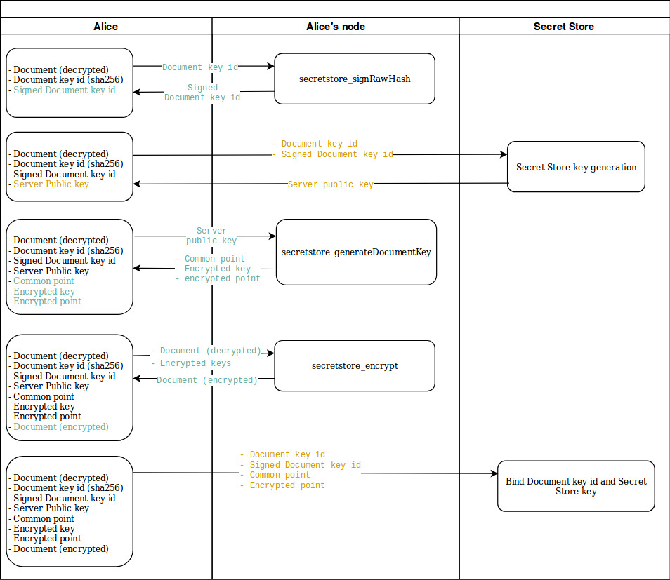

Alice's Secret Document is the following text: "mySecretDocument"

In this section, we will generate an encryption key based on the Secret Store  Server key and encrypt the document. We will also associate the document with the generated key in order for a 3rd party to be able to retrieve the decryption key (Step 3). 

## 1. Choose a Document key id for this document

We will need to identify this specific document on the Secret Store with 64 characters. This `Document key id` will be used often throughout this tutorial. A good candidate for the `Document key id` is the hash of this document. Let's generate its sha256 hash as a `Document key id` using the following command:
```bash 
echo -n mySecretDocument | sha256sum
45ce99addb0f8385bd24f30da619ddcc0cadadab73e2a4ffb7801083086b3fc2
```

Every call to the Secret Store will contain this id (`45ce99a..86b3fc2`), in order for the Secret Store to know what document we call it for.

## 2. Get the server key for this document

At this stage, it is very important to understand when we interact with the Secret Store (using ss1's HTTP API and port 8010) and when we use the HTTP JSON-RPC API from Alice's node (using the port 8545).
- Any call to `http://localhost:8010` that has arguments in the url is a call to the ss1 node (at step 2.2 to generate a key from the Secret Store for instance).
- Any call to `http://127.0.0.1:8545` with JSON-RPC data and a method name such as `secretstore_signRawHash` is a local call from a user to its own node.

### 2.1 Sign the Document Key id

We need to tell the Secret store about this document (identified by its `Document key id`). As a mean to sign our messages, we need to first sign this `Document key id` with the address of Alice.
A Parity client local method can be used:  [secretstore_signRawHash](https://wiki.parity.io/JSONRPC-secretstore-module.html#secretstore_signrawhash00a329c0648769A73afAc7F9381E08FB43dBEA72)
```bash
curl --data-binary '{"jsonrpc": "2.0", "method": "secretstore_signRawHash", "params": ["0xe5a4b6f39b4c3e7203ca8caeecbad58d8f29b046", "alicepwd", "0x45ce99addb0f8385bd24f30da619ddcc0cadadab73e2a4ffb7801083086b3fc2"], "id":1 }' -H 'content-type: application/json' http://127.0.0.1:8545/
```
- `0xe5a4b6..58d8f29b046` is Alice's address (created in [Part 1](Secret-Store-Tutorial-1))
- `alicepwd` is Alice's password
- `0x45ce99..083086b3fc2` is the `Document key id` Alice chose [at step 1](#1-chose-a-document-key-id-for-this-document).

The result is the signed `Document key id` with Alice's account.
```json
{
  "jsonrpc": "2.0",
  "result": "0x5fcf1622c1301cb8332ab589f4f7abd66a21f27636382d57b5ae6d376bab010a2e47c4ad027c96e8e41660d29292c2844454f212b36a7834b64be71f9bd3ac0400",
  "id": 1
}
```

### 2.2 Generate the Secret Store Server key 

Making sure that all Secret Store nodes are running, we can now [generate a `Server-key`](https://wiki.parity.io/Secret-Store.html#server-key-generation-session)

```bash
curl -X POST http://localhost:8010/shadow/45ce99addb0f8385bd24f30da619ddcc0cadadab73e2a4ffb7801083086b3fc2/5fcf1622c1301cb8332ab589f4f7abd66a21f27636382d57b5ae6d376bab010a2e47c4ad027c96e8e41660d29292c2844454f212b36a7834b64be71f9bd3ac0400/1
```
- `http://localhost:8010` is the url of our SS1 node and its Secret Store HTTP port.
- `45ce99a..1083086b3fc2` is the `Document key id` defined earlier.
- `5fcf162..1f9bd3ac0400` is the signed `Document key id` generated in the previous step.
- `1` is the chosen threshold. We will allow the generation of the key if 2 out of 3 nodes are up and running.

The result is the public portion of the `Server key`:
```
"0xddb96b9bb227273121486bef7ffd9a5549f1f73b28e46d5c0592854b7545b0c59846eecd84e7180dec60fe673168d5e789eda21438030eee56dbaaa5b2279e10"
```

Note that the Secret Store server logs show something like:
`0x83a0…75b4: generation session completed`

## 3. Generate the Document key from the Secret Store key 
Alice can now use the local method [`secretstore_generateDocumentKey`](https://wiki.parity.io/JSONRPC-secretstore-module#secretstore_generatedocumentkey) to generate Secret Store keys.

```bash
curl --data-binary '{"jsonrpc": "2.0", "method": "secretstore_generateDocumentKey", "params": ["0xe5a4b6f39b4c3e7203ca8caeecbad58d8f29b046", "alicepwd","0xddb96b9bb227273121486bef7ffd9a5549f1f73b28e46d5c0592854b7545b0c59846eecd84e7180dec60fe673168d5e789eda21438030eee56dbaaa5b2279e10"], "id":1 }' -H 'content-type: application/json' http://127.0.0.1:8545/
```
- `0xe5a4b6..29b046` is Alice's address (created in [Part 1](Secret-Store-Tutorial-1))
- `alicepwd` is Alice's password
- `0xddb96b..279e10` is the public portion of the `Server key` generated by the Secret Store in the [previous step (2.2)](#22-generate-the-secret-store-key).

The result is the `encrypted_key` and pair (`common_point`,  `encrypted_point`) that will be used to encrypt the Document (offline).
```json
{
  "jsonrpc": "2.0",
  "result": {
    "common_point": "0xf0e62b05b68b1847ad948572a1b04a91dee7d7dca2f675fd00c136eb706d491604e0322bb954620dc9145c54729e7b484c0b17a7bda64a1d2392007334f835fd",
    "encrypted_key": "0x042abe5fc72abebb654a92665f669c4503c79c5324fe4e143bf6c5ca3c738352bbc9e5d48e10f55651df8f77af1a4670278c5fc16574b08f3fff0dc8e5e35ab6b305f56d3ba6b8a9b92a8229578f350ac9a180a1eea25367ca0f6feb74dbf2dc5a69e895c99210d7d608320b76a8f736014783babeb405a8aeedb7536a130bc861d74364a388f95d91a48871427932dce5784e9c817971dcca5ad88cb222a3d4dc804f6efdd0193fa1e331382a5b586df7",
    "encrypted_point": "0x49808bd32126e1cd78a96a01e2fb931b0b04f6f5123a3f2fd42e20eaa1aac83a157f7ad4be57518137d51d05a47341bd04b6f873dcd00ac533e783f8e2b87e8b"
  },
  "id": 1
}
```

## 4. Document encryption
Using the  `encrypted_key`  generated in the previous step, Alice can now encrypt her document using the local method: [`secretstore_encrypt`](https://wiki.parity.io/JSONRPC-secretstore-module#secretstore_encrypt)

The document must be encoded (locally) in Hex. We use the xxd command for this:
```bash
echo -n mySecretDocument | xxd -p
6d79536563726574446f63756d656e74
```
Alice can then encrypt her secret document:
```bash
curl --data-binary '{"jsonrpc": "2.0", "method": "secretstore_encrypt", "params": ["0xe5a4b6f39b4c3e7203ca8caeecbad58d8f29b046", "alicepwd", "0x042abe5fc72abebb654a92665f669c4503c79c5324fe4e143bf6c5ca3c738352bbc9e5d48e10f55651df8f77af1a4670278c5fc16574b08f3fff0dc8e5e35ab6b305f56d3ba6b8a9b92a8229578f350ac9a180a1eea25367ca0f6feb74dbf2dc5a69e895c99210d7d608320b76a8f736014783babeb405a8aeedb7536a130bc861d74364a388f95d91a48871427932dce5784e9c817971dcca5ad88cb222a3d4dc804f6efdd0193fa1e331382a5b586df7", "0x6d79536563726574446f63756d656e74"], "id":1 }' -H 'content-type: application/json' http://127.0.0.1:8545/
```
- `0xe5a4b6f39..f29b046` is Alice's address (created in [Part 1](Secret-Store-Tutorial-1))
- `alicepwd` is Alice's password.
- `0x042abe5..a5b586df7` is the `encrypted_key` generated at the previous step.
- `0x6d79536..56d656e74` is the hex encoded secret document that Alice wants to encrypt.


The result is the encrypted secret document that Alice will be able to share.
```json
{"jsonrpc":"2.0","result":"0x237ac394e3f6cbe7395fc7076a3b58036a0e185a519e41b35a87ba73679cc1bb","id":1}
```


## 5. Store the Document key on the SS

The Secret Store was used at [Step 2.2](#22-generate-the-secret-store-key) to generate a `Server key`, used to generate locally the encryption key. Note that at this point, the Secret Store does not have the information that Alice has encrypted her document, and what key was used. In this step, we will store Alice's key in the Secret Store for others to be able to access it if she decides so.
The  `Document key id`  will be associated to this key using the `common_point`,  `encrypted_point` pair generated offline at [Step 3](#3-generate-the-document-key-from-the-secret-store-key).

```bash
curl -X POST http://localhost:8010/shadow/45ce99addb0f8385bd24f30da619ddcc0cadadab73e2a4ffb7801083086b3fc2/5fcf1622c1301cb8332ab589f4f7abd66a21f27636382d57b5ae6d376bab010a2e47c4ad027c96e8e41660d29292c2844454f212b36a7834b64be71f9bd3ac0400/f0e62b05b68b1847ad948572a1b04a91dee7d7dca2f675fd00c136eb706d491604e0322bb954620dc9145c54729e7b484c0b17a7bda64a1d2392007334f835fd/49808bd32126e1cd78a96a01e2fb931b0b04f6f5123a3f2fd42e20eaa1aac83a157f7ad4be57518137d51d05a47341bd04b6f873dcd00ac533e783f8e2b87e8b
```

Here:

-   `http://localhost:8010` is the address on which node is listening for incoming requests;
-   `45ce99addb..3086b3fc2` is the `Document key id` we chose at the begining of this section;
-   `5fcf1622c1..bd3ac0400` is the signed `Document key id` from [step 2.1](#21-sign-the-document-key-id);
-   `f0e62b05b6..334f835fd` is the `common point` portion of encrypted document key received at [step 3](#3-generate-the-document-key-from-the-secret-store-key);
-   `0x49808bd3..8e2b87e8b` is the `encrypted point` portion of encrypted document key received at step 2.

All Secret Store servers should show something like:
`0x83a0…75b4: encryption session completed`

## 6. Section overview

Here is a flow diagram that represents what calls Alice has performed either to her own Parity node or to the Secret Store.



|[ ← Part 1 - Configuring each node](Secret-Store-Tutorial-1.md) | [ Part 3 - Key retrieval → ](Secret-Store-Tutorial-3.md)|

