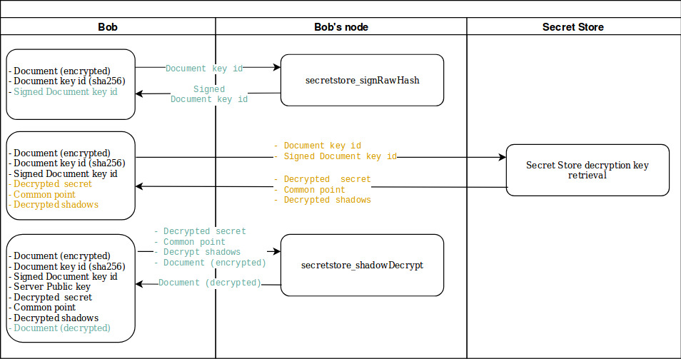

Alice now decides to share her encrypted document with Bob. To do so, all she has to do is send the encrypted document to Bob along with the `Document Key id`. Remember, this is the identifier of the document on the Secret Store, we chose it to be the sha256 of the (decrypted) document.
In this section, we will see how Bob can retrieve the keys from the Secret Store to decrypt the document Alice sent to him.


## 1. Sign the `Document key id` with Bob's account
Just like we did for Alice, as a mean to sign our messages, we need to first sign this `Document key id` with the address of Bob.
A Parity client local method can be used:  [secretstore_signRawHash](https://wiki.parity.io/JSONRPC-secretstore-module.html#secretstore_signrawhash00a329c0648769A73afAc7F9381E08FB43dBEA72)

```bash
curl --data-binary '{"jsonrpc": "2.0", "method": "secretstore_signRawHash", "params": ["0xfeacd0d28fd158ba2d3adb6d69d20c723214edc9", "bobpwd", "0x45ce99addb0f8385bd24f30da619ddcc0cadadab73e2a4ffb7801083086b3fc2"], "id":1 }' -H 'content-type: application/json' http://127.0.0.1:8545/
```
- `0xfeacd0d28fd158ba2d3adb6d69d20c723214edc9` is Bob's address (created in [Part 1](Secret-Store-Tutorial-1))
- `bobpwd` is Bob's password
- `0x45ce99addb..2a4ffb7801083086b3fc2` is the `Document key id` given by Alice.

The result is the signed `Document key id` with Bob's account.
```json
{
  "jsonrpc": "2.0",
  "result": "0xa589bebde7944fd4e01bd3a984fadb1ac0345aec445742e6ff34bb8b81cee5ba01dabfd199a3c90faea62b34051dd12f56e4af70027fd66b19e7f0038bfc158301",
  "id": 1
}
```


## 2. Ask the Secret Store for the decryption keys

Bob can now call the Secret Store to [retrieve the document's keys](Secret-Store.html#document-key-shadow-retrieval-session).

```bash
curl http://localhost:8010/shadow/45ce99addb0f8385bd24f30da619ddcc0cadadab73e2a4ffb7801083086b3fc2/a589bebde7944fd4e01bd3a984fadb1ac0345aec445742e6ff34bb8b81cee5ba01dabfd199a3c90faea62b34051dd12f56e4af70027fd66b19e7f0038bfc158301
```
- `http://localhost:8010`: is the address and port at which SS1 exposes the Secret Store HTTP API;
- `45ce99addb..3086b3fc2`: is the `Document key id` given by Alice along with the encrypted document;
- `a589bebde7..bfc158301`: is the signed `Document key id` generated in the previous step;

Bob receives as a result the triple (`decrypted_secret`,  `common_point`,  `decrypt_shadows`):
```json
{
  "decrypted_secret": "0x9b5aa977f537d24c5f523f67a95329bdd147e6be1b0d913c1506d2a0a210ab24ce380787d9b81f88fd05dfcfc083c8df56569a763440a1159a41db144a0d3d6b",
  "common_point": "0xf0e62b05b68b1847ad948572a1b04a91dee7d7dca2f675fd00c136eb706d4916fb1fcdd446ab9df236eba3ab8d6184b7b3f4e8584259b5e2dc6dff8bcb07c632",
  "decrypt_shadows": [
    "0x0478055ba0c544032560c4db1fbe02cd848217a9d9e476dc3a4f7f2c6dbe9535f64b947d813a42e77a3d21ccbd46a50f10c6a556daa897ed4e80d9938f696b2efde9558da7a1e0c2290fc97d0594a134a2a2fc316250808fb43e42bcfb3586e74a97dde2c6403f25b0952e15e7b2a4d11dab01f1d77d0e39fc98a83bf2971e190bed38108dfe9f6be7c29f9fe1c868df7c",
    "0x04733d896fc8279b3c8209e10dd12f7c052ac9d8f171dff174e2183f68720294b162e879166ae744883c74cbe56528c2908a4d17c6f245d9158491351cc1f11ecf79f8e9b828963e07c839eaf923c2db29d2c85d282326f83e9ccac334e3abf3e99b7e41811940426f97995494e2bae53f0ddd38ccd6dba26847723a77629f703c564c14da4880521e192976e09e7499a4"
  ]
}
```


Note that the Secret Store nodes log the following: 
```bash
0x83a0…75b4: version negotiation session completed
0x83a0…75b4: version negotiation session completed
0x83a0…75b4: decryption session completed
```

As a test, you can try to perform the same call while the nodes 2 and 3 are offline (keeping the node 1 up as it is the only one that exposes an HTTP API):
- Shutting down node 2.. the call is still successful!
- Shutting down node 2 and 3, the call returns a 403 HTTP header with the message `Consensus unreachable` because Alice has set a threshold of 1 for [the server key generation](Secret-Store-Tutorial-2#12-generate-the-secret-store-key). Given 3 Secret Store nodes overall, it means that 2 out of 3 nodes are needed to reconstruct the encryption/decryption keys.


## 3.  Decrypt the document
Bob can now use the triple together with the local method [`secretstore_shadowDecrypt`](https://wiki.parity.io/JSONRPC-secretstore-module#secretstore_shadowdecrypt) to decrypt the document.

```bash
curl --data-binary '{"jsonrpc": "2.0", "method": "secretstore_shadowDecrypt", "params": ["0xfeacd0d28fd158ba2d3adb6d69d20c723214edc9", "bobpwd", "0x9b5aa977f537d24c5f523f67a95329bdd147e6be1b0d913c1506d2a0a210ab24ce380787d9b81f88fd05dfcfc083c8df56569a763440a1159a41db144a0d3d6b", "0xf0e62b05b68b1847ad948572a1b04a91dee7d7dca2f675fd00c136eb706d4916fb1fcdd446ab9df236eba3ab8d6184b7b3f4e8584259b5e2dc6dff8bcb07c632", ["0x0478055ba0c544032560c4db1fbe02cd848217a9d9e476dc3a4f7f2c6dbe9535f64b947d813a42e77a3d21ccbd46a50f10c6a556daa897ed4e80d9938f696b2efde9558da7a1e0c2290fc97d0594a134a2a2fc316250808fb43e42bcfb3586e74a97dde2c6403f25b0952e15e7b2a4d11dab01f1d77d0e39fc98a83bf2971e190bed38108dfe9f6be7c29f9fe1c868df7c","0x04733d896fc8279b3c8209e10dd12f7c052ac9d8f171dff174e2183f68720294b162e879166ae744883c74cbe56528c2908a4d17c6f245d9158491351cc1f11ecf79f8e9b828963e07c839eaf923c2db29d2c85d282326f83e9ccac334e3abf3e99b7e41811940426f97995494e2bae53f0ddd38ccd6dba26847723a77629f703c564c14da4880521e192976e09e7499a4"], "0x237ac394e3f6cbe7395fc7076a3b58036a0e185a519e41b35a87ba73679cc1bb"], "id":1 }' -H 'content-type: application/json' http://127.0.0.1:8545/
```
- `0xfeacd0d2..9d20c723214edc9` is Bob's address.
- `bobpwd`: is the password for Bob's account.
- `0x9b5aa977..a41db144a0d3d6b`: is the value of `decrypted_secret` generated at the previous step.
- `0xf0e62b05..c6dff8bcb07c632`: is the value of `common_point` generated at the previous step.
- `["0x047805..f9fe1c868df7c","0x04733d89..e7499a4"]`: is the value of `decrypt_shadows` generated at the previous step.
- `0x237ac394..a87ba73679cc1bb`: is the encrypted document data that [Alice sent to Bob](Secret-Store-Tutorial-2#4-document-encryption).

The result is the decrypted Document!
```json
{
  "jsonrpc": "2.0",
  "result": "0x6d79536563726574446f63756d656e74",
  "id": 1
}
```

Bob can now decode the Document with the command
```bash
echo 0x6d79536563726574446f63756d656e74 | xxd -rp
mySecretDocument #HOORAY !!
```


## 4. Section overview

Here is a flow diagram that represents what calls Bob has performed either to his own Parity node or to the Secret Store.



|[ ← Part 2 - Document encryption](Secret-Store-Tutorial-2.md) | [ Part 4 - Introducing permissionning → ](Secret-Store-Tutorial-4.md)|


