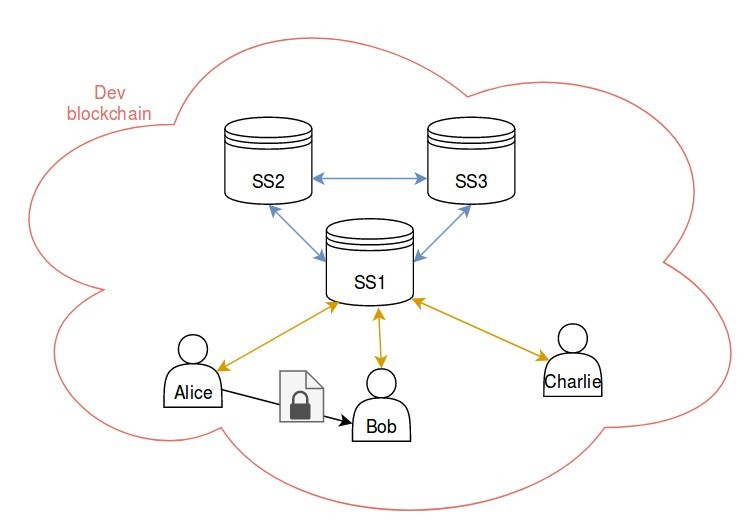

In this tutorial, we will learn step by step how to setup a Secret Store with 3 nodes and use it for a simple use case:

Alice has a confidential document stored locally on her hard-drive. She will encrypt it and store the encryption key in a secure way.
Later on, Alice will share this encrypted document with Bob making sure that he is the only one able to decrypt it.

To keep things simple we will work on a [Private development chain](Private-development-chain) but the Secret Store nodes are meant to be connected to and synchronize any blockchain (Private or Public).

The overall picture of this tutorial is the following:
- 3 Secret Store nodes (each with an account)
- 3 regular user accounts (Alice, Bob and Charlie)

- Each entity on this picture is running a node on the same blockchain. Interactions with the blockchain are not represented on this diagram.
- The nodes part of the secret store are connected with each other using a secure connection (blue lines).
- The Secret Store node 1 (SS1) exposes an HTTP API that Alice, Bob and Charlie can use to generate, store or retrieve encryption keys (orange lines).
- Alice will send an encrypted document to Bob per email (gray line).
- Charlie should not be able to decrypt the document.

## Table of contents:
* [Part 1 - Configuring each node](Secret-Store-Tutorial-1)
  * [1. Enable the Secret Store feature of OpenEthereum](Secret-Store-Tutorial-1#1-enable-the-secret-store-feature-of-openethereum)
  * [2. Create and configure the users' nodes](Secret-Store-Tutorial-1#2-create-and-configure-the-users-nodes)
  * [3. Create and configure the Secret Store nodes](Secret-Store-Tutorial-1#3-create-and-configure-the-secret-store-nodes)
    * [3.1 Configuration file for the Secret Store node 1](Secret-Store-Tutorial-1#31-configuration-file-for-the-secret-store-node-1)
    * [3.2 Configuration file for the Secret Store node 2](Secret-Store-Tutorial-1#32-configuration-file-for-the-secret-store-node-2)
    * [3.3 Configuration file for the Secret Store node 3](Secret-Store-Tutorial-1#33-configuration-file-for-the-secret-store-node-3)
  * [4. Add bootnodes to each configuration file](Secret-Store-Tutorial-1#4-add-bootnodes-to-each-configuration-file)
  * [5. Network overview](Secret-Store-Tutorial-1#5-network-overview)
* [Part 2 - Document encryption](Secret-Store-Tutorial-2)
  * [1. Choose a Document key id for this document](Secret-Store-Tutorial-2#1-choose-a-document-key-id-for-this-document)
  * [2. Get the server key for this document](Secret-Store-Tutorial-2#2-get-the-server-key-for-this-document)
    * [2.1 Sign the Document Key id](Secret-Store-Tutorial-2#21-sign-the-document-key-id)
    * [2.2 Generate the Secret Store Server key](Secret-Store-Tutorial-2#22-generate-the-secret-store-server-key)
  * [3. Generate the Document key from the Secret Store key](Secret-Store-Tutorial-2#3-generate-the-document-key-from-the-secret-store-key)
  * [4. Document encryption](Secret-Store-Tutorial-2#4-document-encryption)
  * [5. Store the Document key on the SS](Secret-Store-Tutorial-2#5-store-the-document-key-on-the-ss)
  * [6. Section overview](Secret-Store-Tutorial-2#6-section-overview)
* [Part 3 - Key retrieval](Secret-Store-Tutorial-3)
  * [1. Sign the Document key id with Bob's account](Secret-Store-Tutorial-3#1-sign-the-document-key-id-with-bobs-account)
  * [2. Ask the Secret Store for the decryption keys](Secret-Store-Tutorial-3#2-ask-the-secret-store-for-the-decryption-keys)
  * [3.  Decrypt the document](Secret-Store-Tutorial-3#3--decrypt-the-document)
  * [4. Section overview](Secret-Store-Tutorial-3#4-section-overview)
* [Part 4 - Introducing permissioning](Secret-Store-Tutorial-4)
  * [1. Sign the Document key id with Charlie's account](Secret-Store-Tutorial-4#1-sign-the-document-key-id-with-charlies-account)
  * [2. Ask the Secret Store for the decryption keys](Secret-Store-Tutorial-4#2-ask-the-secret-store-for-the-decryption-keys)
  * [3. Create and deploy a Permissioning contract](Secret-Store-Tutorial-4#3-create-and-deploy-a-permissioning-contract)
  * [4. Modify the Secret Store configuration files](Secret-Store-Tutorial-4#4-modify-the-secret-store-configuration-files)
  * [5. Permissioning verification](Secret-Store-Tutorial-4#5-permissioning-verification)
    * [5.1 Test with Bob](Secret-Store-Tutorial-4#51-test-with-bob)
    * [5.2 Test with Charlie](Secret-Store-Tutorial-4#52-test-with-charlie)

|[Part 1 - Configuring each node → ](Secret-Store-Tutorial-1)|

