Parity Ethereum supports state-orientated programming of smart contracts with the Solidity programming language for the Ethereum blockchain. The wallet contains an integrated Solidity development environment allowing you to write, compile, and deploy contracts.

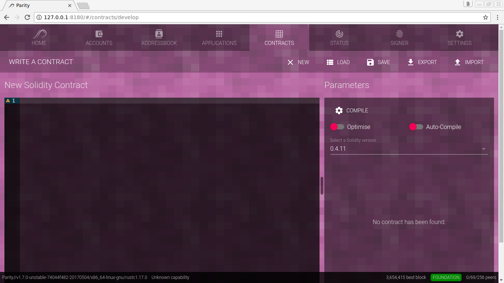
_The contract development view contains a contract code panel (left) and configuration parameters (right)._

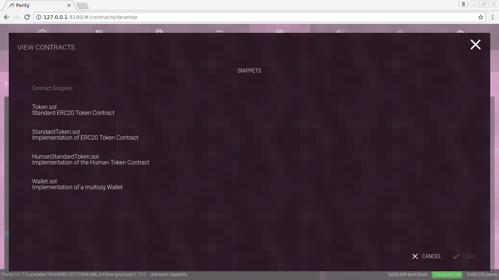
_To get started with your first contract, it's possible to **load** or import existing contracts._

Our first contract will be a Greeter "Hello, World!" contract:

    pragma solidity ^0.4.11;

    contract greeter {

        address owner;
        string message;

        function greeter(string _message) public {
            owner = msg.sender;
            message = _message;
        }

        function say() constant returns (string) {
            return message;
        }

        function die() {
            if (msg.sender == owner) {
                selfdestruct(owner);
            }
        }
    }

This contract contains two member variables, a constructor and two functions. The constructor will be called once upon contract deployment, sets the owner of the contract to the sender of the transaction, and stores the provided message.

The constant function `say()` simply returns the provided message on each call and `die()` allows the creator of the contract to self destruct the contract and clean up the state.

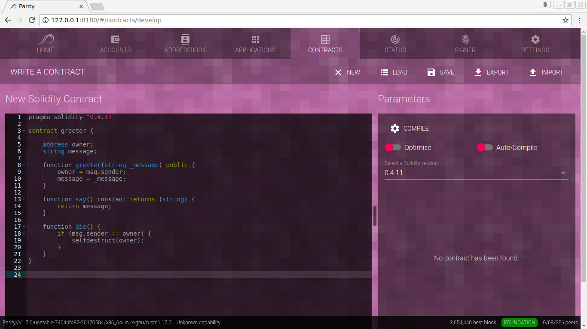
_Let's create the Greeter contract in the integrated Solidity development environment. Note, that `pragma solidity ^0.4.11` requires a Solidity compiler version of 0.4.11 or higher which can be selected on the right._

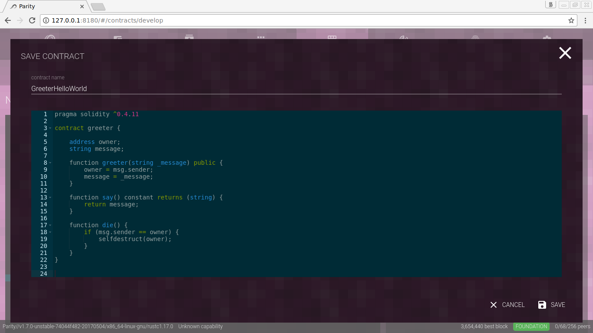
_Before compiling the contract, let's save the Greeter "Hello, world!" contract for later use._

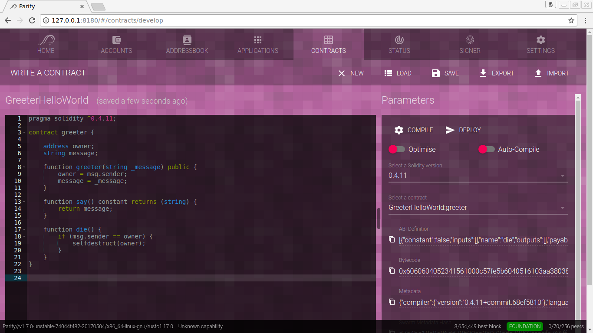
_Now, The Parity Solidity environment allows to compile the bytecode required for deployment on the blockchain and generating the application binary interface (ABI) required for contract-interaction._

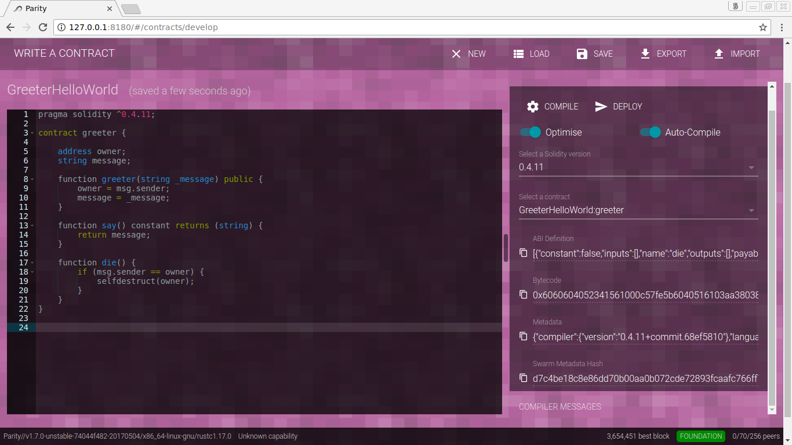
_A handy feature is code-optimization and auto-compilation regenerating the bytecode and ABI as you code._

Once done with these steps, Parity Ethereum provides us with the following JSON interface (ABI), bytecode, metadata, and the swarm hash.

Application binary interface (ABI):

    [
      {
        "constant":false,
        "inputs":[

        ],
        "name":"die",
        "outputs":[

        ],
        "payable":false,
        "type":"function"
      },
      {
        "constant":true,
        "inputs":[

        ],
        "name":"say",
        "outputs":[
          {
            "name":"",
            "type":"string"
          }
        ],
        "payable":false,
        "type":"function"
      },
      {
        "inputs":[
          {
            "name":"_message",
            "type":"string"
          }
        ],
        "payable":false,
        "type":"constructor"
      }
    ]

Compiled bytecode:

    0x6060604052341561000c57fe5b604051610307380380610307833981016040528051015b60008054600160a060020a03191633600160a060020a03161790558051610051906001906020840190610059565b505b506100f9565b828054600181600116156101000203166002900490600052602060002090601f016020900481019282601f1061009a57805160ff19168380011785556100c7565b828001600101855582156100c7579182015b828111156100c75782518255916020019190600101906100ac565b5b506100d49291506100d8565b5090565b6100f691905b808211156100d457600081556001016100de565b5090565b90565b6101ff806101086000396000f300606060405263ffffffff7c010000000000000000000000000000000000000000000000000000000060003504166335f469948114610045578063954ab4b214610057575bfe5b341561004d57fe5b6100556100e7565b005b341561005f57fe5b610067610129565b6040805160208082528351818301528351919283929083019185019080838382156100ad575b8051825260208311156100ad57601f19909201916020918201910161008d565b505050905090810190601f1680156100d95780820380516001836020036101000a031916815260200191505b509250505060405180910390f35b6000543373ffffffffffffffffffffffffffffffffffffffff908116911614156101265760005473ffffffffffffffffffffffffffffffffffffffff16ff5b5b565b6101316101c1565b60018054604080516020600284861615610100026000190190941693909304601f810184900484028201840190925281815292918301828280156101b65780601f1061018b576101008083540402835291602001916101b6565b820191906000526020600020905b81548152906001019060200180831161019957829003601f168201915b505050505090505b90565b604080516020810190915260008152905600a165627a7a72305820bcb6dac55886f2319f381c72002482234ee43206c088e0eea076260a472d83230029

Contract metadata:

    {
      "compiler":{
        "version":"0.4.11+commit.68ef5810"
      },
      "language":"Solidity",
      "output":{
        "abi":[
          {
            "constant":false,
            "inputs":[

            ],
            "name":"die",
            "outputs":[

            ],
            "payable":false,
            "type":"function"
          },
          {
            "constant":true,
            "inputs":[

            ],
            "name":"say",
            "outputs":[
              {
                "name":"",
                "type":"string"
              }
            ],
            "payable":false,
            "type":"function"
          },
          {
            "inputs":[
              {
                "name":"_message",
                "type":"string"
              }
            ],
            "payable":false,
            "type":"constructor"
          }
        ],
        "devdoc":{
          "methods":{

          }
        },
        "userdoc":{
          "methods":{

          }
        }
      },
      "settings":{
        "compilationTarget":{
          "GreeterHelloWorld":"greeter"
        },
        "libraries":{

        },
        "optimizer":{
          "enabled":true,
          "runs":200
        },
        "remappings":[

        ]
      },
      "sources":{
        "GreeterHelloWorld":{
          "keccak256":"0xe8f8f27c4b8e16a9d3b488f689b9e3018d25bdee6a67734444c9bbbf7a59c731",
          "urls":[
            "bzzr://ed1e3e9a69578ad5ccc4bb33539f802ee94b243163491f6ee3f9456b0ae4d281"
          ]
        }
      },
      "version":1
    }

Swarm hash:

    bcb6dac55886f2319f381c72002482234ee43206c088e0eea076260a472d8323

These information are important for deploying your smart contract to the Ethereum blockchain and integrating into your decentralized applications. Keep them for further reference.

By the way, if you prefer using the command line, and have a Solidity compiler installed, the same can be achieved by issuing the following command, assuming you have your contract code stored to a file called `greeter.sol`:

    solc --optimize --abi --bin --metadata greeter.sol

    ======= greeter.sol:greeter =======
    Binary:
    6060604052341561000c57fe5b604051610307380380610307833981016040528051015b60008054600160a060020a03191633600160a060020a03161790558051610051906001906020840190610059565b505b506100f9565b828054600181600116156101000203166002900490600052602060002090601f016020900481019282601f1061009a57805160ff19168380011785556100c7565b828001600101855582156100c7579182015b828111156100c75782518255916020019190600101906100ac565b5b506100d49291506100d8565b5090565b6100f691905b808211156100d457600081556001016100de565b5090565b90565b6101ff806101086000396000f300606060405263ffffffff7c010000000000000000000000000000000000000000000000000000000060003504166335f469948114610045578063954ab4b214610057575bfe5b341561004d57fe5b6100556100e7565b005b341561005f57fe5b610067610129565b6040805160208082528351818301528351919283929083019185019080838382156100ad575b8051825260208311156100ad57601f19909201916020918201910161008d565b505050905090810190601f1680156100d95780820380516001836020036101000a031916815260200191505b509250505060405180910390f35b6000543373ffffffffffffffffffffffffffffffffffffffff908116911614156101265760005473ffffffffffffffffffffffffffffffffffffffff16ff5b5b565b6101316101c1565b60018054604080516020600284861615610100026000190190941693909304601f810184900484028201840190925281815292918301828280156101b65780601f1061018b576101008083540402835291602001916101b6565b820191906000526020600020905b81548152906001019060200180831161019957829003601f168201915b505050505090505b90565b604080516020810190915260008152905600a165627a7a7230582033ca9aeef924a814a80886e9f27b539e8c3b71780e6da527ebcd4df6076c45000029
    Metadata:
    {"compiler":{"version":"0.4.11+commit.68ef5810"},"language":"Solidity","output":{"abi":[{"constant":false,"inputs":[],"name":"die","outputs":[],"payable":false,"type":"function"},{"constant":true,"inputs":[],"name":"say","outputs":[{"name":"","type":"string"}],"payable":false,"type":"function"},{"inputs":[{"name":"_message","type":"string"}],"payable":false,"type":"constructor"}],"devdoc":{"methods":{}},"userdoc":{"methods":{}}},"settings":{"compilationTarget":{"greeter.sol":"greeter"},"libraries":{},"optimizer":{"enabled":true,"runs":200},"remappings":[]},"sources":{"greeter.sol":{"keccak256":"0x2914014e6c5ef4ffd0de42461548cfb78b006af718a3ddf18c9fb851ba457854","urls":["bzzr://622e562f0f51d94c6bd395063133657d178c6c5c7bfd43db6c10470f59eb34ac"]}},"version":1}
    Contract JSON ABI
    [{"constant":false,"inputs":[],"name":"die","outputs":[],"payable":false,"type":"function"},{"constant":true,"inputs":[],"name":"say","outputs":[{"name":"","type":"string"}],"payable":false,"type":"function"},{"inputs":[{"name":"_message","type":"string"}],"payable":false,"type":"constructor"}]

Note that the swarm hash is encoded in the `urls` field of the metadata when using `solc`.

Now, we finally want to deploy our contract, click the **Deploy** button.

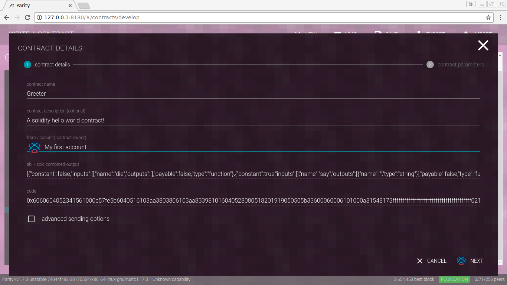
_The greeter contracts can be directly deployed from within Parity._

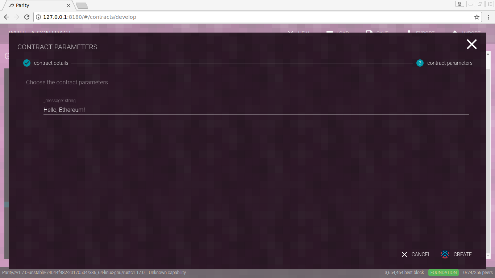
_Chose a string which greets you._

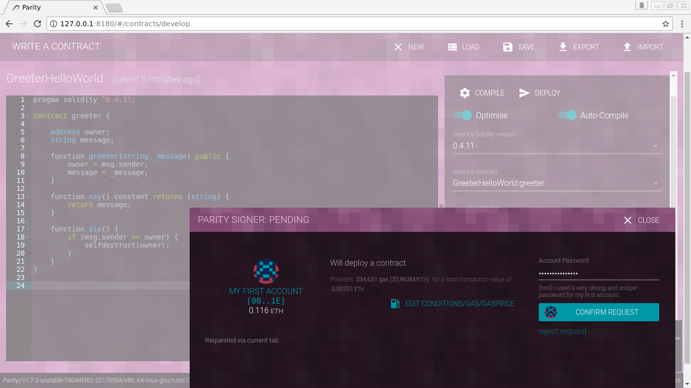
_Once deployed and mined, ..._

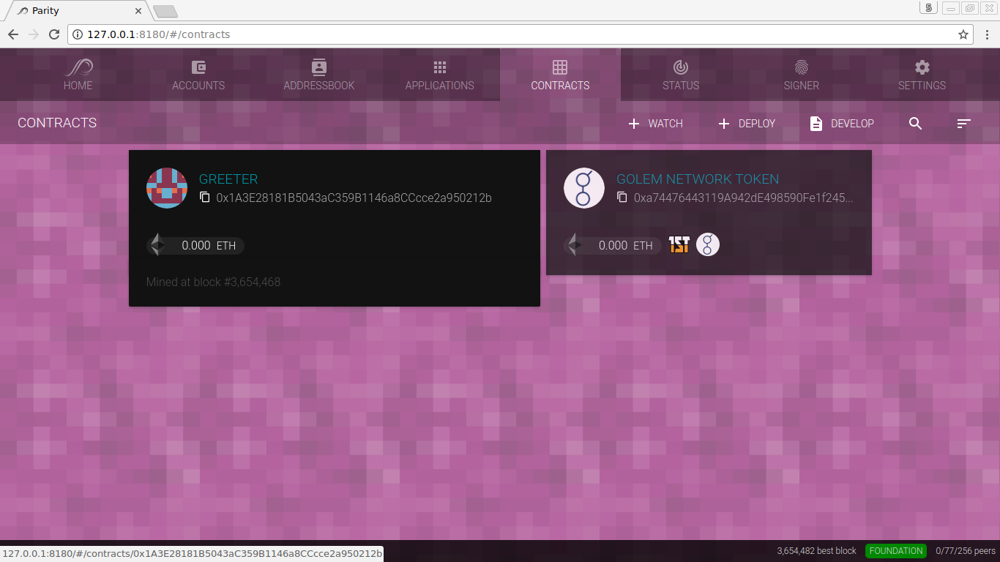
_... the contract becomes available in your Parity Ethereum wallet and allows basic interaction._

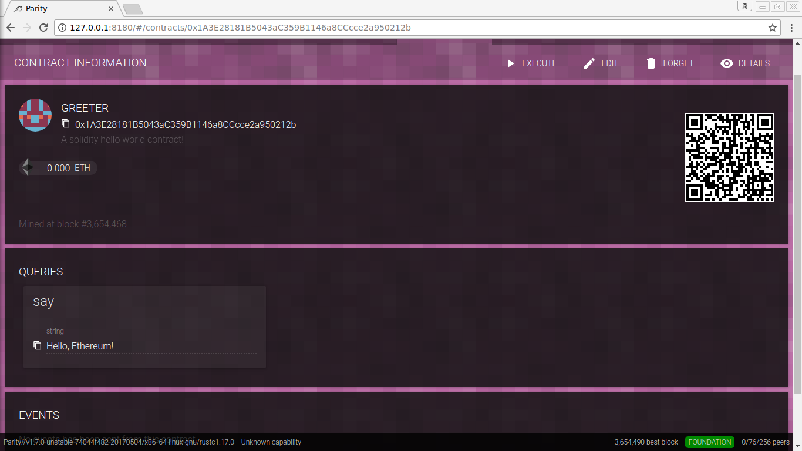
_Use the contract interface to query the `say` function and check the results immediately._

To deploy the contract via JSON-RPC API, we first have to estimate the gas requirements with the `eth_estimateGas` RPC call by passing in the compiled bytecode.

    curl --data '{"jsonrpc":"2.0","method": "eth_estimateGas", "params": [{"from": "0x00a329c0648769a73afac7f9381e08fb43dbea72", "data": "0x6060604052341561000c57fe5b6040516103aa3803806103aa833981016040528080518201919050505b33600060006101000a81548173ffffffffffffffffffffffffffffffffffffffff021916908373ffffffffffffffffffffffffffffffffffffffff1602179055508060019080519060200190610080929190610088565b505b5061012d565b828054600181600116156101000203166002900490600052602060002090601f016020900481019282601f106100c957805160ff19168380011785556100f7565b828001600101855582156100f7579182015b828111156100f65782518255916020019190600101906100db565b5b5090506101049190610108565b5090565b61012a91905b8082111561012657600081600090555060010161010e565b5090565b90565b61026e8061013c6000396000f30060606040526000357c0100000000000000000000000000000000000000000000000000000000900463ffffffff16806335f4699414610046578063954ab4b214610058575bfe5b341561004e57fe5b6100566100f1565b005b341561006057fe5b610068610185565b60405180806020018281038252838181518152602001915080519060200190808383600083146100b7575b8051825260208311156100b757602082019150602081019050602083039250610093565b505050905090810190601f1680156100e35780820380516001836020036101000a031916815260200191505b509250505060405180910390f35b600060009054906101000a900473ffffffffffffffffffffffffffffffffffffffff1673ffffffffffffffffffffffffffffffffffffffff163373ffffffffffffffffffffffffffffffffffffffff16141561018257600060009054906101000a900473ffffffffffffffffffffffffffffffffffffffff1673ffffffffffffffffffffffffffffffffffffffff16ff5b5b565b61018d61022e565b60018054600181600116156101000203166002900480601f0160208091040260200160405190810160405280929190818152602001828054600181600116156101000203166002900480156102235780601f106101f857610100808354040283529160200191610223565b820191906000526020600020905b81548152906001019060200180831161020657829003601f168201915b505050505090505b90565b6020604051908101604052806000815250905600a165627a7a72305820d7c4be18c8e86dd70b00aa0b072cde72893fcaafc766ff7bb86debf4d9357cac00290000000000000000000000000000000000000000000000000000000000000020000000000000000000000000000000000000000000000000000000000000001048656c6c6f2c20457468657265756d2100000000000000000000000000000000"}], "id": 1}' -H "Content-Type: application/json" -X POST localhost:8545
    {"jsonrpc":"2.0","result":"0x4414b","id":1}

Now that we know, the contract deployment will cost 278859 gas (hex `0x4414b`), we can broadcast the transaction:

    curl --data '{"method":"eth_sendTransaction","params":[{"from":"0x00a329c0648769a73afac7f9381e08fb43dbea72","gas":"0x4414b","data":"0x6060604052341561000c57fe5b6040516103aa3803806103aa833981016040528080518201919050505b33600060006101000a81548173ffffffffffffffffffffffffffffffffffffffff021916908373ffffffffffffffffffffffffffffffffffffffff1602179055508060019080519060200190610080929190610088565b505b5061012d565b828054600181600116156101000203166002900490600052602060002090601f016020900481019282601f106100c957805160ff19168380011785556100f7565b828001600101855582156100f7579182015b828111156100f65782518255916020019190600101906100db565b5b5090506101049190610108565b5090565b61012a91905b8082111561012657600081600090555060010161010e565b5090565b90565b61026e8061013c6000396000f30060606040526000357c0100000000000000000000000000000000000000000000000000000000900463ffffffff16806335f4699414610046578063954ab4b214610058575bfe5b341561004e57fe5b6100566100f1565b005b341561006057fe5b610068610185565b60405180806020018281038252838181518152602001915080519060200190808383600083146100b7575b8051825260208311156100b757602082019150602081019050602083039250610093565b505050905090810190601f1680156100e35780820380516001836020036101000a031916815260200191505b509250505060405180910390f35b600060009054906101000a900473ffffffffffffffffffffffffffffffffffffffff1673ffffffffffffffffffffffffffffffffffffffff163373ffffffffffffffffffffffffffffffffffffffff16141561018257600060009054906101000a900473ffffffffffffffffffffffffffffffffffffffff1673ffffffffffffffffffffffffffffffffffffffff16ff5b5b565b61018d61022e565b60018054600181600116156101000203166002900480601f0160208091040260200160405190810160405280929190818152602001828054600181600116156101000203166002900480156102235780601f106101f857610100808354040283529160200191610223565b820191906000526020600020905b81548152906001019060200180831161020657829003601f168201915b505050505090505b90565b6020604051908101604052806000815250905600a165627a7a72305820d7c4be18c8e86dd70b00aa0b072cde72893fcaafc766ff7bb86debf4d9357cac00290000000000000000000000000000000000000000000000000000000000000020000000000000000000000000000000000000000000000000000000000000001048656c6c6f2c20457468657265756d2100000000000000000000000000000000"}],"id":1,"jsonrpc":"2.0"}' -H "Content-Type: application/json" -X POST localhost:8545
    {"jsonrpc":"2.0","result":"0x9f79dbaeab3f0e24bbe2c885432dae3ff4350e357a497e7bf8820a64c219e011","id":1}

Note, if the account is not unlocked yet, you have to switch to the wallet user interface and confirm the transaction with the trusted signer.

Now you get the gist of writing, compiling, and deploying contracts to an Ethereum chain and know how to call the `say()` function of our deployed Greeter contract.

There are two different ways to interact with smart contracts on the Ethereum blockchain. You can either call (query) or invoke (execute) the contract. Calling a contract is a read-only process and is usually free. Invoking a contract requires to broadcast a transaction to execute functions of the desired contract and has to be covered with a fee. So, let's execute our Greeter contract. There is only one function that can be executed: `die()`.

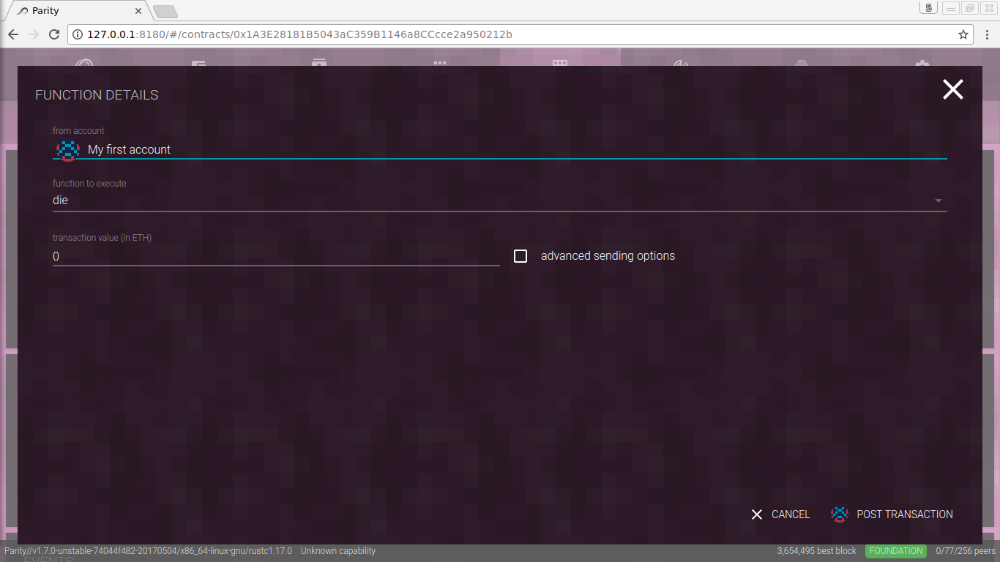
_It's generally a good practice to clean up after development. Now that we know our developed Greeter contract works, we are going to remove it from the blockchain by calling the **die** function that self-destructs the contract._

_Once mined, the self-destruct function will free up space from the current blockchain state._

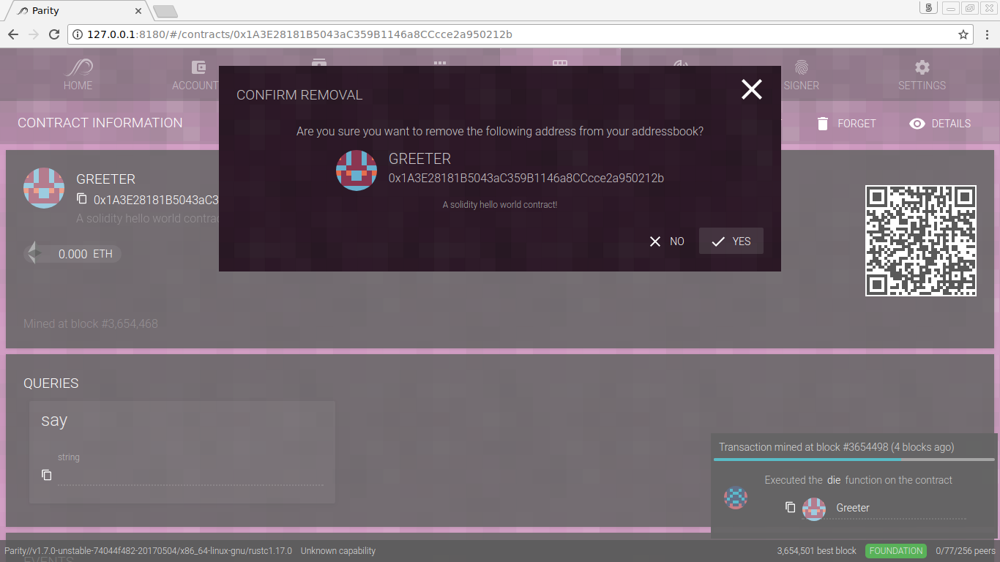
_Since it's not possible to interact with a killed contract, let's remove it by clicking the **Forget** button._

To execute the `die()` function via RPC, we first have to look up the function signature. This can be done via `solc --hash`:

     $ solc --hash greeter.sol

    ======= greeter.sol:greeter =======
    Function signatures:
    35f46994: die()
    954ab4b2: say()

Now, all we have to do is to create a transaction to our Greeter contract at `0x1A3E28181B5043aC359B1146a8CCcce2a950212b` with the data load `0x35f46994`. A self-destruct call usually does not cost much fee, therefore we just assume a small amount `0xc350`.

    curl --data '{"method":"eth_sendTransaction","params":[{"from":"0x00a329c0648769a73afac7f9381e08fb43dbea72",to:"0x1A3E28181B5043aC359B1146a8CCcce2a950212b","gas":"0xc350","data":"0x35f46994"}],"id":1,"jsonrpc":"2.0"}' -H "Content-Type: application/json" -X POST localhost:8545
    {"jsonrpc":"2.0","result":"0x8423e6ed270f92621c14302f0d3db647eaf9677ef8f2ba0dd3374b79d2567c78","id":1}
