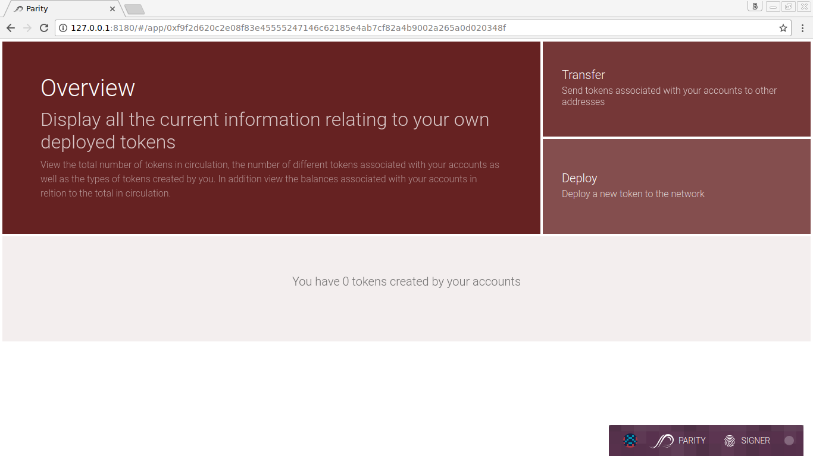
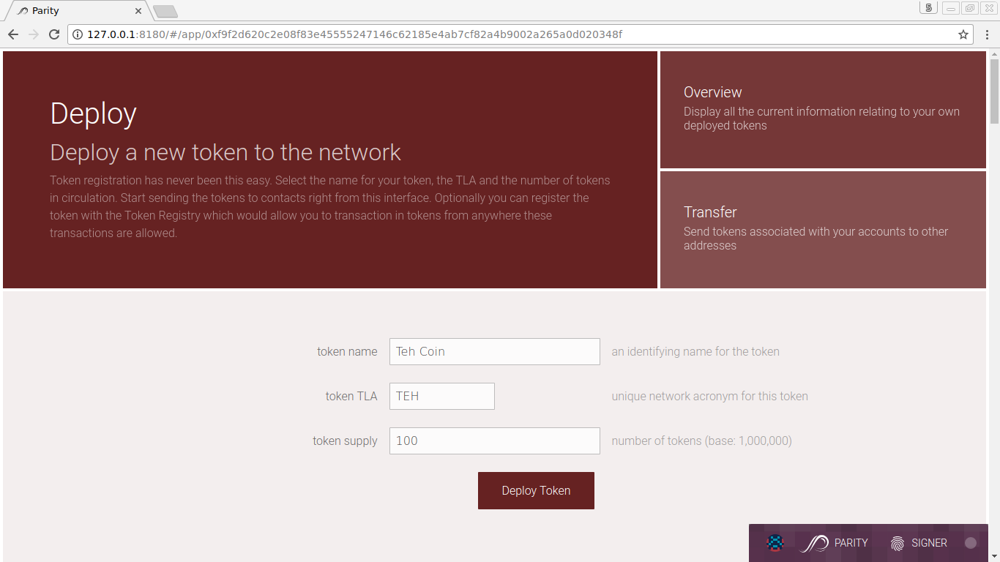
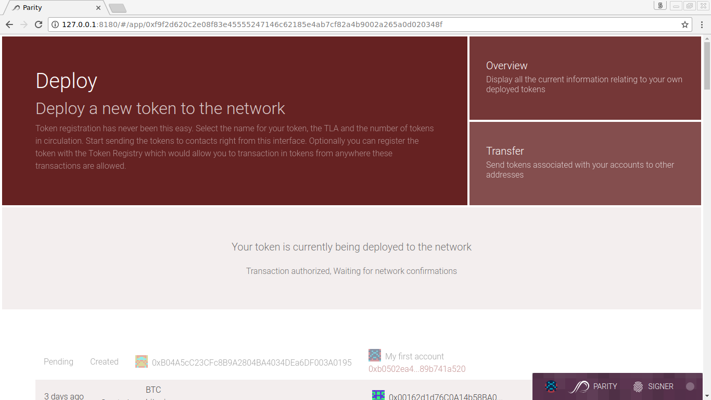
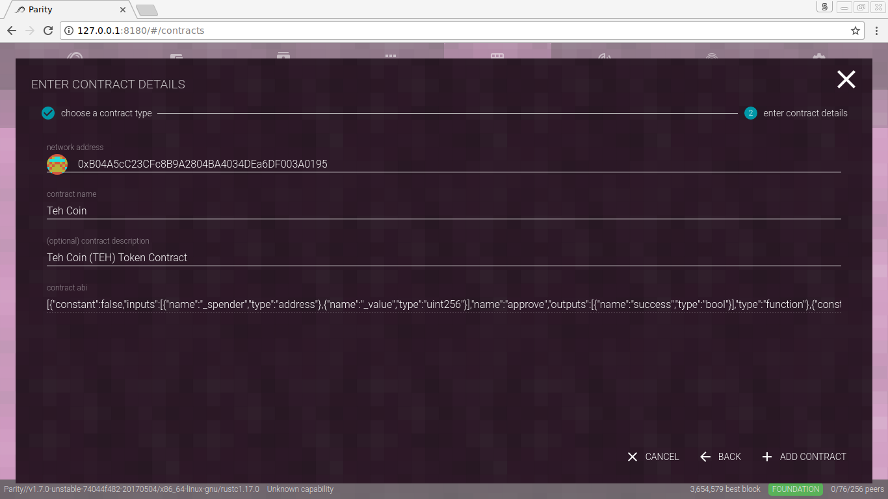

The Parity Ethereum wallet supports any ERC20-compliant [token](Tokens.md) by displaying balances and enabling transfers to be as simple as Ether transactions. The [ERC20-token standard](https://github.com/ethereum/EIPs/issues/20) basically describes which standard functions each token contract should implement to be ERC20-compliant. Those will allow DApps and wallets to handle tokens across multiple interfaces. The most important here are `transfer`, `balanceOf` and the `Transfer` event.

Parity Ethereum enables you to configure and deploy your own token via the **Token Deployment** DApp. Navigate to Applications in your wallet and find the Token Deployment tool. If it's not displayed by default, use the _Edit_ button on top to toggle visibility of displayed DApps.

_Figure: Transfer or deploy tokens with the **Token Deployment** DApp found in the built-in Parity applications._

_Figure: Let's create our own token, Teh Coin (TEH), with an initial supply of 100._

_Figure: And deploy it to the Ethereum blockchain._

_Figure: Once deployed, watch it on the Contracts tab._

Deploying a new token is straight-forward with the Parity Ethereum wallet user interface. If you wish to deploy a token via RPC, grab the `BasicCoin.sol` [contract source code from GitHub](https://github.com/paritytech/contracts/blob/master/BasicCoin.sol), compile and deploy it via the **Contracts** tab.

Now, creating your own token is a nice thing to do. However, it would be nice if _all_ Parity Ethereum users could see and use your token in the wallet by default. Therefore, we need to register our token with the [Token Registry](Token-Registry.md) DApp.
