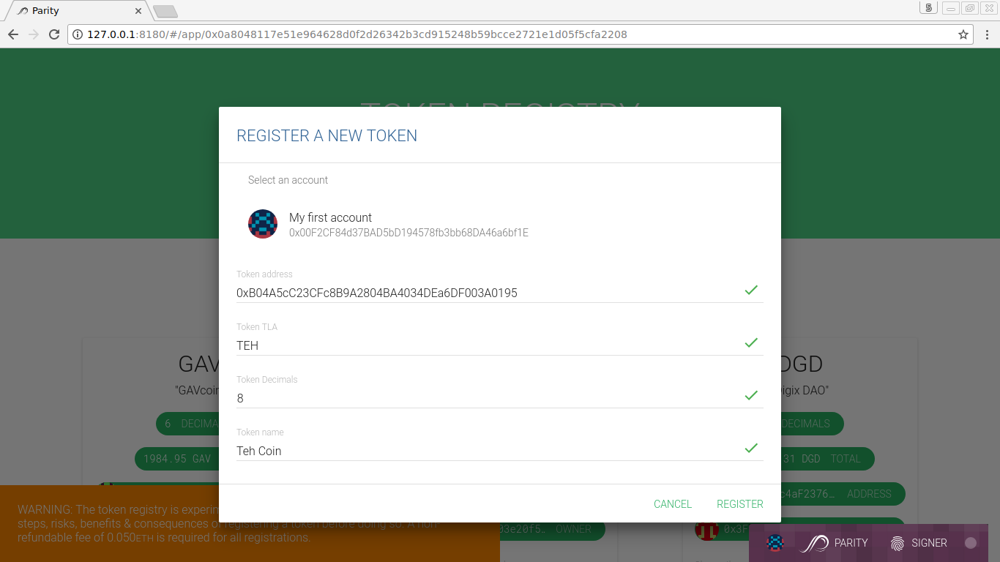
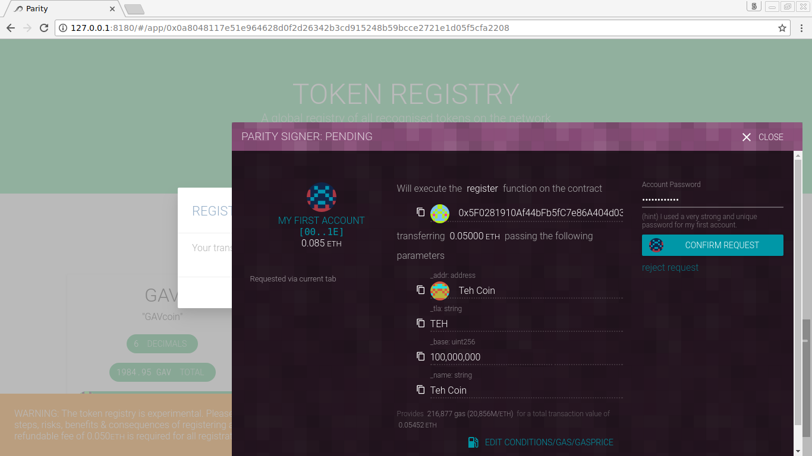
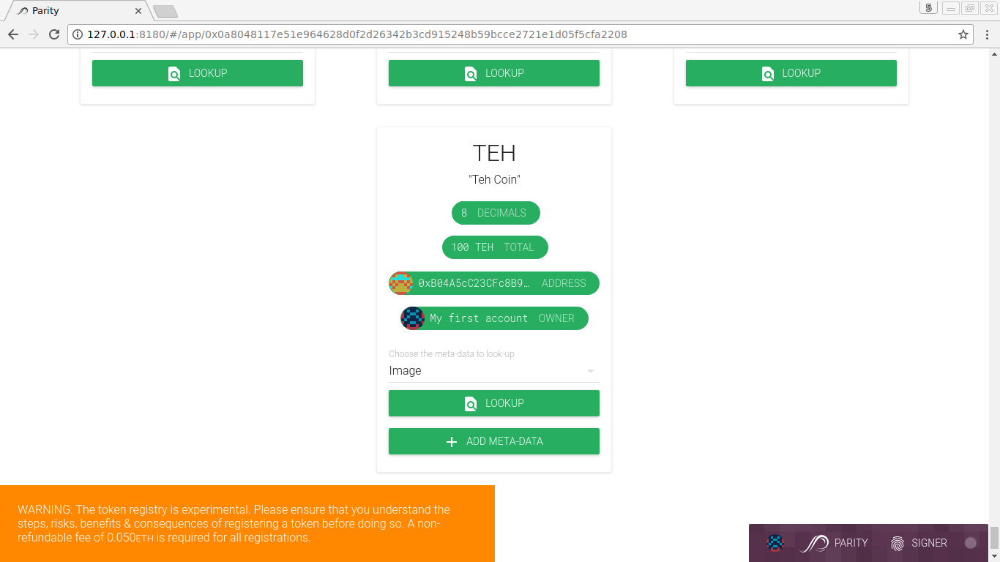
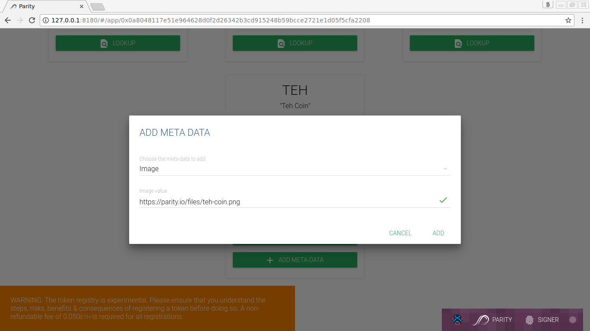
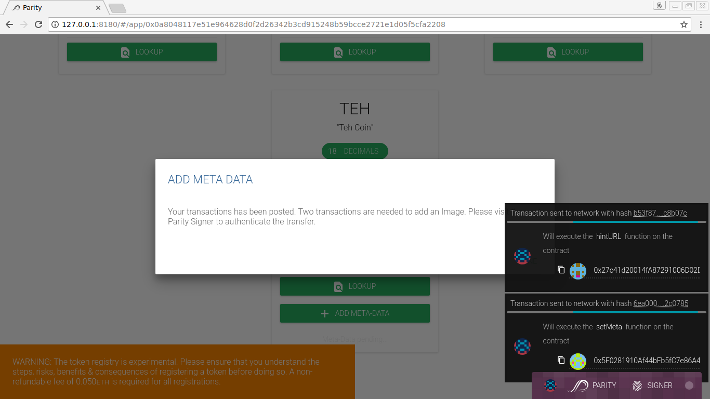
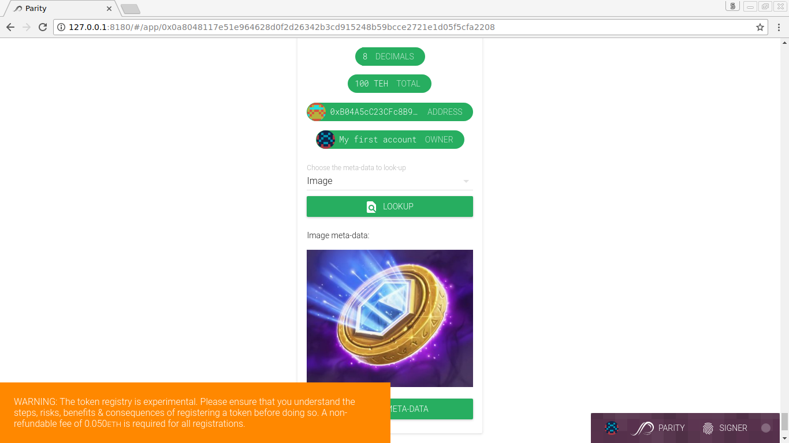
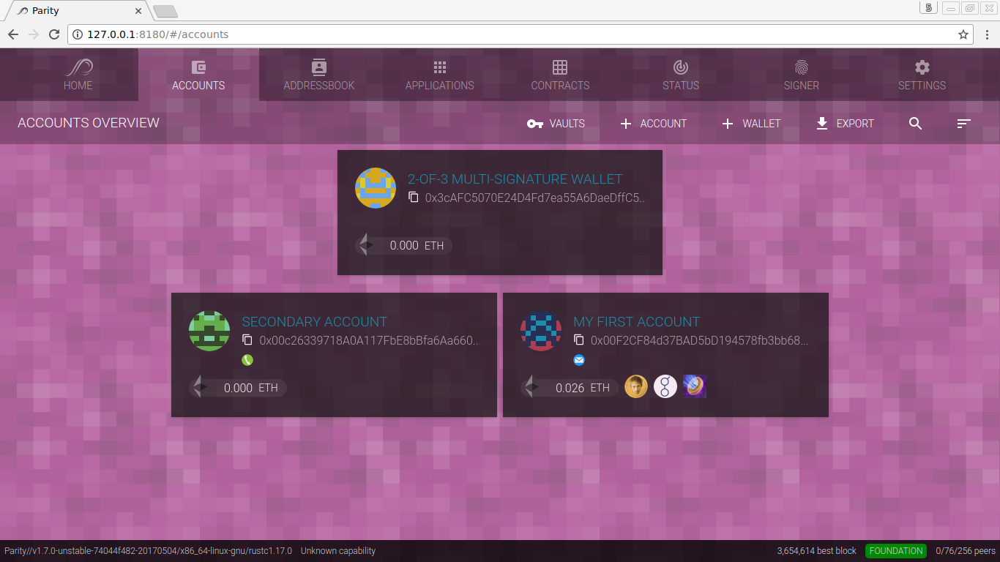

In a previous article on [Token Deployment](Token-Deployment.md), we created _Teh Coin_ [TEH]. Now, creating your own [token](Tokens.md) is a nice thing to do. However, it would be nice if _all_ Parity Ethereum users could see and use your token in the wallet by default. Therefore, we need to register our token with the **Token Registry** DApp. Navigate to Applications in your wallet and find the Token Registry. If it's not displayed by default, use the _Edit_ button on top to toggle visibility of displayed DApps.

_Figure: To register a new token with the **Token Registry**, we need the token address, decide on a 3-letter acronym (TLA), a token name, and specify the number of decimals (between `0` and `18`)._

_Figure: Once done, this will execute the `register` function of the Token Registry smart contract adding our token to Parity. Note, there is a fee of `0.01` ETH to register a token._

_Figure: Once deployed, the token is displayed in the registry among other registered tokens._

Finally, we need an icon for our token to be displayed in the wallet. This can be done by adding meta data to the token registry contract.

_Figure: To add an icon we have to click **Add Metadata** and provide the static URL to the image file._

_Figure: Adding an icon triggers two transactions: The first one is generating a hint for the [URL registry](Parity-github-hint) and the second one is setting the hint as token metadata._

_Figure: Once both transactions are mined, we can look-up the image on the token registry DApp._

_Figure: And our custom token will be displayed along with other tokens in our wallet, note the shiny icon._

Any token registered with the Parity Token Registry will be automatically visibile to all Parity wallet users holding tokens or watching accounts with registered tokens.
