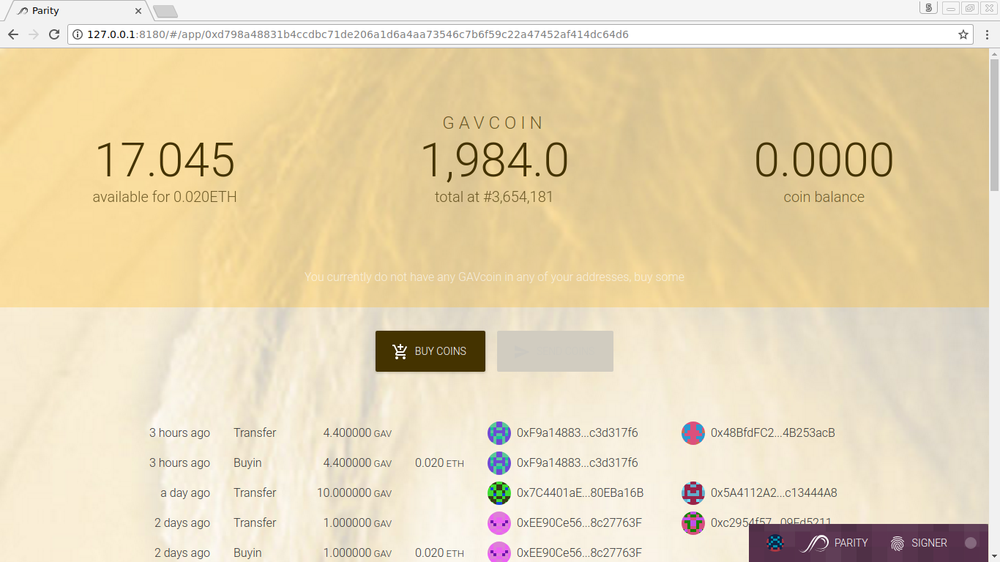
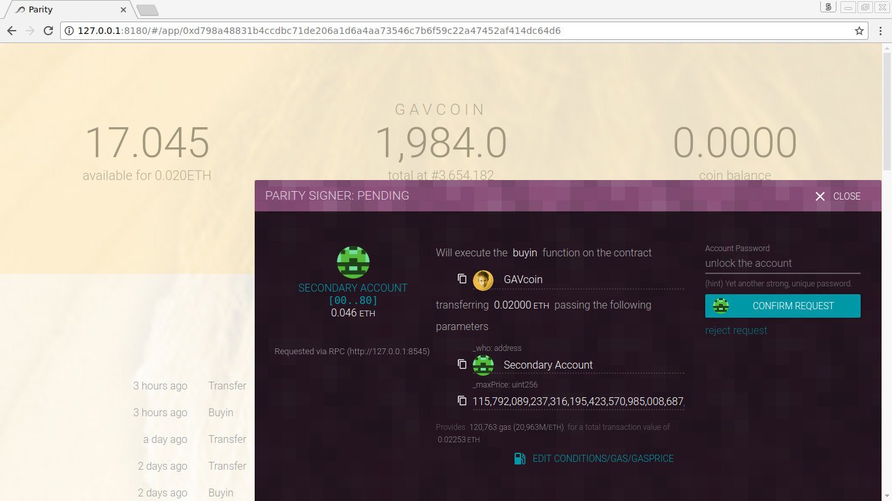
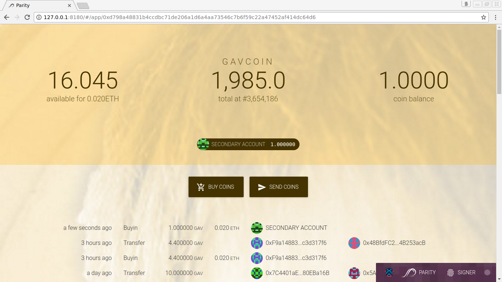
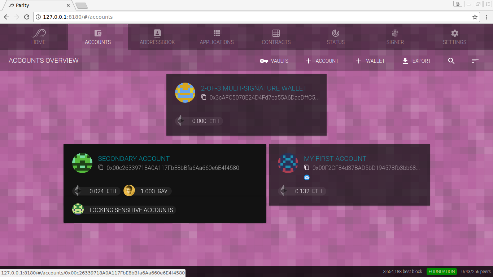
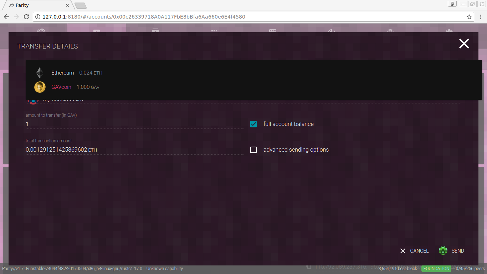
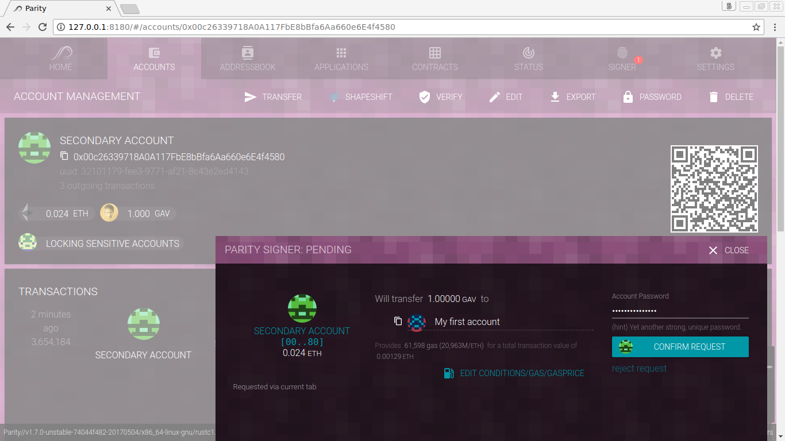

The native token of the Ethereum blockchain is called _Ether_ (ETH). In addition to Ether, additional assets and tokens can be handled by the Ethereum blockchain. The Parity Ethereum wallet supports any [ERC20](https://github.com/ethereum/EIPs/issues/20)-compliant token by displaying balances and enabling transfers to be as simple as Ether transactions.

To get your first tokens, and learn how to use them, you can use the **GavCoin** DApp. Open the **Applications** tab, enable the network applications, and open GavCoin. If it's not displayed by default, make sure to confirm the usage warning for community DApps and use the _Edit_ button on top to toggle visibility of displayed DApps.

_Figure: The GavCoin DApp provides you with GAV, a playful ERC20-compliant token._

_Figure: Let's buy 1 GAV with our account, and confirm the contract execution with your password._

_Figure: The GavCoin DApp will now recognize you as a GAV holder and display your balance._

_Figure: Tokens are also displayed in your accounts view next to your Ether balance._

_Figure: To transfer tokens instead of Ether, simply switch the type of token transfer from ETH to GAV, select the available balance, ..._

_Figure: ... and confirm with your password._

All ERC20-Tokens are also fully supported by [multi-signature](Accounts%2C-Wallets%2C-Vaults.md) and [hardware](Ledger-Nano-S.md) wallets. Now, you probably want to read more about [Token Deployment](Token-Deployment.md) and the Parity [Token Registry](Token-Registry.md).
