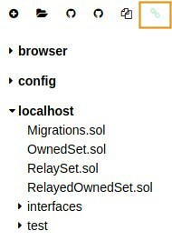
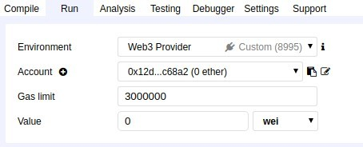
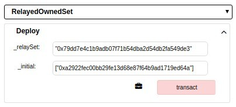
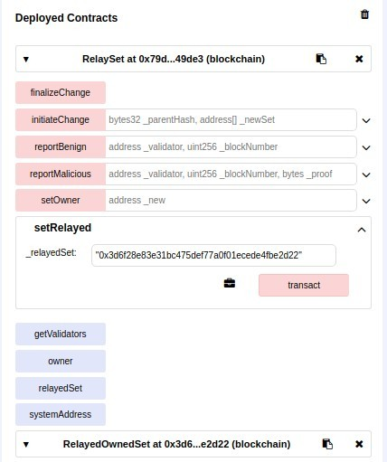

Now that every node is configured, and either creates or imports blocks, we can create and deploy a Validator Set contract. The following steps assume that `Node0`, `Node1` and `Alice` nodes are running.
In this tutorial, `Alice` will deploy and be the owner of the contract. In a real world setting, Alice could be replaced by a multi-signature contract or any other governing logic, so as to prevent one single entity from controlling the Validator Set.

## 1. Setup Remix and `remixd`

The Validator Set contract used for Kovan Network is in fact a set of contracts. We will first download them locally before using [`remixd`](https://github.com/ethereum/remixd) and [Remix](https://remix.ethereum.org) to deploy this set of contracts.
[`remixd`](https://github.com/ethereum/remixd) is a convenient way to load local files to Remix and avoid tedious manual work. Explaining how to install `remixd` is outside of the scope of this tutorial. Please install it with [npm](https://www.npmjs.com/get-npm), and we'll continue from there.

- Run the following command to copy the Validator Set contract's repository and navigate to the contract's directory:
```bash
git clone https://github.com/parity-contracts/kovan-validator-set.git && cd ./kovan-validator-set/contracts
```
- Launch `remixd` from here to share the content of this directory with Remix:
```
remixd -s ./
```
This opens a WebSockets channel to allow your browser to access local files on the port 65520.

- Visit [Remix](https://remix.ethereum.org) and verify that you can see your local file by clicking on the link symbol in the top left corner. If the connection is successful, you should see your local files.



We will now connect remix to `Alice`'s node. We've set it up earlier to accept connections from Remix domain over the standard JSON RPC HTTP port 8545. 
- In Remix, click on the `Run` tab in the top right-hand corner of the window.
- Select `Web3 provider` in the "Environment" drop-down menu.
- Use the default "http://localhost:8545" as it is the port we specified in `alice.toml`.
- You should see Alice's account in the next drop-down menu.



## 2. Deploy RelaySet and RelayedOwnedSet

The contract used in this tutorial is not trivial to understand as it consists of a set of contracts using a proxy as well as libraries.
You can read more about the internals in the [dedicated repository](https://github.com/parity-contracts/kovan-validator-set). The important concept to understand is that `RelaySet` is a proxy contract that will point to the main contract that itself allows to add and remove validators. Proxy contracts allow to be flexible and update the "proxied" contract in the future if needed. In our case, `RelayedOwnedSet` will be the "proxied" contract.

We will need to deploy `RelaySet`, then deploy `RelayedOwnedSet`, and finally, link the former with the later.

- Deploy `RelaySet` by selecting it in the drop-down menu on the right part of Remix and click `Deploy`.
- If the transaction is successful, the `RelaySet` contract is deployed, copy its address.
- Now select `RelayedOwnedSet` in the drop-down menu. The constructor requires two arguments, the `RelaySet` address and the initial set of validators (this is an array).
- Deploy `RelayedOwnedSet` by filling the parameters with the address copied at the previous step, and `Node0`'s address. It should look similar to (notice that the array `["0x.."]` for `_initial` parameter): 

- Finally, call the `setRelay` function from `RelaySet` contract to link the proxied with the proxy contract.


The Validator Set contract is now deployed. You can make sure `Node0` is the only allowed validator by calling `getValidators`.

|[ ← Part 1 - Configuring each node ](Validator-Set-Tutorial-1.md)| [ Part 3 - Hardfork to use the Validator Set contract → ](Validator-Set-Tutorial-3.md)|