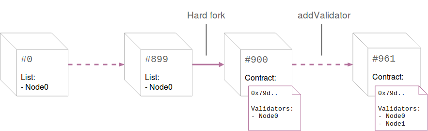

Now that the needed contract is deployed, `Node0`, the only authority in the network has to agree to update its chain specification file to add the block from which the Validator Set contract will be used.

## 1. Choose the hardfork block

Depending on how long the network has been up, you should choose an adequate hardfork block. In this example, the chain is currently at around block #800. We will decide to perform the hardfork at block #900. **Note that the selected hardfork block has to be in the future**. 

Before this block is reached, update the `Validator-set-tutorial.json` chain spec file to add the hardfork block. It should look like:
```json
"validators" : {
    "multi": {
        "0": {
            "list": ["0xa2922fec00bb29fe13d68e87f64b9ad1719ed64a"]
        },
        "900": {
            "contract": "0x79dd7e4c1b9adb07f71b54dba2d54db2fa549de3"
        }
    }
}
```

This tells that the fixed list of validators (containing `Node0`'s address) will be used from block 0 until block 900. From block 900, the network will use the Validator-Set contract deployed at the address `0x79dd..9de3` to determine the validators.

Before the hardfork block has been reached, make sure to stop and restart all the nodes from the network. Once you reach this block, you should see the following in the console.

```bash
2018-09-26 16:50:45  Imported #899 0x9ae3…a403 (0 txs, 0.00 Mgas, 0 ms, 0.57 KiB)
2018-09-26 16:50:50  Signal for switch to contract-based validator set.
2018-09-26 16:50:50  Initial contract validators: [0xa2922fec00bb29fe13d68e87f64b9ad1719ed64a]
2018-09-26 16:50:50  Applying validator set change signalled at block 900
2018-09-26 16:50:50  Imported #900 0x92b4…a3d3 (0 txs, 0.00 Mgas, 1 ms, 0.57 KiB)
2018-09-26 16:50:55  Imported #901 0x21f4…e53e (0 txs, 0.00 Mgas, 0 ms, 0.57 KiB)
```

This indicates that the move from a fixed list to a Validator Set contract was effective!

## 2. Add `Node1` as validator

As explained before, we now have the flexibility to add and remove validator nodes. As `node1` has initially been set up like a validator, we can now add it to the Validator Set.

To do this, in Remix call the `addValidator` function from the `RelayedOwnedSet` contract with `Node1`'s address as the argument.
Once you deploy this transaction, the nodes connected to the network should print the following:

```bash
2018-09-30 19:17:40  Imported #960 0x84bf…5725 (0 txs, 0.00 Mgas, 2 ms, 0.57 KiB)
2018-09-30 19:17:45  Signal for transition within contract. New list: [0xa2922fec00bb29fe13d68e87f64b9ad1719ed64a, 0x32784591c38bf8aa081e96ba4db462bd73a3179e]
2018-09-30 19:17:45  Applying validator set change signalled at block 961
2018-09-30 19:17:45  Imported #961 0xe660…5064 (1 txs, 0.10 Mgas, 2 ms, 0.71 KiB)
```

This indicates that `Node1` is now sealing blocks and the network accepts these. No hardfork was needed, and a simple transaction performed by Alice allowed us to add a Validator.

## 3. Network Overview



|[ ← Part 2 - Deploy the Validator-set contract ](Validator-Set-Tutorial-2)| [ Part 4 - Visualize misbehaviors → ](Validator-Set-Tutorial-4)|
