The service [wallet.parity.io](https://wallet.parity.io/) is a [Public Node](Public-Node.md) serving a secured online version of the [Parity Wallet](Parity-Wallet.md). This walk-through will show you how to set up your first account, back-up your keys, and send a transaction using the online wallet.

### Your first account

To use the Parity online-wallet, please navigate to [wallet.parity.io](https://wallet.parity.io/) and wait for the welcome page to load.

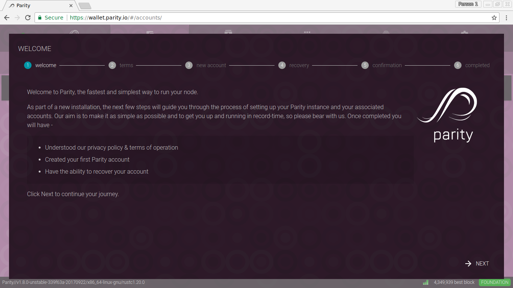

For the first setup, it's required to read, understand, and accept the privacy policy as well as the terms of service.

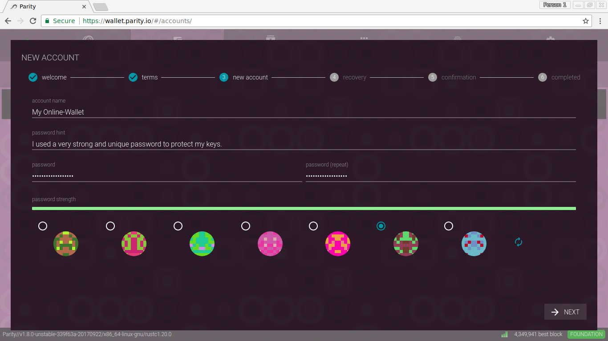

Once done, you can proceed to generate your first Ethereum account. Choose a name, a description, and a strong, unique password to encrypt your keys. In addition, you can also choose an identicon you like most.

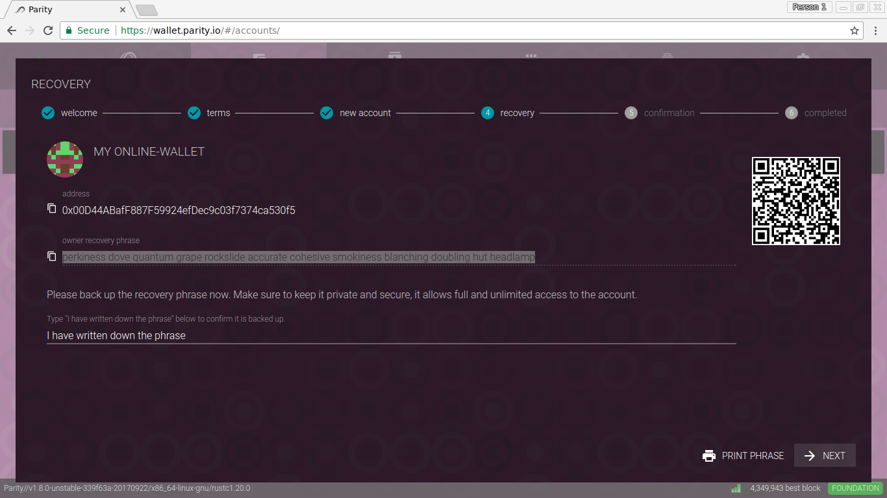

Once generated, the wallet will present you the **recovery phrase**. Like the name suggest, this 12 words mnemonic phrase allows you to recover your account any time with any Parity wallet. **Make sure you write down this phrase offline, or print it out and put it in a secure location**. Do not keep your recovery phrase unencrypted on your computer. Once you have done that, type _I have written down the phrase_ to confirm you are done, and proceed.

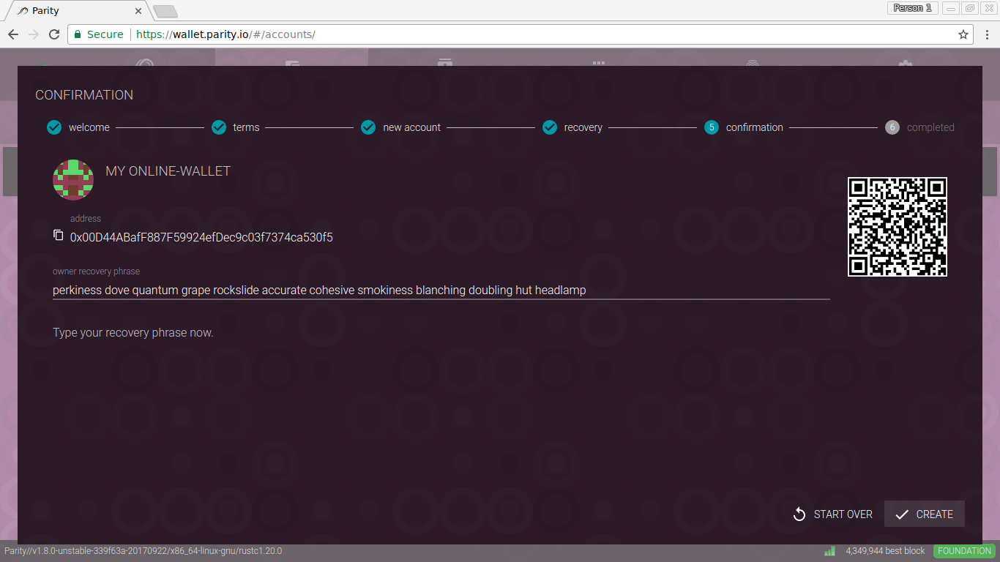

In the last step of the account creation, you are required to proof that you have written down the phrase, please enter it to complete account creation.

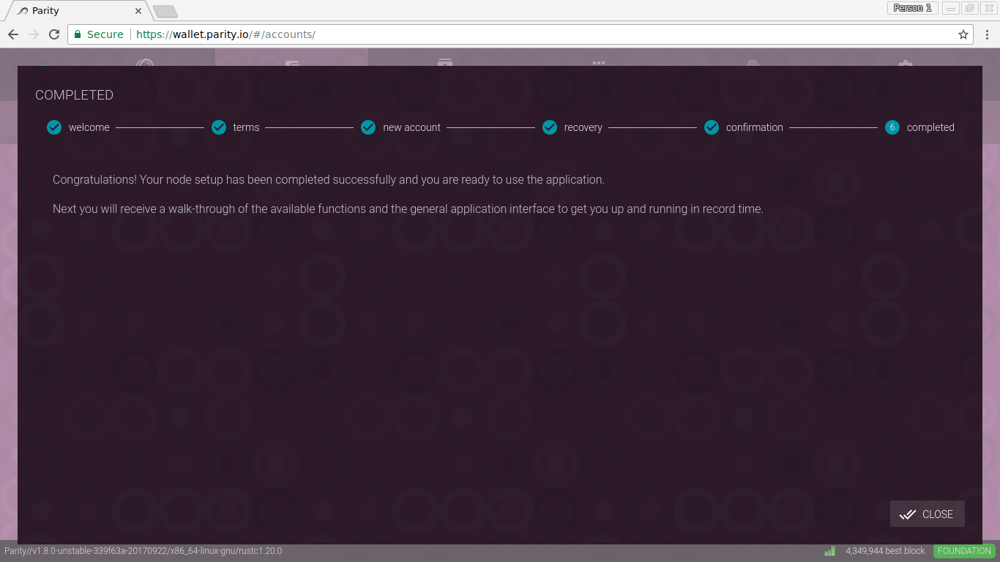

Now you are done setting up your first account, congratulations!

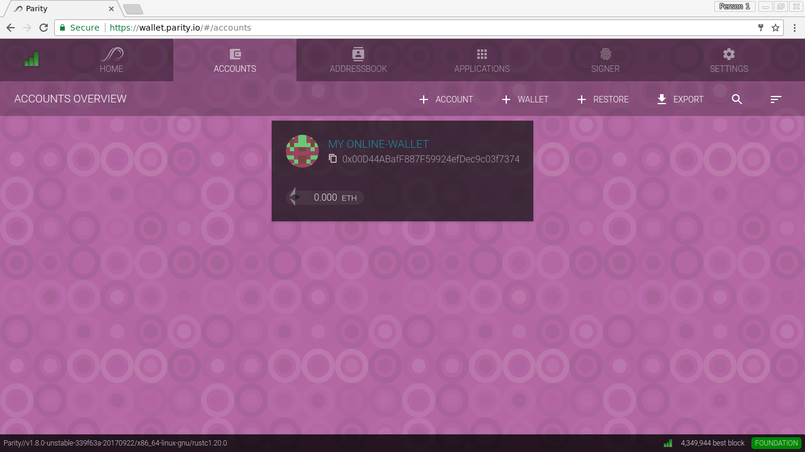

Your account is now visible in the ACCOUNTS view of your Parity online wallet.

### Backing up your keys

Before using the wallet, it's highly recommended to **backup your keys**. You already printed out the recovery phrase in a previous step, good, but that's often not handy to only have backups offline. Therefore, we will export an encrypted keyfile in the next steps.

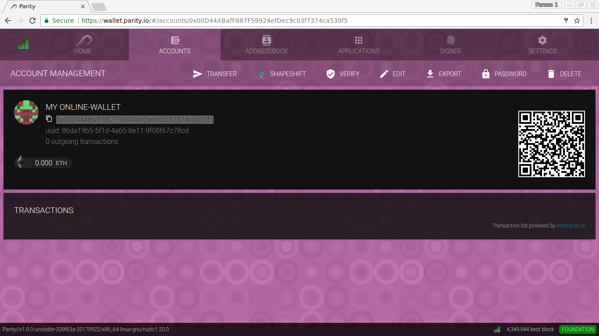

Open the account you wish to backup and find the EXPORT button. Click it.

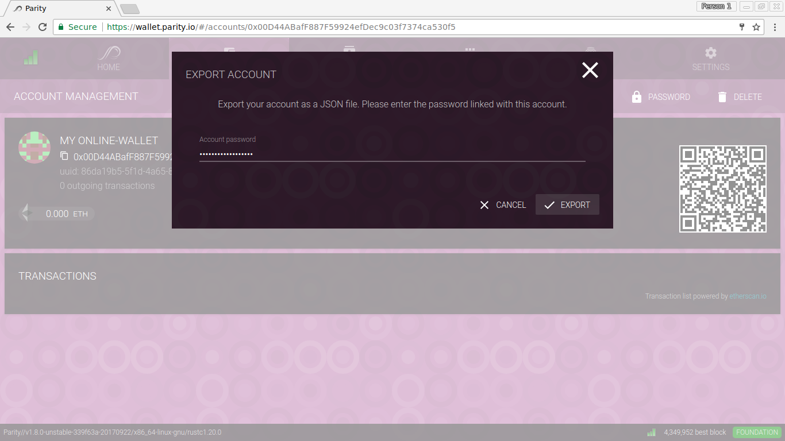

Enter the strong, unique password you initially used to setup your account, and confirm the Export.

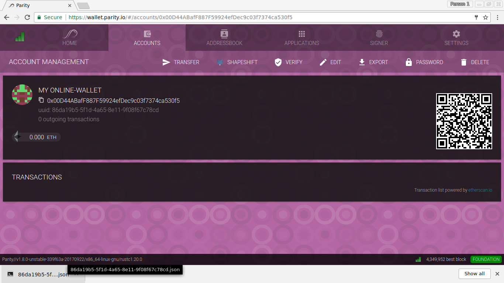

Your browser will download or prompt you to download a JSON file containing your **encrypted private keys**.

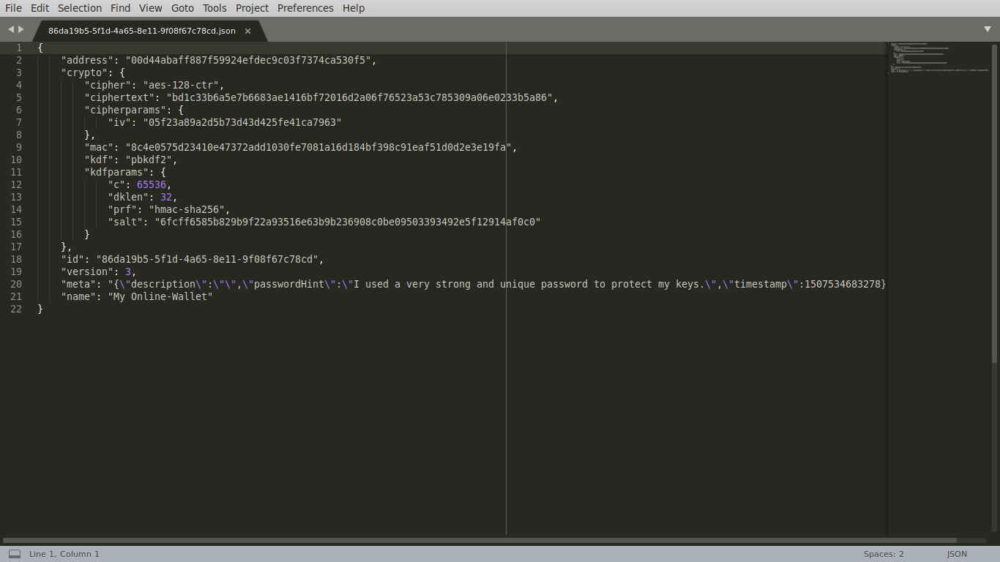

This is an example key file. Since your keys in this file are encrypted with your password, you can securly store it on your disk. However, **make sure you do not forget your password**! You could use a password manager for example.

### Sending Ether and Tokens

Now you are ready to use the wallet. To receive Ether or Tokens, simply send them to your public Address, which usually starts with `0x00...`.

To send a transaction, go to ACCOUNTS, open the account you wish to send funds from, and click the TRANSFER button.

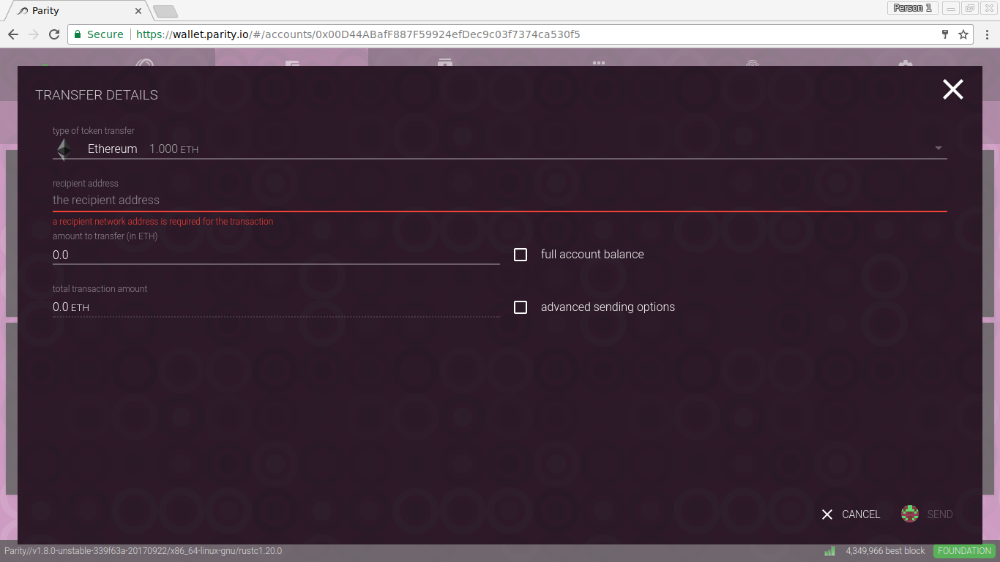

From the first drop-down menu, you can select either to send Ether or any other available token balance. For this tutorial we simply send ETH, but the process for sending tokens is basically the same.

Now, enter a recipient address by either copy-pasting it, or by selecting it from your address book.

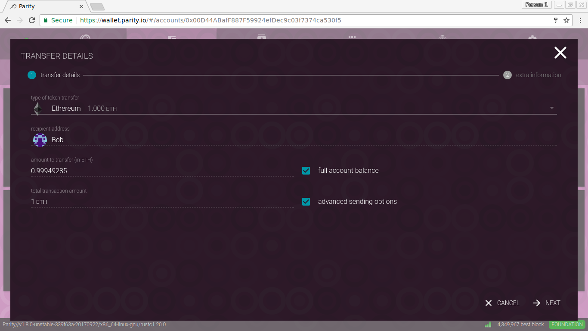

You can no enter a balance to transfer or chose to send the _full account balance_. In addition, it's possible to enable _advanced sending options_ in an intermediary step.

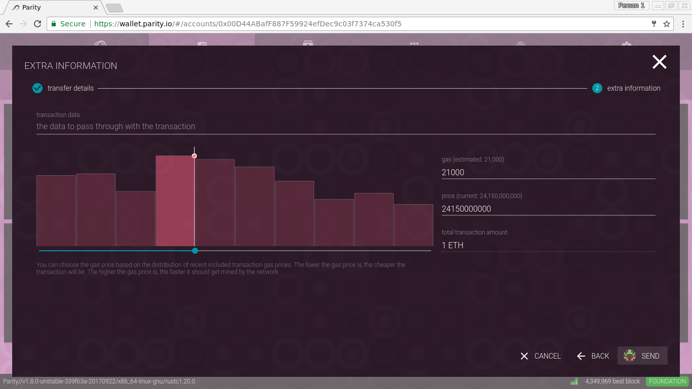

Optional: If you go into the advanced sending options, you can provide transaction data, modify the transaction gas limit, or adjust the gas price. If you are unsure what to enter here, just skip this step by clicking SEND.

Once you clicked SEND, the secure signer will pop up and ask you to confirm the transaction with your password.

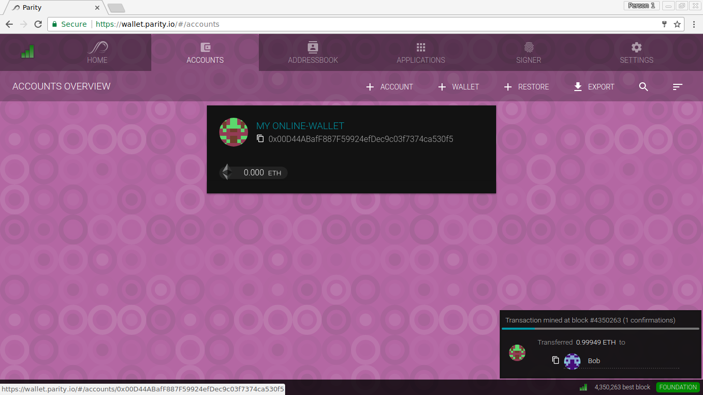

Once confirmed, the transaction will be broadcasted to the Ethereum network. You can track the progress in the little overlay at the bottom.

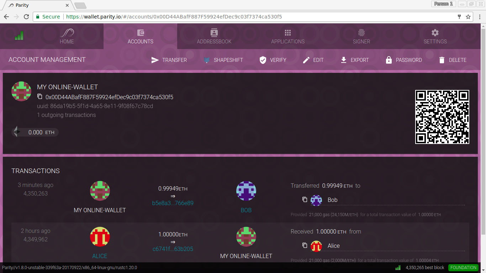

All your transaction history is visible in your ACCOUNTS view after opening your account.

